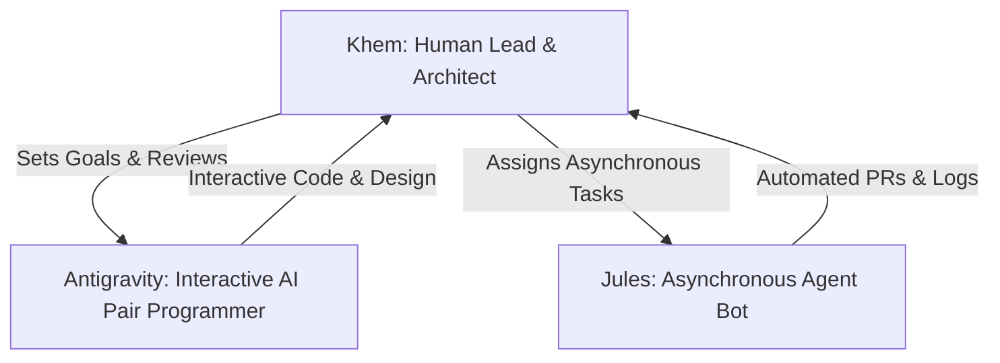

# AI Sandbox Development Workflow Guide

This guide establishes the collaborative development workflow for the human lead (**Khem**) and the AI assistants (**Antigravity** and **Jules**) to build, migrate, and maintain the Slinky-based AI Sandbox.

---

## 1. Roles & Division of Labor

We operate as a three-party team:

### 🧑‍💻 Khem (Human Lead & Architect)
*   **Responsibilities:** Architecture decisions, security policies, final code reviews, and physical testing.
*   **Workflow:** Reviews all changes before merging into base branches (`slinky` or `main`). Sets target milestones.

### 🌌 Antigravity (Interactive AI Pair Programmer)
*   **Responsibilities:** Real-time design discussions, code implementation with Khem, drafting documentation, and rapid prototyping.
*   **Workflow:** Works directly in the chat environment alongside Khem, executing commands, editing code, and creating interactive plan files.

### 🤖 Jules (Asynchronous Agent Bot)
*   **Responsibilities:** Asynchronous background execution, running test suites, auto-formatting, lint resolution, and bulk configuration updates.
*   **Workflow:** Operates in background tasks or pull requests, committing directly to designated agent branches.

---

## 2. Git & Branching Strategy

To keep the repository clean and ensure Khem has full control, we follow a strict branching model:

### Branch Naming Conventions
*   **Base Branch (`slinky` / `main`):** Stable/production-ready code. Only Khem merges here.
*   **Feature Branches (`feature/*`):** Active development branches (e.g., [feature/k8s-native-isolation](file:///home/khemi/workspace/ai_sandbox)). Both human and agents collaborate on these.
*   **Jules' Asynchronous Branches (`agent/jules/*`):** Created by Jules to work on isolated tasks before submitting a PR.
*   **Antigravity's Branches (`agent/antigravity/*`):** Created for larger changes that require offline compilation or review.

### Pull Request & Integration Protocol
1.  **No Direct Push to Main/Base:** Neither Antigravity nor Jules will ever merge directly to main or base branches without human approval.
2.  **Linting & Verification:** Before an agent requests a review, they must verify their changes (e.g., by checking configs, dry-running yaml, or running the Go build for the portal).
3.  **Detailed Pull Request Templates:** Every agent-created PR will detail:
    *   What changed (with file links).
    *   Why it was done.
    *   How Khem can verify/test the change locally.

---

## 3. The "Increment Log" Protocol
To ensure Khem understands the project status on every increment without having to parse complex git diffs, we maintain a live log in [INCREMENT_LOG.md](file:///home/khemi/workspace/ai_sandbox/INCREMENT_LOG.md).

### Rules for the Log:
1.  **Mandatory Updates:** After completing a task or submitting a PR, the active agent **must** append a new entry to the top of [INCREMENT_LOG.md](file:///home/khemi/workspace/ai_sandbox/INCREMENT_LOG.md).
2.  **Clear Explanations:** Focus on the "why" and "how to test," not just the "what."
3.  **File Links:** Every log entry must include direct, clickable file links using the `file://` scheme.

For details on the current implementation state, see [INCREMENT_LOG.md](file:///home/khemi/workspace/ai_sandbox/INCREMENT_LOG.md).
