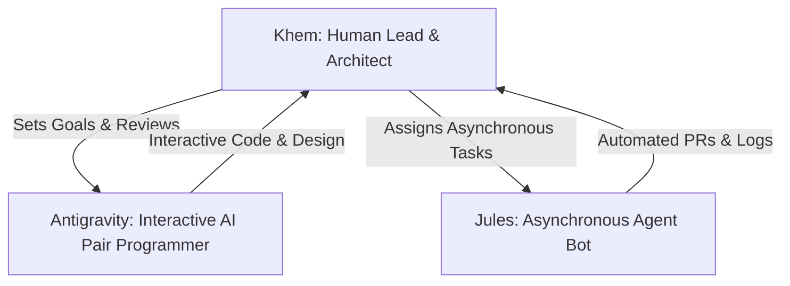

# AI Sandbox Development Workflow Guide

This guide establishes the collaborative development workflow for the human lead (**Khem**) and the AI assistants (**Antigravity** and **Jules**) to build, migrate, and maintain the Slinky-based AI Sandbox.

---

## 1. Roles & Division of Labor

We operate as a three-party team:

### 🧑‍💻 Khem (Human Lead & Architect)
*   **Responsibilities:** Architecture decisions, security policies, final code reviews, and physical testing.
*   **Workflow:** Reviews all changes before merging into base branches (`slinky` or `main`). Sets target milestones.

### 🌌 Antigravity (Interactive AI Pair Programmer)
*   **Responsibilities:** Real-time design discussions, code implementation with Khem, drafting documentation, and rapid prototyping.
*   **Workflow:** Works directly in the chat environment alongside Khem, executing commands, editing code, and creating interactive plan files.

### 🤖 Jules (Asynchronous Agent Bot)
*   **Responsibilities:** Asynchronous background execution, running test suites, auto-formatting, lint resolution, and bulk configuration updates.
*   **Workflow:** Operates in background tasks or pull requests, committing directly to designated agent branches.

---

## 2. Git & Branching Strategy

To keep the repository clean, isolate active changes from production, and enable safe automation by Jules, we follow a two-tier central branching model:

### Branch Naming Conventions
*   **`main` (Production Branch):** Stable, production-ready release branch. Only Khem merges here.
*   **`development` (Central Integration Branch):** Active staging branch where feature branches are integrated and validated. Automated tasks (linting, tests, refactoring) target this branch.
*   **Feature Branches (`feature/*`):** Active development branches (e.g., [feature/k8s-native-isolation](file:///home/khemi/workspace/ai_sandbox)). Branch off of `development` and merge back via Pull Request.
*   **Jules' Asynchronous Branches (`agent/jules/*`):** Created by Jules to run isolated refactors or quality fixes, submitting PRs that target `development`.
*   **Antigravity's Branches (`agent/antigravity/*`):** Created for larger interactive changes that require offline review.

### Pull Request & Integration Protocol
1.  **No Direct Push to Main/Development:** Neither Antigravity nor Jules will ever push directly to the central branches without human approval.
2.  **Linting & Verification:** Before an agent requests a review, they must verify their changes (e.g., by executing config validation or running the Go build for the portal).
3.  **Detailed Pull Request Templates:** Every agent-created PR will detail:
    *   What changed (with file links).
    *   Why it was done.
    *   How Khem can verify/test the change.

---

## 3. The "Increment Log" Protocol
To ensure Khem understands the project status on every increment without having to parse complex git diffs, we maintain a live log in [INCREMENT_LOG.md](file:///home/khemi/workspace/ai_sandbox/INCREMENT_LOG.md).

### Rules for the Log:
1.  **Mandatory Updates:** After completing a task or submitting a PR, the active agent **must** append a new entry to the top of [INCREMENT_LOG.md](file:///home/khemi/workspace/ai_sandbox/INCREMENT_LOG.md).
2.  **Clear Explanations:** Focus on the "why" and "how to test," not just the "what."
3.  **File Links:** Every log entry must include direct, clickable file links using the `file://` scheme.

For details on the current implementation state, see [INCREMENT_LOG.md](file:///home/khemi/workspace/ai_sandbox/INCREMENT_LOG.md).

---

## 4. Jules Automated Routine Tasks (GCP)
Since Jules (jules.google.com) executes asynchronously on Google Cloud VMs, we can offload routine and recurring tasks to it. To initiate a task, sign in to Jules, select the `ai_sandbox` repository, specify the `development` branch, and run one of the following prompts:

### 🔄 Task A: Weekly Infrastructure Stability Check (Continuous Verification)
*   **Prompt to Jules:**
    > *"Run `./scripts/verify-infrastructure.sh`. This test suite verifies Slinky clean booting, queuing, parallel node execution, shared storage, and controller recovery. If it fails, inspect the Kubernetes pod logs, fix the configuration in values.yaml or our manifests, verify that the script succeeds, and open a PR."*
*   **Benefits:** Ensures our Helm configurations and Kubernetes manifests do not rot over time, and verifies resilience against pod crashes.

### 🔄 Task B: Weekly Code Formatting and Linting
*   **Prompt to Jules:**
    > *"Run go fmt ./portal/... and go vet ./portal/... on our codebase. Resolve any formatting inconsistencies, syntax issues, or unused imports, and commit the changes directly in a PR."*
*   **Benefits:** Keeps the Go portal codebase standard and lint-free.

### 🔄 Task C: Repository Cleanup
*   **Prompt to Jules:**
    > *"Analyze the Git branches. Identify merged branches, archive them locally and remotely as tags with an archive/ prefix, prune stale remote-tracking references, and clean up the branch list."*
*   **Benefits:** Automates branch management, keeping the repository list clean.

