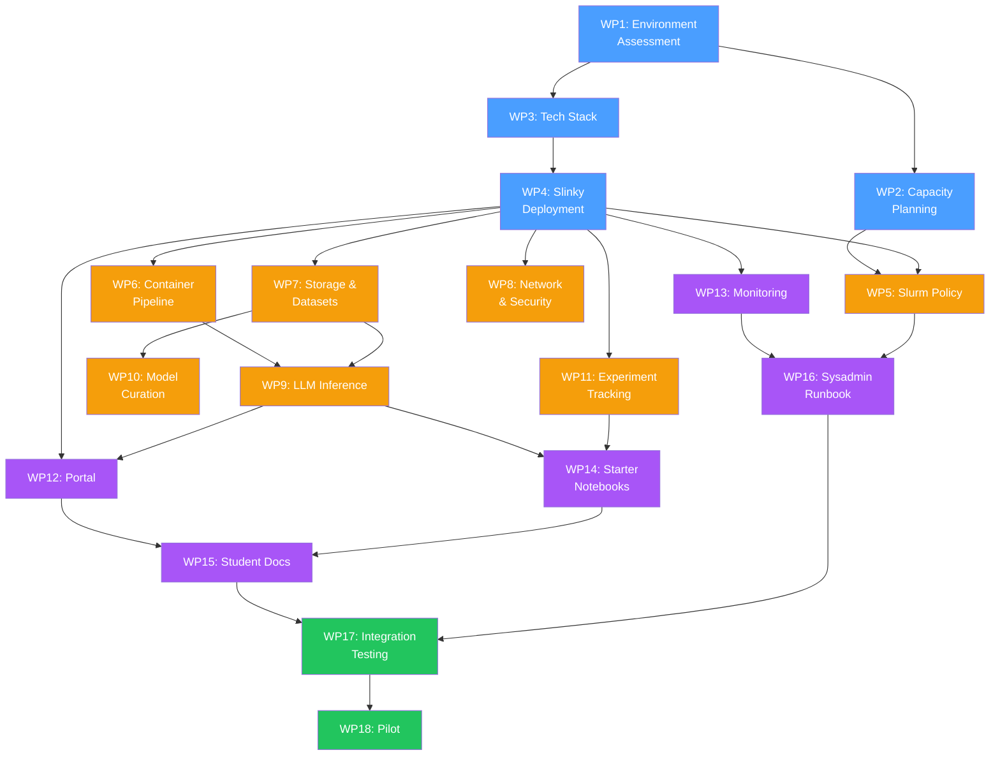

# WP3-1 AI Sandbox

## Project Goal

> **AI Sandbox** provides students a turnkey platform for hands-on AI engineering — pre-installed tools, powerful compute, and an easy-to-use portal — so they can focus on learning, not infrastructure.
>
> **Scope:** Low-level orchestration (Slurm/Slinky on K8s) → central AI services (LLM inference, datasets, experiment tracking) → user interface (Go portal, monitoring) → documentation and validation.
>
> **Student experience:** Log in → pick a tool → start working.

---

## Work Package Overview

| WP | Name | Phase | Status |
|---|---|---|---|
| 1 | Environment Assessment & Requirements | 🏗️ Foundation | 🟡 Partial |
| 2 | Capacity Planning & Workload Profiling | 🏗️ Foundation | 🔴 Not started |
| 3 | Tech Stack Selection & Architecture Decision | 🏗️ Foundation | 🟢 Mostly done |
| 4 | Slinky Deployment & Orchestrator Integration | 🏗️ Foundation | 🟡 Partial |
| 5 | Slurm Policy & Resource Configuration | 🧩 Services | 🔴 Not started |
| 6 | Container Environment & Image Pipeline | 🧩 Services | 🔴 Not started |
| 7 | Shared Storage, Datasets & Model Repository | 🧩 Services | 🟡 Partial |
| 8 | Network & Security Baseline | 🧩 Services | 🟡 Partial |
| 9 | LLM Inference Server Deployment | 🧩 Services | 🔴 Not started |
| 10 | Open-Source Model Curation & Evaluation | 🧩 Services | 🔴 Not started |
| 11 | Experiment Tracking Tools Setup | 🧩 Services | 🔴 Not started |
| 12 | Web Portal Enhancements | 🎨 UX | 🟡 Partial |
| 13 | Monitoring & Observability | 🎨 UX | 🔴 Not started |
| 14 | Starter Lab Notebook Development | 🎨 UX | 🔴 Not started |
| 15 | Student Documentation & Onboarding Guide | 🎨 UX | 🔴 Not started |
| 16 | Sysadmin Runbook & Operations Guide | 🎨 UX | 🟡 Partial |
| 17 | Integration Testing | ✅ Validation | 🟡 Partial |
| 18 | Pilot with Early Adopters | ✅ Validation | 🔴 Not started |

---

## Phase 1: Foundation 🏗️

### WP3-1-1: Environment Assessment & Requirements

Document the target environments — local Kind cluster (now) and physical HPC cluster with GPUs (later). Define hardware requirements so all software decisions are hardware-aware.

- Target environment specification (local dev vs. production HPC)
- Hardware requirements matrix (CPU, GPU, memory, storage per role)
- Network topology diagram
- Gap analysis: Kind prototype → production cluster

### WP3-1-2: Capacity Planning & Workload Profiling

Define expected student workloads (notebooks, training, inference) and size partitions and quotas for fair multi-user access.

- Workload profile catalog (job types, resource needs, durations)
- Partition design (interactive, batch-cpu, batch-gpu, inference)
- Resource quotas per student/project
- Autoscaling policy (NodeSet min/max replicas)

### WP3-1-3: Tech Stack Selection & Architecture Decision

Record all technology choices made (Slinky, Kind, Nix, Go portal) and remaining open decisions. Produce a reference architecture.

- Architecture Decision Records (ADRs)
- Reference architecture diagram
- Tech comparison matrices for open decisions

### WP3-1-4: Slinky Deployment & Orchestrator Integration

Deploy the full Slinky stack — `slurm-operator`, `slurm-bridge`, controller, worker NodeSets. The invisible engine under the sandbox.

- Working slurm-operator + CRDs
- slurm-bridge for K8s-native job partition
- CPU and GPU NodeSet configurations
- Finalized Helm values.yaml
- Infrastructure verification suite passing

---

## Phase 2: Central Services 🧩

### WP3-1-5: Slurm Policy & Resource Configuration

Configure scheduling policies — partitions, QoS, fair-share, preemption. Determines who gets what and when on the shared cluster.

- Partition definitions (interactive, batch-cpu, batch-gpu, inference)
- QoS levels (student, power-user, admin)
- Fair-share and priority rules
- Resource limit enforcement

### WP3-1-6: Container Environment & Image Pipeline

Build curated OCI images for every workload type (JupyterLab, PyTorch, etc.). Students pick an environment from a dropdown — no Docker knowledge needed.

- Dockerfiles per workload type
- OCI registry deployment
- Image build automation
- Pre-pull DaemonSet for fast startup
- Updated manifest schema (`image:` replaces `image_file:`)

### WP3-1-7: Shared Storage, Datasets & Model Repository

Shared storage for workspaces, pre-downloaded datasets, and model weights. `ls /datasets/cifar10` just works.

- Production PVC configuration (NFS CSI or equivalent)
- Directory structure: `/projects/`, `/datasets/`, `/models/`, `/scratch/`
- Curated dataset collection (pre-downloaded, versioned)
- Model weight cache (shared across users)
- Storage quotas and backup plan

### WP3-1-8: Network & Security Baseline

Network isolation, Traefik ingress, TLS, and authentication. Students can only see their own jobs and data.

- Kubernetes NetworkPolicy definitions
- Traefik ingress with TLS
- Auth integration (JWT → SSO/OAuth2)
- RBAC for namespaces and resources
- Student workspace isolation

### WP3-1-9: LLM Inference Server Deployment

Central LLM service (Ollama/vLLM/TGI) with pre-loaded models. `curl http://sandbox/api/chat` just works.

- Inference server deployment
- Pre-loaded model set (Llama 3, Mistral, embeddings, etc.)
- API endpoint with rate limiting
- GPU resource allocation for inference
- Portal integration (model picker UI)

### WP3-1-10: Open-Source Model Curation & Evaluation

Select, benchmark, and document models for the sandbox. A catalog students can browse with model cards and performance data.

- Curated model catalog (LLMs, vision, embeddings, code)
- Evaluation benchmarks per model
- Model cards with usage guidance
- Download/caching automation
- GPU memory requirements per model

### WP3-1-11: Experiment Tracking Tools Setup

Deploy MLflow (or similar) so students `import mlflow` and go. Pre-configured — no database setup needed.

- Tracking server deployment
- Storage backend (DB + artifact store on shared PVC)
- Per-student/project isolation
- Pre-configured client in container images
- Integration guide and examples

---

## Phase 3: User Experience 🎨

### WP3-1-12: Web Portal Enhancements

The Go/Echo portal is the single entry point. Launch notebooks, submit jobs, call inference, view usage — all from the browser.

- Remove legacy SSH + `ext_*` code paths
- GPU job submission support
- Inference server integration (model picker, chat UI)
- User dashboard (active jobs, usage, quota)
- Resource availability view (free GPUs, queue depth)

### WP3-1-13: Monitoring & Observability

Prometheus, Grafana, slurm-exporter. Dashboards for admins (cluster health) and students (their usage).

- Prometheus + slurm-exporter deployment
- Grafana dashboards (cluster, GPU, jobs)
- Student-facing usage metrics in portal
- Alerting rules (node down, GPU OOM, queue full)

### WP3-1-14: Starter Lab Notebook Development

Template notebooks for the "first 5 minutes" experience — each walks through one sandbox capability.

- "Hello Sandbox" — submit a job, see results
- GPU training — fine-tune a small model
- LLM inference — call the API, build a RAG chain
- Experiment tracking — log a run to MLflow
- All pre-loaded in default workspace

### WP3-1-15: Student Documentation & Onboarding Guide

The docs students actually read. Practical, concise, example-heavy.

- Getting started guide (login → first job in 5 min)
- Tool catalog (what's available, how to access)
- GPU usage guide
- FAQ and common errors

### WP3-1-16: Sysadmin Runbook & Operations Guide

Ops documentation for long-term maintainability after this project ends.

- Cluster bootstrap/teardown procedures
- Slinky + K8s upgrade runbook
- User and project management
- Backup and restore procedures
- Incident response playbook

---

## Phase 4: Validation ✅

### WP3-1-17: Integration Testing

End-to-end tests covering the full student journey — login through results. All job types, storage, auth, monitoring.

- E2E test suite (extending verify-infrastructure.sh)
- Portal integration tests
- GPU and inference pipeline tests
- Performance benchmarks under concurrent users

### WP3-1-18: Pilot with Early Adopters

Real students use it. Observe, collect feedback, iterate.

- Pilot deployment on target HPC hardware
- Feedback collection (surveys, usage data, interviews)
- Bug and friction-point tracking
- Iteration plan from findings
- Go/no-go for full rollout

---

## Dependency Graph

