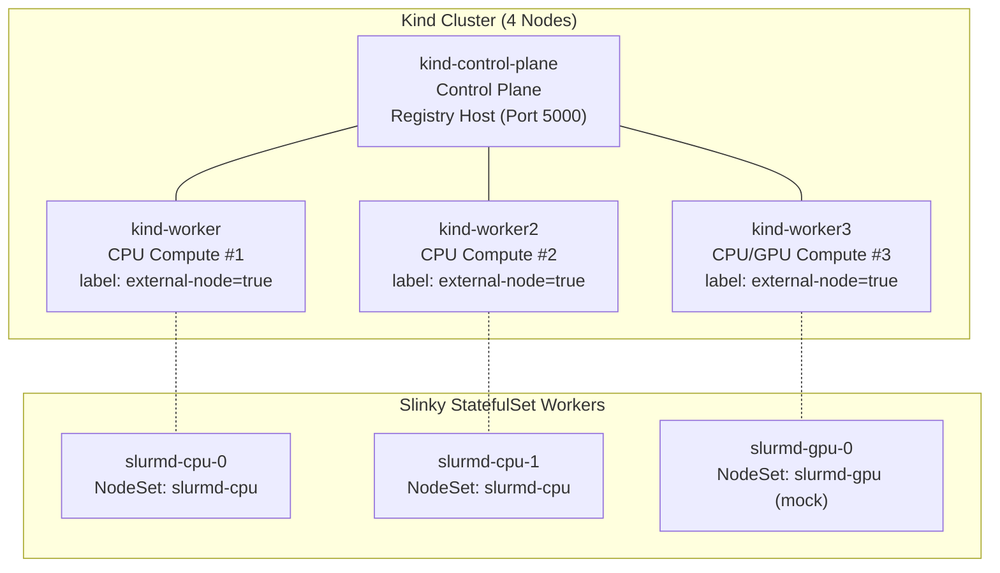
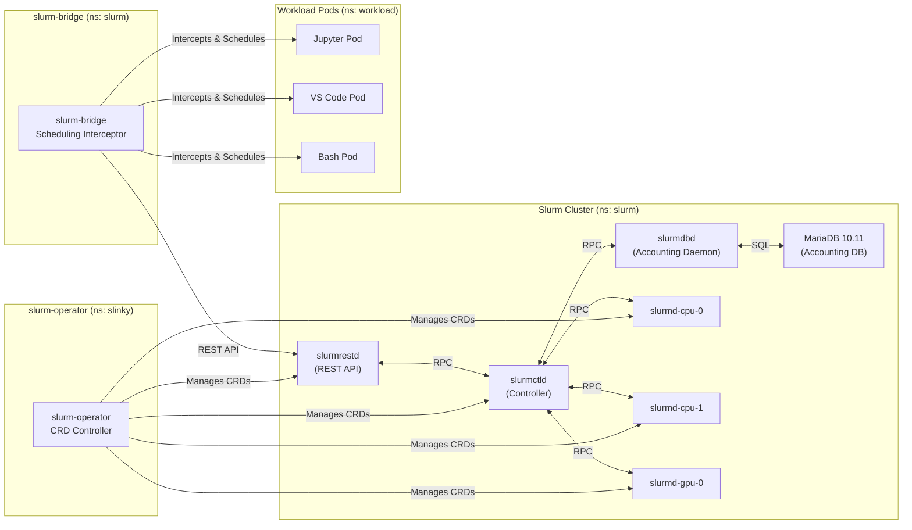
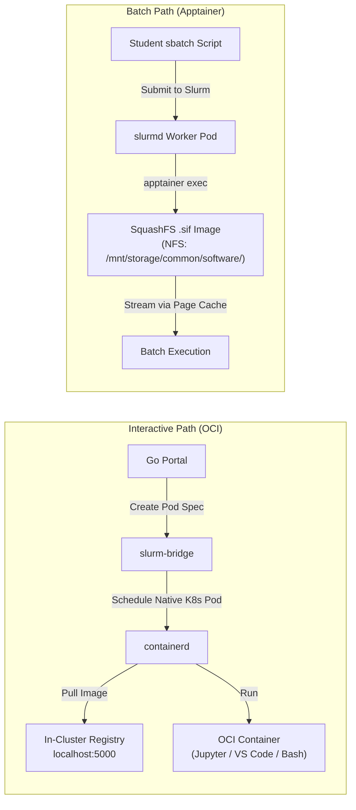
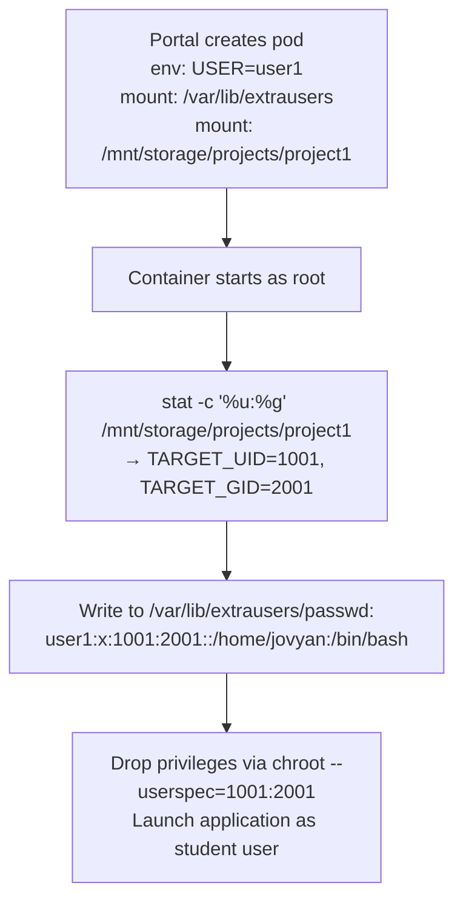
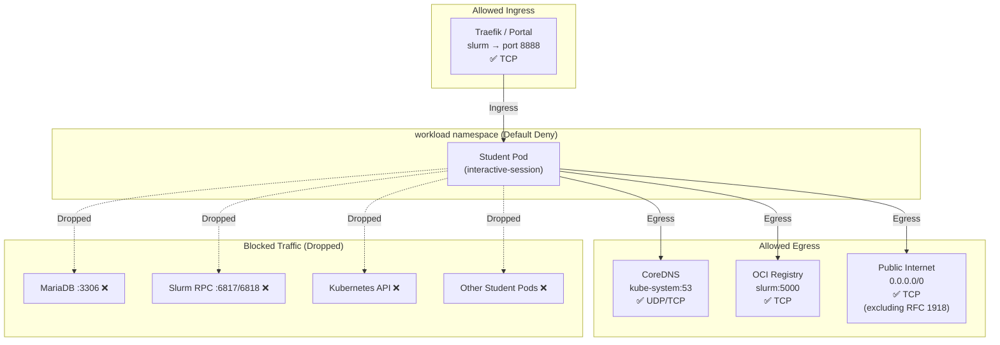

# AI Sandbox: Backend Deployment Report

**Document Status:** Milestone Implementation Report  
**Target Audience:** Department Head, Faculty Supervisors, and IT Staff — Computer Engineering Department

This document records the complete backend infrastructure deployment for the AI Sandbox platform. It covers all work completed across Work Packages WP3-1-4 through WP3-1-8: the Slinky orchestrator deployment, Slurm scheduling policy, container image pipeline, shared storage and dataset repository, and network security baseline. All configurations described in this report are fully deployed and verified.

---

## Table of Contents

- [1. Resource Summary & Configuration](#1-resource-summary--configuration)
  - [1.1 Cluster Topology](#11-cluster-topology)
  - [1.2 Kubernetes Volume Architecture](#12-kubernetes-volume-architecture)
  - [1.3 Namespace & Zone Model](#13-namespace--zone-model)
- [2. Slinky Deployment & Manual](#2-slinky-deployment--manual)
  - [2.1 Slinky Component Overview](#21-slinky-component-overview)
  - [2.2 Operator & CRD Bootstrap](#22-operator--crd-bootstrap)
  - [2.3 Deployment Pipeline](#23-deployment-pipeline)
  - [2.4 Slurm Bridge Configuration](#24-slurm-bridge-configuration)
  - [2.5 Accounting Database](#25-accounting-database)
  - [2.6 Disaster Recovery & State Isolation](#26-disaster-recovery--state-isolation)
- [3. Slurm Configuration](#3-slurm-configuration)
  - [3.1 Partition Design](#31-partition-design)
  - [3.2 Quality of Service (QoS) Policies](#32-quality-of-service-qos-policies)
  - [3.3 Fair-Share Scheduling](#33-fair-share-scheduling)
  - [3.4 Cgroup Enforcement](#34-cgroup-enforcement)
  - [3.5 User & Account Management](#35-user--account-management)
  - [3.6 Epilog Webhook Integration](#36-epilog-webhook-integration)
- [4. Container Configuration](#4-container-configuration)
  - [4.1 Dual-Path Execution Architecture](#41-dual-path-execution-architecture)
  - [4.2 Interactive OCI Images](#42-interactive-oci-images)
  - [4.3 Custom Slurm Daemon Images](#43-custom-slurm-daemon-images)
  - [4.4 In-Cluster OCI Registry](#44-in-cluster-oci-registry)
  - [4.5 Batch Apptainer Pipeline](#45-batch-apptainer-pipeline)
  - [4.6 Dynamic User Identity Resolution](#46-dynamic-user-identity-resolution)
- [5. Dataset & Model Repository](#5-dataset--model-repository)
  - [5.1 Central Storage Hierarchy](#51-central-storage-hierarchy)
  - [5.2 Model Repository & Dual-Tier Caching](#52-model-repository--dual-tier-caching)
  - [5.3 Curated Dataset Library](#53-curated-dataset-library)
  - [5.4 Multi-Tenant Project Workspaces](#54-multi-tenant-project-workspaces)
  - [5.5 Ephemeral Scratch Space](#55-ephemeral-scratch-space)
  - [5.6 Container Environment Contract](#56-container-environment-contract)
  - [5.7 Storage Governance Tooling](#57-storage-governance-tooling)
- [6. Network Configuration](#6-network-configuration)
  - [6.1 Zero-Trust Network Baseline](#61-zero-trust-network-baseline)
  - [6.2 Network Policy Rules](#62-network-policy-rules)
  - [6.3 RBAC & Service Account Hardening](#63-rbac--service-account-hardening)
  - [6.4 Ingress TLS & Security Headers](#64-ingress-tls--security-headers)
  - [6.5 Traefik Dynamic Session Routing](#65-traefik-dynamic-session-routing)
  - [6.6 Automated Security Verification](#66-automated-security-verification)
- [7. Software Catalog & Application Manifests](#7-software-catalog--application-manifests)
- [8. Conclusion](#8-conclusion)

---

## 1. Resource Summary & Configuration

### 1.1 Cluster Topology

The backend is deployed on a four-node Kubernetes cluster provisioned via Kind (Kubernetes-in-Docker). The cluster consists of one control-plane node and three worker nodes, simulating the target production topology of separate control and compute layers.



| Node | Role | Kubelet Feature Gate | Host Mount | Special Function |
| :--- | :--- | :--- | :--- | :--- |
| `kind-control-plane` | Control Plane | `KubeletInUserNamespace=true` | `/mnt/storage` | OCI registry host (`hostPort: 5000`) |
| `kind-worker` | Compute Worker #1 | `KubeletInUserNamespace=true` | `/mnt/storage` | Slurm external node, partition routing |
| `kind-worker2` | Compute Worker #2 | `KubeletInUserNamespace=true` | `/mnt/storage` | Slurm external node, partition routing |
| `kind-worker3` | Compute Worker #3 | `KubeletInUserNamespace=true` | `/mnt/storage` | Slurm external node, bridge-managed interactive sessions |

All three worker nodes carry the label `scheduler.slinky.slurm.net/external-node=true` and the annotation `scheduler.slinky.slurm.net/external-node-partitions=interactive,batch-cpu,batch-gpu,inference`, enabling `slurm-bridge` to schedule native Kubernetes pods on them as Slurm-tracked workloads.

> **Note on `KubeletInUserNamespace`:** This feature gate is required because the host kernel restricts `/proc/sys/kernel/keys/root_maxkeys` access, which would otherwise cause Kubelet crashes during Kind node initialization.

### 1.2 Kubernetes Volume Architecture

Three persistent volumes provide strict separation between Slurm controller state, shared student data, and workload-namespace data access:

| PersistentVolume | Capacity | Access Mode | Host Path | Claimed By | Mount Purpose |
| :--- | :--- | :--- | :--- | :--- | :--- |
| `slinky-storage-pv` | 20 Gi | `ReadWriteMany` | `/mnt/storage` | `slinky-storage-pvc` (ns: `slurm`) | Student workspaces, models, datasets, common software, registry |
| `slurm-state-pv` | 5 Gi | `ReadWriteOnce` | `/mnt/slurm-state` | `slurm-state-pvc` (ns: `slurm`) | `slurmctld` controller checkpoints (`/var/spool/slurmctld`) |
| `workload-storage-pv` | 20 Gi | `ReadWriteMany` | `/mnt/storage` | `slinky-storage-pvc` (ns: `workload`) | Interactive session pod access to `/mnt/storage` |
| `registry-pv` | 20 Gi | `ReadWriteOnce` | `/mnt/storage/registry` | `registry-pvc` (ns: `slurm`) | In-cluster OCI registry blob storage |

> **Why state isolation matters:** The Slurm controller's checkpoint directory (`/var/spool/slurmctld`) is mounted on a separate PV from student data. This prevents a scenario where student storage filling to capacity would starve the scheduler's ability to write state files, causing a cluster-wide scheduling outage.

### 1.3 Namespace & Zone Model

The cluster is divided into two namespaces with distinct security zones:

| Namespace | Zone Label | Purpose | Key Pods |
| :--- | :--- | :--- | :--- |
| `slurm` | `sandbox.zone: control-plane` | Scheduler control plane, portal, registry, accounting database | `slurm-controller-0`, `slurm-restapi-*`, `slurmd-cpu-[0-1]`, `slurmd-gpu-0`, `hpc-portal`, `registry`, `mariadb` |
| `workload` | `sandbox.zone: workload` | Dynamic student interactive sessions and bridge-managed pods | Transient Jupyter, VS Code, and Bash terminal pods |

This zone model is the foundation for all network policies — the `control-plane` zone houses trusted infrastructure, while the `workload` zone houses untrusted student code under strict isolation.

---

## 2. Slinky Deployment & Manual

### 2.1 Slinky Component Overview

The AI Sandbox uses SchedMD's **Slinky** (Apache 2.0, GA release November 2025) to run Slurm natively on Kubernetes. Slinky consists of two decoupled systems:



| Component | Role | Image | Namespace |
| :--- | :--- | :--- | :--- |
| **slurm-operator** | Kubernetes operator managing Slurm CRDs (Controller, NodeSet, RestAPI) | `ghcr.io/slinkyproject/slurm-operator` | `slinky` |
| **slurmctld** | Slurm controller daemon — scheduling decisions, job queue management | `slurmctld-custom:latest` | `slurm` |
| **slurmrestd** | Slurm REST API — HTTP interface for job submission | `slurmrestd-custom:latest` | `slurm` |
| **slurmdbd** | Slurm accounting daemon — connects to MariaDB for fair-share and QoS tracking | Bundled in Helm chart | `slurm` |
| **slurmd (CPU)** | Compute worker NodeSet for CPU partitions (2 replicas, StatefulSet) | `slurmd-custom:latest` | `slurm` |
| **slurmd (GPU)** | Compute worker NodeSet for GPU partitions (1 replica, StatefulSet) | `slurmd-custom:latest` | `slurm` |
| **slurm-bridge** | Kubernetes scheduling interceptor — translates Slurm allocations into native K8s pods | `ghcr.io/slinkyproject/slurm-bridge` | `slurm` |

### 2.2 Operator & CRD Bootstrap

The Slinky deployment follows a strict sequential dependency chain:

1. **cert-manager** is installed first (`quay.io/jetstack/charts/cert-manager` with `--set crds.enabled=true`) in namespace `cert-manager`, as the Slinky operator's webhook system requires TLS certificates.
2. **slurm-operator-crds** Helm chart is installed (`ghcr.io/slinkyproject/charts/slurm-operator-crds`) in namespace `slinky`, registering the Custom Resource Definitions.
3. **slurm-operator** Helm chart is installed (`ghcr.io/slinkyproject/charts/slurm-operator` with `--wait`) in namespace `slinky`. The deployment blocks until the operator reaches `1/1 READY`.

### 2.3 Deployment Pipeline

The complete cluster bootstrap is automated in a single script (`scripts/start-slinky.sh`) executing 14 sequential stages:

| Stage | Action | Key Command / Manifest |
| :--- | :--- | :--- |
| 1 | Install cert-manager, CRDs, and operator | `helm install` (3 charts) |
| 2 | Create namespaces, storage PVs, and network policies | `kubectl apply -f k8s/namespaces.yaml, pv-pvc.yaml, network-policies/` |
| 3 | Build custom Slurm daemon images | `scripts/build-custom-images.sh` |
| 4 | Wait for operator readiness | `kubectl wait --for=condition=available deployment/slurm-operator` |
| 5 | Deploy MariaDB accounting database | `kubectl apply -f k8s/mariadb.yaml` |
| 6 | Install Slurm cluster via Helm | `helm install slurm oci://ghcr.io/slinkyproject/charts/slurm -f k8s/values.yaml` |
| 7 | Configure Slurm accounting (QoS, accounts, TRES) | `scripts/setup-accounting.sh` |
| 8 | Generate JWT token for bridge authentication | `scontrol token lifespan=unlimited` → Secret `slurm-bridge-token` |
| 9 | Deploy slurm-bridge | `helm install slurm-bridge -f k8s/slurm-bridge-values.yaml` |
| 10 | Register external worker nodes in Slurm | Label/annotate Kind workers, `scontrol update PartitionName=...` |
| 11 | Patch inotify limits on all Kind nodes | `sysctl fs.inotify.max_user_instances=8192` |
| 12 | Deploy in-cluster OCI registry and configure containerd mirrors | `k8s/registry.yaml`, `/etc/containerd/certs.d/` config |
| 13 | Build and push interactive images, deploy portal and TLS | `build-oci-images.sh`, `generate-certs.sh`, portal manifests |
| 14 | Initialize storage hierarchy and seed test data | `init-storage.sh`, `seed-models.sh`, `seed-datasets.sh` |

### 2.4 Slurm Bridge Configuration

The `slurm-bridge` connects Kubernetes pod scheduling to Slurm job accounting. When a pod is submitted to the `workload` namespace with `schedulerName: slurm-bridge-scheduler`, the bridge intercepts it, submits a real Slurm job via the REST API, and tracks the pod's lifecycle under a proper Slurm job ID.

| Parameter | Value |
| :--- | :--- |
| **Managed Namespace** | `workload` |
| **Slurm REST API Endpoint** | `http://slurm-restapi.slurm:6820` |
| **JWT Secret** | `slurm-bridge-token` (key: `auth-token`) |
| **Default Partition** | `interactive` |
| **Tolerations** | `slinky.slurm.net/managed-node:NoExecute` (all sub-components) |

The portal Go application injects Slinky-specific annotations into every interactive pod spec:

| Annotation | Purpose | Example Value |
| :--- | :--- | :--- |
| `slurmjob.slinky.slurm.net/job-name` | Human-readable job identifier | `jupyter-user1` |
| `slurmjob.slinky.slurm.net/partition` | Target Slurm partition | `interactive` |
| `slurmjob.slinky.slurm.net/account` | Student's Slurm account (project) | `project1` |
| `slurmjob.slinky.slurm.net/user-id` | Student's Slurm username | `user1` |

### 2.5 Accounting Database

Slurm accounting is backed by a MariaDB 10.11 StatefulSet providing persistent job history, fair-share usage tracking, and QoS enforcement.

| Parameter | Value |
| :--- | :--- |
| **Image** | `mariadb:10.11` |
| **Namespace** | `slurm` |
| **Database** | `slurm_acct_db` |
| **Service User** | `slurm` |
| **Service** | `mariadb.slurm.svc` (ClusterIP, port 3306) |
| **Volume** | `emptyDir: {}` (ephemeral in development; production requires persistent storage) |
| **Readiness Probe** | `mysqladmin ping` (initial delay: 10s, period: 5s) |
| **Tolerations** | `slinky.slurm.net/managed-node:NoExecute` |

The `slurmdbd` daemon connects to MariaDB and communicates with `slurmctld` to enforce QoS limits and record job accounting data. The connection parameters are injected into the Slinky Helm values:

```yaml
accounting:
  enabled: true
  storageConfig:
    host: mariadb
    port: 3306
    database: slurm_acct_db
    username: slurm
    passwordKeyRef:
      name: mariadb-password
      key: password
```

### 2.6 Disaster Recovery & State Isolation

The `slurmctld` controller pod stores all scheduling state (job queue, node state, checkpoint data) on a dedicated `ReadWriteOnce` PV mounted at `/var/spool/slurmctld`. This enables automatic state recovery:

- **Pod crash/restart:** Kubernetes recreates the pod and reattaches the same PV. The controller reads its checkpoint file and resumes scheduling without job loss.
- **Verified behavior:** Force-killing the `slurmctld` pod (`--force --grace-period=0`) during active job execution results in full state recovery — queued jobs resume, running jobs are tracked to completion.
- **State isolation guarantee:** Because `/var/spool/slurmctld` (5 Gi, RWO) is on a separate volume from student data `/mnt/storage` (20 Gi, RWX), storage pressure from student workloads cannot corrupt or starve the scheduler.

---

## 3. Slurm Configuration

### 3.1 Partition Design

The cluster is divided into four scheduling partitions, each with enforced resource ceilings and priority tiers:

| Partition | NodeSets / Nodes | Default | Max Duration | PreemptMode | Priority Tier | MaxTRESPerJob | Associated QoS |
| :--- | :--- | :--- | :--- | :--- | :--- | :--- | :--- |
| `interactive` | `slurmd-cpu`, `slurmd-gpu`, `worker[1-3]` | YES | 2 Hours | OFF | 2 (High) | `cpu=4, mem=16G, gres/gpu=1` | `interactive_qos` |
| `batch-cpu` | `slurmd-cpu`, `worker[1-2]` | NO | 24 Hours | OFF | 1 (Medium) | `cpu=16, mem=64G` | `batch_cpu_qos` |
| `batch-gpu` | `slurmd-cpu`, `slurmd-gpu`, `worker[3]` | NO | 7 Days | OFF | 1 (Medium) | `cpu=16, mem=64G, gres/gpu=1` | `batch_gpu_qos` |
| `inference` | `slurmd-gpu`, `worker[3]` | NO | 12 Hours | OFF | 3 (Highest) | `cpu=4, mem=32G, gres/gpu=1` | `inference_qos` |

> **Why preemption is universally disabled (`PreemptMode=OFF`):** In a classroom environment, killing an active Jupyter session destroys all in-memory state — loaded datasets, model weights, and training progress. Instead of preemption, resource contention is managed exclusively through `MaxTRESPerJob` fencing, which prevents any single job from consuming resources beyond its partition ceiling.

### 3.2 Quality of Service (QoS) Policies

Each partition has an associated QoS that enforces hard resource ceilings and scheduling priority. These are configured via `scripts/setup-accounting.sh`:

| QoS Name | MaxTRESPerJob | Priority Weight | Partition |
| :--- | :--- | :--- | :--- |
| `interactive_qos` | `cpu=4, mem=16G` | 200 | `interactive` |
| `batch_cpu_qos` | `cpu=16, mem=64G` | 100 | `batch-cpu` |
| `batch_gpu_qos` | `cpu=16, mem=64G` | 100 | `batch-gpu` |
| `inference_qos` | `mem=32G` | 300 | `inference` |

**Verified enforcement:** A job requesting 8 CPUs on the `interactive` partition (limit: 4 CPUs) is rejected and held in `PENDING` state with reason `QOSMaxCpuPerJobLimit`. A job requesting 2 CPUs on the same partition is immediately scheduled.

### 3.3 Fair-Share Scheduling

The scheduler uses Slurm's native multifactor priority algorithm to dynamically balance resource allocation across students:

| Parameter | Value | Effect |
| :--- | :--- | :--- |
| `PriorityType` | `priority/multifactor` | Enables multi-factor priority calculation |
| `PriorityWeightFairshare` | `10000` | Fair-share is the dominant factor in job priority |
| `AccountingStorageEnforce` | `limits,qos` | Rejects jobs that exceed QoS or account limits |

**How fair-share works in practice:** Students who have consumed more than their proportional share of cluster resources see their job priority automatically reduced. Students who have been waiting or have consumed fewer resources get priority boosts. This eliminates the need for manual administrator intervention to balance resource usage across a class of 50–100 students.

### 3.4 Cgroup Enforcement

Resource limits are enforced at the Linux kernel level via cgroup v2 configuration on all Slurm compute workers:

```ini
CgroupPlugin=cgroup/v2
IgnoreSystemd=yes
ConstrainCores=yes
ConstrainRAMSpace=yes
ConstrainDevices=yes
ConstrainSwapSpace=yes
```

This ensures that a student's batch job cannot escape its Slurm-assigned CPU or memory limits, even if the container runtime's own limits are misconfigured.

### 3.5 User & Account Management

Student identity is managed through a centralized NSS (Name Service Switch) system rather than traditional LDAP or local `/etc/passwd` files:

- **Static user database:** Files (`passwd`, `group`, `shadow`) are stored at `/mnt/storage/common/etc/` and mounted read-only into all Slurm daemons via the `extrausers` NSS module.
- **Slurm accounting account:** A single default account `default_acct` (`Organization="AI Sandbox"`) is created. All users are assigned to this account.
- **Administrative users:** `root` and `slurm` are granted `adminlevel=Admin` with access to all QoS policies (`normal`, `interactive_qos`, `batch_cpu_qos`, `batch_gpu_qos`, `inference_qos`).
- **Demo user seeding:** `scripts/seed-demo-users.sh` provisions test users (`user1`–`user4`) with UIDs 1001–1004, assigns them to project groups (`project1`, `project2`, `project3`), and synchronizes the NSS files.

### 3.6 Epilog Webhook Integration

A Slurm epilog script (`01-webhook.sh`) executes at the completion of every job and sends a POST request with job metadata to the portal for real-time status updates:

```json
{
  "job_id": "$SLURM_JOB_ID",
  "user": "$SLURM_JOB_USER",
  "account": "$SLURM_JOB_ACCOUNT",
  "partition": "$SLURM_JOB_PARTITION",
  "nodelist": "$SLURM_JOB_NODELIST"
}
```

The webhook attempts delivery to multiple endpoints (`host.k3d.internal:8080`, `host.minikube.internal:8080`, `172.17.0.1:8080`, `localhost:8080`) with a 5-second timeout, ensuring compatibility across different local development network topologies.

---

## 4. Container Configuration

### 4.1 Dual-Path Execution Architecture

The AI Sandbox implements a dual-path container execution model, reflecting the fundamentally different requirements of interactive and batch workloads:



| Path | Image Format | Delivery Method | Execution Runtime | Use Case |
| :--- | :--- | :--- | :--- | :--- |
| **Interactive** | OCI (Docker) | On-demand pull from `localhost:5000` via containerd | Native Kubernetes pod via `slurm-bridge` | Jupyter, VS Code, Bash terminal sessions |
| **Batch** | Apptainer SquashFS `.sif` | Direct NFS streaming into Linux page cache | `apptainer exec` inside privileged `slurmd` pod | Training scripts, data preprocessing |

**Why DaemonSet pre-pullers were rejected:** The in-cluster registry provides sub-second pull times for cached layers via containerd's local layer deduplication. A DaemonSet pre-puller would add unnecessary complexity, waste memory on nodes that never run interactive sessions, and create garbage collection conflicts.

### 4.2 Interactive OCI Images

Three curated interactive images are built and pushed to the in-cluster registry:

| Image | Base Image | Registry Tag | Port | Key Packages |
| :--- | :--- | :--- | :--- | :--- |
| **JupyterLab** | `jupyter/scipy-notebook:latest` | `localhost:5000/interactive-jupyter:latest` | 8888 | NumPy, SciPy, Pandas, Matplotlib, scikit-learn, PyTorch, `libnss-extrausers` |
| **VS Code Server** | `codercom/code-server:latest` | `localhost:5000/interactive-codeserver:latest` | 8888 | VS Code web server, `libnss-extrausers` |
| **Web Terminal** | `public.ecr.aws/ubuntu/ubuntu:24.04` | `localhost:5000/interactive-bash:latest` | 8888 | `ttyd`, `build-essential`, `curl`, `git`, `htop`, `jq`, `vim`, `wget`, `libnss-extrausers` |

All three images share a common architecture pattern:
1. Install `libnss-extrausers` and configure `/etc/nsswitch.conf` (`passwd: files extrausers`, `group: files extrausers`).
2. Create mount point `/var/lib/extrausers` for the shared NSS database.
3. Include a startup script that dynamically resolves the student's UID/GID and drops root privileges before launching the application.

The images are built by `scripts/build-oci-images.sh`, which tags them with the `localhost:5000/` prefix and pushes directly to the in-cluster registry.

### 4.3 Custom Slurm Daemon Images

The standard Slinky Slurm images are extended with custom builds to support the `extrausers` NSS module and Apptainer batch execution:

| Image | Base | Additions |
| :--- | :--- | :--- |
| `slurmctld-custom:latest` | `ghcr.io/slinkyproject/slurmctld:25.11-ubuntu24.04` | `libnss-extrausers`, NSS configuration |
| `slurmrestd-custom:latest` | `ghcr.io/slinkyproject/slurmrestd:25.11-ubuntu24.04` | `libnss-extrausers`, NSS configuration |
| `slurmd-custom:latest` | `ghcr.io/slinkyproject/slurmd:25.11-ubuntu24.04` | `libnss-extrausers`, NSS configuration, `curl`, `wget`, Apptainer v1.3.6 + `apptainer-suid` v1.3.6 |

These images are built by `scripts/build-custom-images.sh` and loaded directly into Kind (`kind load docker-image`).

**Worker pod security context:** The `slurmd` worker pods run with `privileged: false` but are granted specific Linux capabilities (`SYS_ADMIN`, `DAC_OVERRIDE`, `DAC_READ_SEARCH`) required for Apptainer's container-in-container execution with proot.

### 4.4 In-Cluster OCI Registry

A local Docker Distribution registry (`registry:2`) runs on the control-plane node, providing fast image delivery without external network dependencies:

| Parameter | Value |
| :--- | :--- |
| **Image** | `registry:2` |
| **Namespace** | `slurm` |
| **Host Port** | `5000` (mapped from Kind control-plane to host `127.0.0.1:5000`) |
| **Storage** | PVC `registry-pvc` (20 Gi, backed by hostPath `/mnt/storage/registry`) |
| **Node Selector** | `kubernetes.io/hostname: kind-control-plane` |
| **Delete Enabled** | `true` |

**containerd mirror configuration:** All Kind nodes have `/etc/containerd/certs.d/localhost:5000/hosts.toml` configured to resolve `localhost:5000` to `http://kind-control-plane:5000`, ensuring that pods on any node can pull images from the registry without TLS or DNS issues.

### 4.5 Batch Apptainer Pipeline

Batch workloads use Apptainer SquashFS images stored on shared NFS:

- **Image location:** `/mnt/storage/common/software/` (e.g., `python.sif` at 60.7 MB, `jupyterlab.sif` at 283 MB).
- **Permission enforcement:** Directory ownership is `root:root` with `755` on directories and `644` on `.sif` files. Unprivileged users (e.g., UID 1001) cannot modify or delete shared software images.
- **Execution model:** Students submit `sbatch` scripts that invoke `apptainer exec /mnt/storage/common/software/python.sif python3 script.py`. The SquashFS image is streamed directly from NFS into the Linux kernel page cache — no local disk staging is required.
- **Apptainer configuration:** Rootless execution is enabled via `proot` (`allow setuid = no` in `apptainer.conf`), avoiding the need for `--privileged` security context on worker pods.

### 4.6 Dynamic User Identity Resolution

All interactive images implement a dynamic user mapping system using `libnss-extrausers`. This avoids the need to bake student accounts into container images:



**How it works:**
1. The portal starts the pod as `root` with the environment variable `USER` set to the student's username.
2. The startup script inspects the ownership of the student's workspace directory (`/mnt/storage/projects/project1`) using `stat` to determine the correct UID and GID.
3. A dynamic entry is written to `/var/lib/extrausers/passwd` and `/var/lib/extrausers/group`.
4. The process drops root privileges using `chroot --userspec=TARGET_UID:TARGET_GID` and launches the application (Jupyter, VS Code, or ttyd) as the student user.

This ensures that all file operations inside the container happen under the student's real UID, and POSIX permissions on NFS are correctly enforced.

---

## 5. Dataset & Model Repository

### 5.1 Central Storage Hierarchy

All shared data resides under `/mnt/storage/`, organized into a strict directory hierarchy with POSIX permission enforcement:

```
/mnt/storage/
├── common/                         root:root  755
│   ├── etc/                        root:root  755    (NSS passwd/group/shadow)
│   └── software/                   root:root  755    (Apptainer .sif + manifests)
├── models/                         root:root  755
│   ├── huggingface/hub/            root:root  755    (Central model cache)
│   ├── torch/checkpoints/          root:root  755    (PyTorch pretrained weights)
│   └── ollama/manifests/           root:root  755    (Ollama model descriptors)
├── datasets/                       root:root  755
│   ├── kaggle/competitions/        root:root  755    (Kaggle competition data)
│   ├── vision/                     root:root  755    (MNIST, CIFAR-10)
│   └── nlp/                        root:root  755    (IMDb, SQuAD)
├── projects/                       root:root  755
│   ├── project1/                   1001:1001  700    (Private workspace)
│   ├── project2/                   1002:1002  700    (Private workspace)
│   └── project3/                   1004:1004  700    (Private workspace)
├── scratch/                        root:root  1777   (Ephemeral temp space)
└── registry/                       root:root  755    (OCI registry blobs)
```

### 5.2 Model Repository & Dual-Tier Caching

The model repository uses a dual-tier caching strategy to eliminate redundant downloads of multi-gigabyte model weights:

| Tier | Path | Owner | Permissions | Purpose |
| :--- | :--- | :--- | :--- | :--- |
| **Central (Read-Only)** | `/mnt/storage/models/huggingface/hub/` | `root:root` | `755` (dirs), `644` (files) | Pre-loaded shared models — all students read from here |
| **Private (Read-Write)** | `/mnt/storage/projects/<project>/.cache/huggingface/` | `<uid>:<uid>` | `700` | Student-specific model downloads (fallback when model not in central cache) |

**Pre-loaded model inventory:**

| Model | Location | Purpose | Size |
| :--- | :--- | :--- | :--- |
| `BAAI/bge-small-en-v1.5` | `models/huggingface/hub/models--BAAI--bge-small-en-v1.5/` | Embedding model for RAG applications | ~130 MB |
| `Qwen/Qwen2.5-0.5B-Instruct` | `models/huggingface/hub/models--Qwen--Qwen2.5-0.5B-Instruct/` | Lightweight instruction-following LLM | ~1 GB |
| `resnet18` | `models/torch/checkpoints/resnet18-f37072fd.pth` | PyTorch image classification baseline | ~45 MB |
| `qwen2.5-0.5b` | `models/ollama/manifests/qwen2.5-0.5b.json` | Ollama-format model descriptor | Manifest only |

**How it works:** The container environment contract sets `HF_HUB_CACHE` to the central read-only path. When a student calls `AutoModel.from_pretrained("BAAI/bge-small-en-v1.5")`, the HuggingFace library finds the cached model immediately — no download occurs. If a model is not in the central cache, the library falls back to `HF_HOME` (the student's private workspace) and downloads it there, consuming only that student's storage quota.

### 5.3 Curated Dataset Library

Pre-loaded datasets are stored in `/mnt/storage/datasets/` and are read-only for all students:

| Dataset | Path | Domain | Contents |
| :--- | :--- | :--- | :--- |
| **MNIST** | `datasets/vision/mnist/` | Computer Vision | Handwritten digit images, `dataset_info.json` |
| **CIFAR-10** | `datasets/vision/cifar10/` | Computer Vision | 10-class image classification, `dataset_info.json` |
| **IMDb** | `datasets/nlp/imdb/` | NLP | Sentiment analysis, `train.csv` |
| **SQuAD v2.0** | `datasets/nlp/squad/` | NLP | Reading comprehension QA, `train-v2.0.sample.json` |
| **Titanic** | `datasets/kaggle/competitions/titanic/` | Tabular ML | `train.csv`, `test.csv` |

**Kaggle credential isolation:** Each student's Kaggle API key (`kaggle.json`) is stored in their private workspace at `/mnt/storage/projects/<project>/.kaggle/kaggle.json` with permissions `600`. The `KAGGLE_CONFIG_DIR` environment variable points to this private path, ensuring one student cannot access another student's Kaggle credentials.

### 5.4 Multi-Tenant Project Workspaces

Each project gets an isolated private directory under `/mnt/storage/projects/`:

| Directory | Owner | Permissions | Members | Home Directory |
| :--- | :--- | :--- | :--- | :--- |
| `projects/project1/` | `1001:1001` | `drwx------` (700) | `user1` (1001), `user2` (1002) | `/mnt/storage/projects/project1` |
| `projects/project2/` | `1002:1002` | `drwx------` (700) | `user3` (1003) | `/mnt/storage/projects/project2` |
| `projects/project3/` | `1004:1004` | `drwx------` (700) | `user4` (1004) | `/mnt/storage/projects/project3` |

The `700` permission mask ensures that only the owning user (or group members via supplementary groups) can access the directory contents. This is enforced at the Linux kernel level — no application-layer access control is needed.

### 5.5 Ephemeral Scratch Space

The directory `/mnt/storage/scratch/` provides temporary shared storage for intermediate computation results:

| Property | Value |
| :--- | :--- |
| **Permissions** | `1777` (sticky bit) |
| **Behavior** | Any student can create files; no student can delete another student's files |
| **Cleanup Policy** | Files older than 7 days are automatically purged |
| **Cleanup Mechanism** | Kubernetes CronJob `clean-scratch` running daily at `02:00 UTC` in namespace `slurm` |
| **Cleanup Command** | `find /mnt/storage/scratch -type f -mtime +7 -delete` |
| **CronJob Image** | `alpine:latest` |

### 5.6 Container Environment Contract

The portal injects a standard set of environment variables into every interactive pod and batch job, ensuring consistent behavior regardless of which container image is used:

| Variable | Value | Purpose |
| :--- | :--- | :--- |
| `HF_HUB_CACHE` | `/mnt/storage/models/huggingface/hub` | Central read-only model cache (prevents redundant downloads) |
| `HF_HOME` | `/mnt/storage/projects/<project>/.cache/huggingface` | Private model fallback directory |
| `TORCH_HOME` | `/mnt/storage/models/torch` | Central PyTorch model cache |
| `TRANSFORMERS_OFFLINE` | `1` (when using central models) | Forces HuggingFace to use cached models without network requests |
| `KAGGLE_CONFIG_DIR` | `/mnt/storage/projects/<project>/.kaggle` | Private Kaggle credential directory |
| `KAGGLEHUB_CACHE` | `/mnt/storage/datasets/kaggle` | Central Kaggle dataset cache |
| `TMPDIR` | `/mnt/storage/scratch/<username>` | Per-user temporary directory in shared scratch space |

### 5.7 Storage Governance Tooling

Two operational scripts provide ongoing storage management:

| Script | Purpose | Key Features |
| :--- | :--- | :--- |
| `scripts/audit-storage.sh` | Storage auditing and quota reporting | Per-project disk usage calculation, Slurm association mapping, duplicate dataset detection across projects |
| `scripts/init-storage.sh` | Idempotent hierarchy initialization | Creates the full directory tree with correct ownership and permissions; safe to re-run without data loss |

**Quota model:** Storage accounting uses a pro-rata formula where each user's quota share equals the sum of their project budget fractions: Quota(u) = Σ Budget(p) / N_members(p) ≤ 50 GB. Membership is dynamically tracked via Slurm `sacctmgr show association`.

---

## 6. Network Configuration

### 6.1 Zero-Trust Network Baseline

The workload namespace implements a zero-trust network model where **all traffic is denied by default** and only explicitly whitelisted flows are permitted:



### 6.2 Network Policy Rules

Five Kubernetes NetworkPolicy manifests in `k8s/network-policies/` implement the zero-trust model:

| Policy | Scope | Direction | Target | Ports | Effect |
| :--- | :--- | :--- | :--- | :--- | :--- |
| `default-deny-workload` | All pods in `workload` | Ingress + Egress | — | — | **Drop all traffic** by default |
| `allow-dns-egress` | All pods in `workload` | Egress | `kube-system` (selector: `k8s-app: kube-dns`) | UDP/TCP 53 | Allow DNS resolution |
| `allow-traefik-ingress` | Pods with label `interactive-session` | Ingress | From `slurm` namespace (selector: `app: hpc-portal`) | TCP 8888 | Allow portal to reach student sessions |
| `allow-registry-egress` | All pods in `workload` | Egress | `slurm` namespace (selector: `app: registry`) | TCP 5000 | Allow image pulls from in-cluster registry |
| `allow-internet-egress` | All pods in `workload` | Egress | `0.0.0.0/0` excluding `10.0.0.0/8`, `172.16.0.0/12`, `192.168.0.0/16` | All | Allow public downloads; **block all private RFC 1918 subnets** |

> **Why RFC 1918 filtering is critical:** By allowing egress to `0.0.0.0/0` but explicitly excluding all private IP ranges, students can freely install packages (`pip install`), clone repositories (`git clone`), and download datasets from public APIs — while being completely unable to reach internal cluster services like MariaDB (3306), Slurm RPCs (6817/6818), the Kubernetes API server, or other students' pods.

### 6.3 RBAC & Service Account Hardening

The portal's service account (`portal-sa`) follows strict least-privilege principles:

**Scoped permissions (namespace-level Roles, not ClusterRoles):**

| Role | Namespace | Resources | Verbs |
| :--- | :--- | :--- | :--- |
| `portal-workload-role` | `workload` | `pods`, `services` | `create`, `get`, `list`, `watch`, `delete` |
| `portal-workload-role` | `workload` | `ingresses` | `create`, `get`, `list`, `watch`, `delete` |
| `portal-workload-role` | `workload` | `endpoints`, `endpointslices` | `get`, `list`, `watch` |
| `traefik-slurm-role` | `slurm` | `services`, `endpoints`, `endpointslices`, `ingresses` | `get`, `list`, `watch` |

**Explicitly denied:** No `ClusterRole` or `ClusterRoleBinding` exists. The portal cannot read `nodes`, `secrets`, or any resource outside its two target namespaces.

**Student pod hardening:** All student interactive session pods are created with `automountServiceAccountToken: false`, which prevents the Kubernetes API token from being mounted at `/var/run/secrets/kubernetes.io/serviceaccount/token`. This eliminates the attack vector where a student could use the mounted token to query or modify the Kubernetes API from within their session.

### 6.4 Ingress TLS & Security Headers

All student traffic enters the cluster through Traefik v3.1, running as a sidecar container in the `hpc-portal` pod:

| EntryPoint | Port | Behavior |
| :--- | :--- | :--- |
| `web` | 80 | Unconditional redirect to `websecure` (HTTPS) |
| `websecure` | 443 | TLS termination with self-signed certificate |

**TLS Certificate:** Generated by `scripts/generate-certs.sh` — a 2048-bit RSA key with a self-signed certificate valid for 365 days, covering SANs: `localhost`, `127.0.0.1`, `portal`, `portal.slurm.svc.cluster.local`, and `*.sandbox.local`. Stored in Kubernetes Secret `traefik-tls-cert`.

**Security headers middleware (`security-headers`):**

| Header | Value | Purpose |
| :--- | :--- | :--- |
| `X-Content-Type-Options` | `nosniff` | Prevents MIME-type sniffing attacks |
| `X-XSS-Protection` | `1; mode=block` | Enables browser XSS filter |
| `X-Frame-Options` | `SAMEORIGIN` | Prevents clickjacking via iframes |

### 6.5 Traefik Dynamic Session Routing

The portal generates dynamic Traefik routing rules for each active student session. Routes are written to `/etc/traefik/dynamic/dynamic-routes.yml` (shared via an `emptyDir` volume between the portal and Traefik containers) and picked up by Traefik's file provider (`watch: true`).

**Route structure per session:**

```yaml
# Example: user2's Jupyter session (Slurm Job ID 16)
http:
  routers:
    jupyter-job-16:
      rule: "PathPrefix('/user2/jupyter/16')"
      service: jupyter-service-16
      entryPoints: ["websecure"]
      middlewares: ["strip-user2-jupyter-16"]
  middlewares:
    strip-user2-jupyter-16:
      stripPrefix:
        prefixes: ["/user2/jupyter/16"]
  services:
    jupyter-service-16:
      loadBalancer:
        servers:
          - url: "http://172.18.0.9:30000"
```

The `stripPrefix` middleware removes the path prefix before forwarding to the container, so the application inside the pod receives requests at its root `/` path.

> **inotify tuning:** Kind nodes inherit the host's default `fs.inotify.max_user_instances=128`, which is insufficient for Traefik's file watcher. The bootstrap script patches all Kind nodes to `fs.inotify.max_user_instances=8192` and `fs.inotify.max_user_watches=524288`.

### 6.6 Automated Security Verification

A comprehensive test suite (`scripts/verify-security.sh`) validates the entire security posture across four phases:

| Phase | Test | Expected Result |
| :--- | :--- | :--- |
| **1. RBAC Confinement** | `portal-sa` attempts to list nodes | Rejected (Forbidden) |
| **1. RBAC Confinement** | `portal-sa` attempts to list secrets | Rejected (Forbidden) |
| **1. Token Absence** | Check for ServiceAccount token in workload pod | File does not exist |
| **2. DB Isolation** | TCP probe from `workload` → `mariadb.slurm:3306` | Connection drops / times out |
| **3. Peer Isolation** | TCP probe between `tenant-a` → `tenant-b` on port 8888 | Connection drops / times out |
| **4. TLS & Headers** | HTTP request to port 80 | `301`/`307`/`308` redirect to HTTPS |
| **4. TLS & Headers** | HTTPS request to port 443 | Valid TLS handshake + security headers present |

The test suite includes an `EXIT` trap for automatic cleanup of probe pods and background port-forwards, preventing resource leaks on test machines.

---

## 7. Software Catalog & Application Manifests

The software catalog at `/mnt/storage/common/software/` defines the applications available to students through the portal:

| Application | Manifest ID | Image | Slurm Resources | Port |
| :--- | :--- | :--- | :--- | :--- |
| **JupyterLab** | `jupyterlab` | `localhost:5000/interactive-jupyter:latest` | 1 node, 1 task, 2 CPU, 2G RAM | 8888 |
| **VS Code Server** | `codeserver` | `localhost:5000/interactive-codeserver:latest` | 1 node, 1 task, 2 CPU, 2G RAM | 8888 |
| **Web Terminal** | `bash` | `localhost:5000/interactive-bash:latest` | 1 node, 1 task, 1 CPU, 1G RAM | 8888 |

Each application has a `manifest.yaml` defining its container image, startup command, Slurm resource requirements (`--nodes`, `--ntasks`, `--cpus-per-task`, `--mem`), and execution type (`interactive`). The portal reads these manifests to construct the pod specification and Slurm job annotations.

---

## 8. Conclusion

The backend deployment across Work Packages WP3-1-4 through WP3-1-8 establishes the complete operational foundation for the AI Sandbox platform. The key outcomes are:

1. **Slinky as the unified orchestrator** — the Slurm-on-Kubernetes stack is fully deployed with automated bootstrap, accounting, and disaster recovery. The dual-component architecture (slurm-operator for daemon management, slurm-bridge for interactive pod scheduling) provides a clean separation between HPC job scheduling and Kubernetes container orchestration.

2. **Four-partition scheduling with hard resource fencing** — the `interactive`, `batch-cpu`, `batch-gpu`, and `inference` partitions enforce strict per-job resource ceilings via `MaxTRESPerJob` and QoS policies. Fair-share scheduling (`PriorityWeightFairshare=10000`) automatically balances resource allocation across students without administrator intervention.

3. **Dual-path container execution** — interactive workloads run as native OCI containers pulled on-demand from the in-cluster registry, while batch workloads execute Apptainer `.sif` images streamed from NFS. The `libnss-extrausers` dynamic identity system ensures correct POSIX ownership across both paths without baking student accounts into images.

4. **Structured data repository with zero-duplication model caching** — the dual-tier model cache (`HF_HUB_CACHE` for central read-only models, `HF_HOME` for private fallback) eliminates redundant multi-gigabyte downloads. Curated datasets, isolated project workspaces, and sticky-bit scratch space provide a complete multi-tenant storage model.

5. **Zero-trust network security** — default-deny network policies, RFC 1918 egress filtering, namespace-scoped RBAC, disabled ServiceAccount token mounting, and TLS-terminated ingress with security headers create a defense-in-depth posture that protects cluster infrastructure from untrusted student code.

All configurations are verified by automated test suites (`verify-infrastructure.sh`, `verify-storage.sh`, `verify-security.sh`) and are deployed reproducibly via the single-command bootstrap script `start-slinky.sh`.
