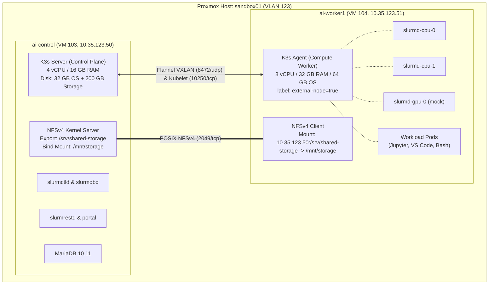
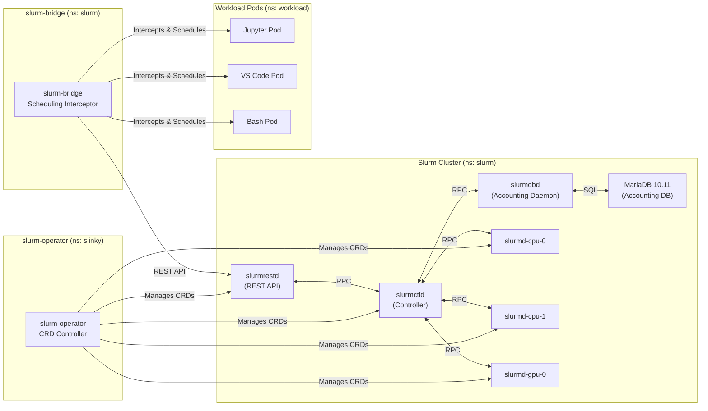
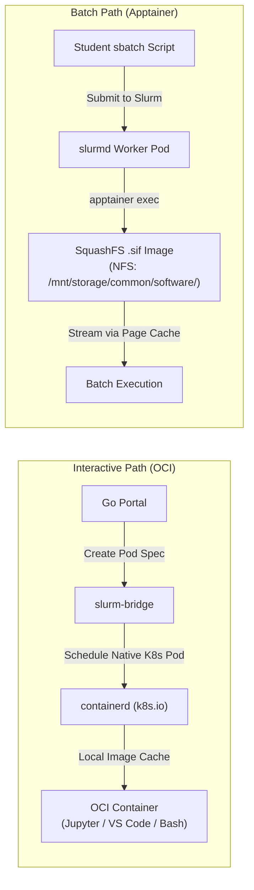
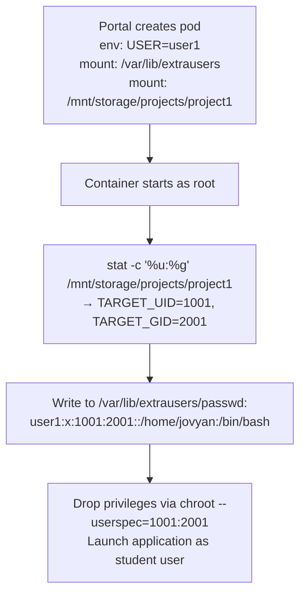
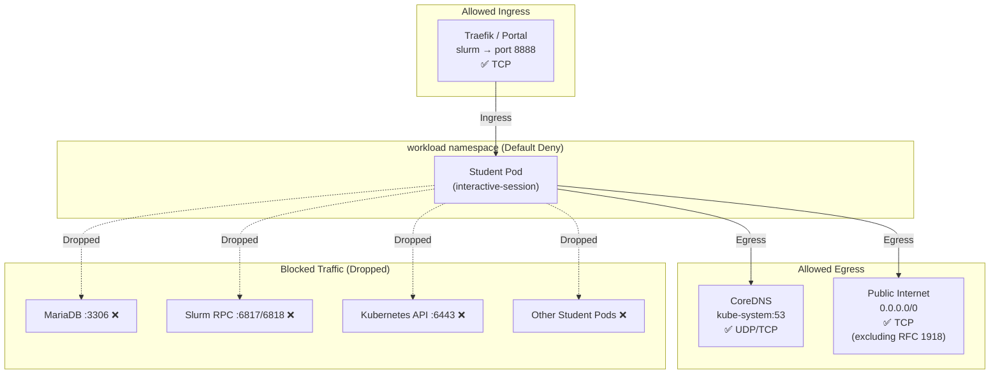

# AI Sandbox: Backend Deployment Report

**Document Status:** Milestone Implementation Report  
**Target Audience:** Department Head, Faculty Supervisors, and IT Staff — Computer Engineering Department

This document records the complete backend infrastructure deployment for the AI Sandbox platform. It covers all work completed across Work Packages WP3-1-4 through WP3-1-8: the Slinky orchestrator deployment, Slurm scheduling policy, container image pipeline, shared storage and dataset repository, and network security baseline. All configurations described in this report are fully deployed and verified.

---

## Table of Contents

- [1. Resource Summary & Configuration](#1-resource-summary--configuration)
  - [1.1 Cluster Topology](#11-cluster-topology)
  - [1.2 Kubernetes Volume Architecture](#12-kubernetes-volume-architecture)
  - [1.3 Namespace & Zone Model](#13-namespace--zone-model)
- [2. Slinky Deployment & Manual](#2-slinky-deployment--manual)
  - [2.1 Slinky Component Overview](#21-slinky-component-overview)
  - [2.2 Operator & CRD Bootstrap](#22-operator--crd-bootstrap)
  - [2.3 Deployment Pipeline](#23-deployment-pipeline)
  - [2.4 Slurm Bridge Configuration](#24-slurm-bridge-configuration)
  - [2.5 Accounting Database](#25-accounting-database)
  - [2.6 Disaster Recovery & State Isolation](#26-disaster-recovery--state-isolation)
- [3. Slurm Configuration](#3-slurm-configuration)
  - [3.1 Partition Design](#31-partition-design)
  - [3.2 Quality of Service (QoS) Policies](#32-quality-of-service-qos-policies)
  - [3.3 Fair-Share Scheduling](#33-fair-share-scheduling)
  - [3.4 Cgroup Enforcement](#34-cgroup-enforcement)
  - [3.5 User & Account Management](#35-user--account-management)
  - [3.6 Epilog Webhook Integration](#36-epilog-webhook-integration)
- [4. Container Configuration](#4-container-configuration)
  - [4.1 Dual-Path Execution Architecture](#41-dual-path-execution-architecture)
  - [4.2 Interactive OCI Images](#42-interactive-oci-images)
  - [4.3 Custom Slurm Daemon Images](#43-custom-slurm-daemon-images)
  - [4.4 Zero-Registry Image Distribution Architecture](#44-zero-registry-image-distribution-architecture)
  - [4.5 Batch Apptainer Pipeline](#45-batch-apptainer-pipeline)
  - [4.6 Dynamic User Identity Resolution](#46-dynamic-user-identity-resolution)
- [5. Dataset & Model Repository](#5-dataset--model-repository)
  - [5.1 Central Storage Hierarchy](#51-central-storage-hierarchy)
  - [5.2 Model Repository & Dual-Tier Caching](#52-model-repository--dual-tier-caching)
  - [5.3 Curated Dataset Library](#53-curated-dataset-library)
  - [5.4 Multi-Tenant Project Workspaces](#54-multi-tenant-project-workspaces)
  - [5.5 Ephemeral Scratch Space](#55-ephemeral-scratch-space)
  - [5.6 Container Environment Contract](#56-container-environment-contract)
  - [5.7 Storage Governance Tooling](#57-storage-governance-tooling)
- [6. Network Configuration](#6-network-configuration)
  - [6.1 Perimeter Defense & Host Firewall (UFW)](#61-perimeter-defense--host-firewall-ufw)
  - [6.2 Zero-Trust Network Baseline](#62-zero-trust-network-baseline)
  - [6.3 Network Policy Rules](#63-network-policy-rules)
  - [6.4 RBAC & Service Account Hardening](#64-rbac--service-account-hardening)
  - [6.5 Ingress TLS & Security Headers](#65-ingress-tls--security-headers)
  - [6.6 Traefik Dynamic Session Routing](#66-traefik-dynamic-session-routing)
  - [6.7 Automated Security Verification](#67-automated-security-verification)
- [7. Software Catalog & Application Manifests](#7-software-catalog--application-manifests)
- [8. Conclusion](#8-conclusion)

---

## 1. Resource Summary & Configuration

### 1.1 Cluster Topology

The backend is deployed on a two-node virtualized Kubernetes cluster running K3s (v1.36.4+k3s1) on the Computer Engineering Department's Proxmox VE hypervisor (`sandbox01`) across VLAN 123 (`10.35.123.0/24`). The deployment implements a strict separation between control-plane infrastructure and compute execution.



| Node | Role | vCPU / RAM | Host Storage | IP Address | Special Function & Components |
| :--- | :--- | :--- | :--- | :--- | :--- |
| `ai-control` (VM 103) | Control Plane | 4 vCPU / 16 GB | 32 GB OS (`/`)<br/>200 GB (`/srv/shared-storage`) | `10.35.123.50` | K3s Server, NFSv4 Server, Slinky Operator, `slurmctld`, `slurmdbd`, `slurmrestd`, `mariadb-0`, `hpc-portal` |
| `ai-worker1` (VM 104) | Compute Worker | 8 vCPU / 32 GB | 64 GB OS (`/`)<br/>NFS mount (`/mnt/storage`) | `10.35.123.51` | K3s Agent, Slurm NodeSets (`slurmd-cpu-[0-1]`, `slurmd-gpu-0`), Apptainer runtime, interactive workload pods |

The worker node `ai-worker1` carries the label `scheduler.slinky.slurm.net/external-node=true` and the annotation `scheduler.slinky.slurm.net/external-node-partitions=interactive,batch-cpu,batch-gpu,inference`, enabling `slurm-bridge` to schedule native Kubernetes pods onto it as Slurm-tracked workloads. Workload components are pinned using explicit `nodeSelector: kubernetes.io/hostname: ai-control` for control services and `kubernetes.io/hostname: ai-worker1` for compute NodeSets.

> **Native Virtualization Advantage:** Unlike containerized development environments (such as Kind) which require user-namespace workarounds (`KubeletInUserNamespace`) and inotify monkey-patching, the Proxmox VMs run native Ubuntu 24.04.5 LTS kernels with full cgroup v2 support, unconstrained kernel keys, and native systemd integration.

### 1.2 Kubernetes Volume Architecture

Persistent volumes provide strict isolation between Slurm controller state, shared multi-tenant student data, and workload session access:

| PersistentVolume | Capacity | Access Mode | Host Path | Claimed By | Mount Purpose |
| :--- | :--- | :--- | :--- | :--- | :--- |
| `slinky-storage-pv` | 200 Gi (underlying) / 20 Gi (claim) | `ReadWriteMany` | `/mnt/storage` | `slinky-storage-pvc` (ns: `slurm`) | Student workspaces, models, datasets, common software |
| `slurm-state-pv` | 5 Gi | `ReadWriteOnce` | `/mnt/slurm-state` | `slurm-state-pvc` (ns: `slurm`) | `slurmctld` controller checkpoints on `ai-control` (`/var/spool/slurmctld`) |
| `workload-storage-pv` | 200 Gi (underlying) / 20 Gi (claim) | `ReadWriteMany` | `/mnt/storage` | `slinky-storage-pvc` (ns: `workload`) | Interactive student session pod access to `/mnt/storage` |

> **Shared Storage Backing & Multi-Node RWX:** Shared storage is backed by a 200 GB dedicated virtual disk on `ai-control` mounted at `/srv/shared-storage` and bind-mounted to `/mnt/storage`. This directory is exported via `nfs-kernel-server` (NFSv4) strictly to `ai-worker1`, where it is mounted at `/mnt/storage`. Multi-node RWX read/write consistency was verified across both VMs using cross-node test pods (`k8s/test-rwx.yaml`).
>
> **Why state isolation matters:** The Slurm controller checkpoint directory (`/var/spool/slurmctld`) resides on a local `ReadWriteOnce` PV on `ai-control` separate from shared student storage. This ensures that student storage exhaustion on `/mnt/storage` can never starve scheduler checkpoint writes or trigger cluster-wide scheduling outages.

### 1.3 Namespace & Zone Model

The cluster is organized into two primary namespaces with distinct security zones:

| Namespace | Zone Label | Node Placement | Purpose | Key Pods |
| :--- | :--- | :--- | :--- | :--- |
| `slurm` | `sandbox.zone: control-plane` | `ai-control` (controller)<br/>`ai-worker1` (workers) | Scheduler control plane, portal, accounting database, and compute daemons | `slurm-controller-0`, `slurm-restapi-*`, `mariadb-0`, `hpc-portal`, `slurmd-cpu-[0-1]`, `slurmd-gpu-0` |
| `workload` | `sandbox.zone: workload` | `ai-worker1` | Dynamic student interactive sessions and bridge-managed pods | Transient Jupyter, VS Code, and Bash terminal pods |

This zone model forms the foundation for all network policies: the `control-plane` zone houses trusted infrastructure pinned to `ai-control`, while the `workload` zone houses untrusted student workloads executed on `ai-worker1` under strict zero-trust network isolation.

---

## 2. Slinky Deployment & Manual

### 2.1 Slinky Component Overview

The AI Sandbox uses SchedMD's **Slinky** (Apache 2.0, GA release November 2025) to run Slurm natively on Kubernetes. Slinky consists of two decoupled systems:



| Component | Role | Image | Namespace | Node Placement |
| :--- | :--- | :--- | :--- | :--- |
| **slurm-operator** | Kubernetes operator managing Slurm CRDs (Controller, NodeSet, RestAPI) | `ghcr.io/slinkyproject/slurm-operator` | `slinky` | `ai-control` |
| **slurmctld** | Slurm controller daemon — scheduling decisions, job queue management | `slurmctld-custom:latest` | `slurm` | `ai-control` |
| **slurmrestd** | Slurm REST API — HTTP interface for job submission | `slurmrestd-custom:latest` | `slurm` | `ai-control` |
| **slurmdbd** | Slurm accounting daemon — connects to MariaDB for fair-share and QoS tracking | Bundled in Helm chart | `slurm` | `ai-control` |
| **slurmd (CPU)** | Compute worker NodeSet for CPU partitions (2 replicas, StatefulSet, oversubscribed) | `slurmd-custom:latest` | `slurm` | `ai-worker1` |
| **slurmd (GPU)** | Compute worker NodeSet for GPU partitions (1 replica, StatefulSet, oversubscribed) | `slurmd-custom:latest` | `slurm` | `ai-worker1` |
| **slurm-bridge** | Kubernetes scheduling interceptor — translates Slurm allocations into native K8s pods | `ghcr.io/slinkyproject/slurm-bridge` | `slurm` | `ai-control` |

### 2.2 Operator & CRD Bootstrap

The Slinky deployment follows a strict sequential dependency chain:

1. **cert-manager** is installed first (`quay.io/jetstack/charts/cert-manager` with `--set crds.enabled=true`) in namespace `cert-manager`, as the Slinky operator's webhook system requires TLS certificates.
2. **slurm-operator-crds** Helm chart is installed (`ghcr.io/slinkyproject/charts/slurm-operator-crds`) in namespace `slinky`, registering the Custom Resource Definitions.
3. **slurm-operator** Helm chart is installed (`ghcr.io/slinkyproject/charts/slurm-operator` with `--wait`) in namespace `slinky`. The deployment blocks until the operator reaches `1/1 READY`.

### 2.3 Deployment Pipeline

The cluster deployment follows a validated, reproducible 14-stage runbook executed via the remote operations workflow (`ptunnel` over SSH):

| Stage | Action | Key Command / Manifest |
| :--- | :--- | :--- |
| 1 | Install cert-manager, CRDs, and operator | `helm install` (cert-manager, slurm-operator-crds, slurm-operator) |
| 2 | Create namespaces, storage PVs, and verify multi-node RWX | `kubectl apply -f k8s/namespaces.yaml, pv-pvc.yaml, test-rwx.yaml` |
| 3 | Side-load custom Slurm daemon images into K3s containerd | `scripts/transfer-images-proxmox.sh` / stream over SSH into `sudo k3s ctr -n k8s.io images import -` |
| 4 | Wait for operator readiness | `kubectl wait -n slinky --for=condition=available deployment/slurm-operator` |
| 5 | Deploy MariaDB accounting database pinned to `ai-control` | `kubectl apply -f k8s/mariadb.yaml` |
| 6 | Install Slurm cluster via Helm with Proxmox topology pinning | `helm install slurm oci://ghcr.io/slinkyproject/charts/slurm -f k8s/values.yaml` |
| 7 | Configure Slurm accounting (QoS, accounts, TRES limits) | `scripts/setup-accounting.sh` |
| 8 | Generate JWT token for bridge authentication | `scontrol token lifespan=unlimited` → Secret `slurm-bridge-token` |
| 9 | Deploy slurm-bridge pinned to `ai-control` | `helm install slurm-bridge -f k8s/slurm-bridge-values.yaml` |
| 10 | Register external worker node `ai-worker1` in Slurm | `kubectl label/annotate node ai-worker1`, `scontrol update PartitionName=interactive Nodes=ai-worker1,...` |
| 11 | Initialize storage hierarchy and seed test models & datasets | `init-storage.sh`, `seed-models.sh --test-mode`, `seed-datasets.sh --test-mode` |
| 12 | Deploy ephemeral scratch space cleanup CronJob | `kubectl apply -f k8s/clean-scratch-cronjob.yaml` |
| 13 | Generate Ingress TLS certificates & apply Zero-Trust NetworkPolicies | `generate-certs.sh`, `traefik-security-configmap.yaml`, `k8s/network-policies/` |
| 14 | Execute test suites & capture hypervisor baseline snapshot | `verify-storage.sh` (6/6 pass), `verify-security.sh` (7/7 pass) → Proxmox snapshot `backend` |

### 2.4 Slurm Bridge Configuration

The `slurm-bridge` connects Kubernetes pod scheduling to Slurm job accounting. When a pod is submitted to the `workload` namespace with `schedulerName: slurm-bridge-scheduler`, the bridge intercepts it, submits a real Slurm job via the REST API, and tracks the pod's lifecycle under a proper Slurm job ID.

| Parameter | Value |
| :--- | :--- |
| **Managed Namespace** | `workload` |
| **Slurm REST API Endpoint** | `http://slurm-restapi.slurm:6820` |
| **JWT Secret** | `slurm-bridge-token` (key: `auth-token`) |
| **Default Partition** | `interactive` |
| **Node Placement** | Pinned to `ai-control` via `nodeSelector: kubernetes.io/hostname: ai-control` |
| **Tolerations** | `slinky.slurm.net/managed-node:NoExecute` (all sub-components) |

The portal Go application injects Slinky-specific annotations into every interactive pod spec:

| Annotation | Purpose | Example Value |
| :--- | :--- | :--- |
| `slurmjob.slinky.slurm.net/job-name` | Human-readable job identifier | `jupyter-user1` |
| `slurmjob.slinky.slurm.net/partition` | Target Slurm partition | `interactive` |
| `slurmjob.slinky.slurm.net/account` | Student's Slurm account (project) | `project1` |
| `slurmjob.slinky.slurm.net/user-id` | Student's Slurm username | `user1` |

### 2.5 Accounting Database

Slurm accounting is backed by a MariaDB 10.11 StatefulSet providing persistent job history, fair-share usage tracking, and QoS enforcement.

| Parameter | Value |
| :--- | :--- |
| **Image** | `mariadb:10.11` |
| **Namespace** | `slurm` |
| **Database** | `slurm_acct_db` |
| **Service User** | `slurm` |
| **Service** | `mariadb.slurm.svc` (ClusterIP, port 3306) |
| **Node Selector** | `kubernetes.io/hostname: ai-control` |
| **Volume** | `emptyDir: {}` (ephemeral in development; production requires persistent storage) |
| **Readiness Probe** | `mysqladmin ping` (initial delay: 10s, period: 5s) |
| **Tolerations** | `slinky.slurm.net/managed-node:NoExecute` |

The `slurmdbd` daemon connects to MariaDB and communicates with `slurmctld` to enforce QoS limits and record job accounting data. The connection parameters are injected into the Slinky Helm values:

```yaml
accounting:
  enabled: true
  storageConfig:
    host: mariadb
    port: 3306
    database: slurm_acct_db
    username: slurm
    passwordKeyRef:
      name: mariadb-password
      key: password
```

### 2.6 Disaster Recovery & State Isolation

The AI Sandbox implements a two-tier disaster recovery and state isolation model:

1. **Kubernetes Storage Isolation:**
   - The `slurmctld` controller pod stores all scheduling state (job queue, node state, checkpoint data) on a dedicated `ReadWriteOnce` PV mounted at `/var/spool/slurmctld` on `ai-control`'s local filesystem.
   - **Pod crash/restart:** Kubernetes recreates the pod and reattaches the same PV. The controller reads its checkpoint file and resumes scheduling without job loss.
   - **Verified behavior:** Force-killing the `slurmctld` pod (`--force --grace-period=0`) during active job execution results in full state recovery — queued jobs resume and running jobs are tracked to completion.
   - **State isolation guarantee:** Because `/var/spool/slurmctld` (5 Gi, RWO) is on a separate volume from shared student storage `/mnt/storage` (200 Gi, RWX), storage exhaustion by student jobs cannot corrupt or starve scheduler state.

2. **Hypervisor Snapshot Checkpoints:**
   - Synchronized Proxmox VE snapshots are taken across **both VMs together** (`ai-control` and `ai-worker1`) with RAM **unchecked** for clean disk-level consistency.
   - The `ai-control` snapshot captures the underlying 200 GB storage disk (`/srv/shared-storage`), ensuring that rollbacks cleanly restore both cluster metadata and the shared filesystem simultaneously.
   - Verified snapshot milestones: `pre-k8s` (base OS), `k8s-ready` (K3s joined), `core-infra-ready` (storage & DB), `slurm-deployed` (Slinky running), and `backend` (all tests verified).

---

## 3. Slurm Configuration

### 3.1 Partition Design

The cluster is divided into four scheduling partitions, each with enforced resource ceilings and priority tiers:

| Partition | NodeSets / Nodes | Default | Max Duration | PreemptMode | Priority Tier | MaxTRESPerJob | Associated QoS |
| :--- | :--- | :--- | :--- | :--- | :--- | :--- | :--- |
| `interactive` | `slurmd-cpu-[0-1]`, `slurmd-gpu-0`, `ai-worker1` | YES | 2 Hours | OFF | 2 (High) | `cpu=4, mem=16G, gres/gpu=1` | `interactive_qos` |
| `batch-cpu` | `slurmd-cpu-[0-1]`, `ai-worker1` | NO | 24 Hours | OFF | 1 (Medium) | `cpu=16, mem=64G` | `batch_cpu_qos` |
| `batch-gpu` | `slurmd-cpu-[0-1]`, `slurmd-gpu-0`, `ai-worker1` | NO | 7 Days | OFF | 1 (Medium) | `cpu=16, mem=64G, gres/gpu=1` | `batch_gpu_qos` |
| `inference` | `slurmd-gpu-0`, `ai-worker1` | NO | 12 Hours | OFF | 3 (Highest) | `cpu=4, mem=32G, gres/gpu=1` | `inference_qos` |

> **Topology Scheduling & Memory Allocation:** Because compute workers run together on the 8-core `ai-worker1` VM, the Slinky configuration enables `oversubscribeNode: true` across all compute NodeSets. Furthermore, the controller specifies `DefMemPerCPU=2048` (2 GB per requested CPU core) in `extraConf`, guaranteeing predictable memory sizing when jobs request CPU cores without explicit memory specifications.
>
> **Why preemption is universally disabled (`PreemptMode=OFF`):** In a classroom environment, killing an active Jupyter session destroys all in-memory state — loaded datasets, model weights, and training progress. Instead of preemption, resource contention is managed exclusively through `MaxTRESPerJob` fencing, which prevents any single job from consuming resources beyond its partition ceiling.

### 3.2 Quality of Service (QoS) Policies

Each partition has an associated QoS that enforces hard resource ceilings and scheduling priority. These are configured via `scripts/setup-accounting.sh`:

| QoS Name | MaxTRESPerJob | Priority Weight | Partition |
| :--- | :--- | :--- | :--- |
| `interactive_qos` | `cpu=4, mem=16G` | 200 | `interactive` |
| `batch_cpu_qos` | `cpu=16, mem=64G` | 100 | `batch-cpu` |
| `batch_gpu_qos` | `cpu=16, mem=64G` | 100 | `batch-gpu` |
| `inference_qos` | `mem=32G` | 300 | `inference` |

**Verified enforcement:** A job requesting 8 CPUs on the `interactive` partition (limit: 4 CPUs) is rejected and held in `PENDING` state with reason `QOSMaxCpuPerJobLimit`. A job requesting 2 CPUs on the same partition is immediately scheduled.

### 3.3 Fair-Share Scheduling

The scheduler uses Slurm's native multifactor priority algorithm to dynamically balance resource allocation across students:

| Parameter | Value | Effect |
| :--- | :--- | :--- |
| `PriorityType` | `priority/multifactor` | Enables multi-factor priority calculation |
| `PriorityWeightFairshare` | `10000` | Fair-share is the dominant factor in job priority |
| `AccountingStorageEnforce` | `limits,qos` | Rejects jobs that exceed QoS or account limits |

**How fair-share works in practice:** Students who have consumed more than their proportional share of cluster resources see their job priority automatically reduced. Students who have been waiting or have consumed fewer resources get priority boosts. This eliminates the need for manual administrator intervention to balance resource usage across a class of 50–100 students.

### 3.4 Cgroup Enforcement

Resource limits are enforced at the Linux kernel level via cgroup v2 configuration on all Slurm compute workers:

```ini
CgroupPlugin=cgroup/v2
IgnoreSystemd=yes
ConstrainCores=yes
ConstrainRAMSpace=yes
ConstrainDevices=yes
ConstrainSwapSpace=yes
```

This ensures that a student's batch job cannot escape its Slurm-assigned CPU or memory limits, even if the container runtime's own limits are misconfigured.

### 3.5 User & Account Management

Student identity is managed through a centralized NSS (Name Service Switch) system rather than traditional LDAP or local `/etc/passwd` files:

- **Static user database:** Files (`passwd`, `group`, `shadow`) are stored at `/mnt/storage/common/etc/` and mounted read-only into all Slurm daemons via the `extrausers` NSS module.
- **Slurm accounting account:** A single default account `default_acct` (`Organization="AI Sandbox"`) is created. All users are assigned to this account.
- **Administrative users:** `root` and `slurm` are granted `adminlevel=Admin` with access to all QoS policies (`normal`, `interactive_qos`, `batch_cpu_qos`, `batch_gpu_qos`, `inference_qos`).
- **Demo user seeding:** `scripts/seed-demo-users.sh` provisions test users (`user1`–`user4`) with UIDs 1001–1004, assigns them to project groups (`project1`, `project2`, `project3`), and synchronizes the NSS files.

### 3.6 Epilog Webhook Integration

A Slurm epilog script (`01-webhook.sh`) executes at the completion of every job and sends a POST request with job metadata to the portal for real-time status updates:

```json
{
  "job_id": "$SLURM_JOB_ID",
  "user": "$SLURM_JOB_USER",
  "account": "$SLURM_JOB_ACCOUNT",
  "partition": "$SLURM_JOB_PARTITION",
  "nodelist": "$SLURM_JOB_NODELIST"
}
```

The webhook delivers status events directly to the portal service (`hpc-portal.slurm.svc.cluster.local:8080`) and fallback endpoints (`localhost:8080`, `10.35.123.50:8080`) with a 5-second timeout, ensuring fast and reliable job state synchronization across both cluster networking and local administration.

---

## 4. Container Configuration

### 4.1 Dual-Path Execution Architecture

The AI Sandbox implements a dual-path container execution model, reflecting the fundamentally different requirements of interactive and batch workloads:



| Path | Image Format | Delivery Method | Execution Runtime | Use Case |
| :--- | :--- | :--- | :--- | :--- |
| **Interactive** | OCI (Docker) | Pre-loaded in K3s containerd (`k8s.io` namespace) via authenticated SSH stream | Native Kubernetes pod via `slurm-bridge` on `ai-worker1` | Jupyter, VS Code, Bash terminal sessions |
| **Batch** | Apptainer SquashFS `.sif` | Direct NFSv4 streaming into Linux kernel page cache | `apptainer exec` inside `slurmd` worker pod on `ai-worker1` | Training scripts, data preprocessing |

**Why DaemonSet pre-pullers were rejected:** Direct containerd injection provides sub-second instantiation without polling external registries. A DaemonSet pre-puller would add unnecessary complexity, waste memory on nodes that never run interactive sessions, and create garbage collection conflicts.

### 4.2 Interactive OCI Images

Three curated interactive images are built and side-loaded into containerd on `ai-worker1`:

| Image | Base Image | Local Tag | Port | Key Packages |
| :--- | :--- | :--- | :--- | :--- |
| **JupyterLab** | `jupyter/scipy-notebook:latest` | `localhost:5000/interactive-jupyter:latest` | 8888 | NumPy, SciPy, Pandas, Matplotlib, scikit-learn, PyTorch, `libnss-extrausers` |
| **VS Code Server** | `codercom/code-server:latest` | `localhost:5000/interactive-codeserver:latest` | 8888 | VS Code web server, `libnss-extrausers` |
| **Web Terminal** | `public.ecr.aws/ubuntu/ubuntu:24.04` | `localhost:5000/interactive-bash:latest` | 8888 | `ttyd`, `build-essential`, `curl`, `git`, `htop`, `jq`, `vim`, `wget`, `libnss-extrausers` |

All three images share a common architecture pattern:
1. Install `libnss-extrausers` and configure `/etc/nsswitch.conf` (`passwd: files extrausers`, `group: files extrausers`).
2. Create mount point `/var/lib/extrausers` for the shared NSS database.
3. Include a startup script that dynamically resolves the student's UID/GID and drops root privileges before launching the application.

The images are built by `scripts/build-oci-images.sh` and imported directly into K3s containerd on `ai-worker1`.

### 4.3 Custom Slurm Daemon Images

The standard Slinky Slurm images are extended with custom builds to support the `extrausers` NSS module and Apptainer batch execution:

| Image | Base | Additions | Target Node |
| :--- | :--- | :--- | :--- |
| `slurmctld-custom:latest` | `ghcr.io/slinkyproject/slurmctld:25.11-ubuntu24.04` | `libnss-extrausers`, NSS configuration | `ai-control` |
| `slurmrestd-custom:latest` | `ghcr.io/slinkyproject/slurmrestd:25.11-ubuntu24.04` | `libnss-extrausers`, NSS configuration | `ai-control` |
| `slurmd-custom:latest` | `ghcr.io/slinkyproject/slurmd:25.11-ubuntu24.04` | `libnss-extrausers`, NSS configuration, `curl`, `wget`, Apptainer v1.3.6 + `apptainer-suid` v1.3.6 | `ai-worker1` |

These images are built by `scripts/build-custom-images.sh` and side-loaded onto the respective Proxmox nodes using `scripts/transfer-images-proxmox.sh`.

**Worker pod security context:** The `slurmd` worker pods run with `privileged: false` but are granted specific Linux capabilities (`SYS_ADMIN`, `DAC_OVERRIDE`, `DAC_READ_SEARCH`) required for Apptainer's container-in-container execution with proot.

### 4.4 Zero-Registry Image Distribution Architecture

In the Proxmox production-grade environment, running an unauthenticated Docker distribution registry pod (`registry:2`) on a shared departmental VLAN (VLAN 123) poses security and resource overhead risks. Instead, the AI Sandbox adopts a **Zero-Registry, Direct Containerd Side-Load Architecture**:

1. **Pipeline Script (`scripts/transfer-images-proxmox.sh`):** Streams container images directly from the local operator Docker daemon over authenticated SSH into K3s containerd:
   ```bash
   docker save <image> | ssh "$SSH_USER@$TARGET_IP" "sudo k3s ctr -n k8s.io images import -"
   ```
2. **Selective Node Distribution:**
   - **`ai-control` (10.35.123.50):** Receives `slurmctld-custom:latest`, `slurmrestd-custom:latest`, and `hpc-portal:local`.
   - **`ai-worker1` (10.35.123.51):** Receives `slurmd-custom:latest` and interactive workload session images.
3. **Operational Benefits:** Pods resolve images instantly from the local containerd cache with zero pull latency, zero network traffic during pod startup, zero storage footprint for registry blob caches, and complete isolation from other tenants on VLAN 123.

### 4.5 Batch Apptainer Pipeline

Batch workloads use Apptainer SquashFS images stored on shared NFS:

- **Image location:** `/mnt/storage/common/software/` (e.g., `python.sif` at 60.7 MB, `jupyterlab.sif` at 283 MB).
- **Permission enforcement:** Directory ownership is `root:root` with `755` on directories and `644` on `.sif` files. Unprivileged users (e.g., UID 1001) cannot modify or delete shared software images.
- **Execution model:** Students submit `sbatch` scripts that invoke `apptainer exec /mnt/storage/common/software/python.sif python3 script.py`. The SquashFS image is streamed directly from NFS into the Linux kernel page cache — no local disk staging is required.
- **Apptainer configuration:** Rootless execution is enabled via `proot` (`allow setuid = no` in `apptainer.conf`), avoiding the need for `--privileged` security context on worker pods.

### 4.6 Dynamic User Identity Resolution

All interactive images implement a dynamic user mapping system using `libnss-extrausers`. This avoids the need to bake student accounts into container images:



**How it works:**
1. The portal starts the pod as `root` with the environment variable `USER` set to the student's username.
2. The startup script inspects the ownership of the student's workspace directory (`/mnt/storage/projects/project1`) using `stat` to determine the correct UID and GID.
3. A dynamic entry is written to `/var/lib/extrausers/passwd` and `/var/lib/extrausers/group`.
4. The process drops root privileges using `chroot --userspec=TARGET_UID:TARGET_GID` and launches the application (Jupyter, VS Code, or ttyd) as the student user.

This ensures that all file operations inside the container happen under the student's real UID, and POSIX permissions on NFS are correctly enforced.

---

## 5. Dataset & Model Repository

### 5.1 Central Storage Hierarchy

All shared data resides under `/mnt/storage/` (backed by the dedicated 200 GB virtual disk on `ai-control` mounted at `/srv/shared-storage` and exported to `ai-worker1` via NFSv4), organized into a strict directory hierarchy with POSIX permission enforcement:

```
/mnt/storage/
├── common/                         root:root  755
│   ├── etc/                        root:root  755    (NSS passwd/group/shadow)
│   └── software/                   root:root  755    (Apptainer .sif + manifests)
├── models/                         root:root  755
│   ├── huggingface/hub/            root:root  755    (Central model cache)
│   ├── torch/checkpoints/          root:root  755    (PyTorch pretrained weights)
│   └── ollama/manifests/           root:root  755    (Ollama model descriptors)
├── datasets/                       root:root  755
│   ├── kaggle/competitions/        root:root  755    (Kaggle competition data)
│   ├── vision/                     root:root  755    (MNIST, CIFAR-10)
│   └── nlp/                        root:root  755    (IMDb, SQuAD)
├── projects/                       root:root  755
│   ├── project1/                   1001:1001  700    (Private workspace)
│   ├── project2/                   1002:1002  700    (Private workspace)
│   └── project3/                   1004:1004  700    (Private workspace)
├── scratch/                        root:root  1777   (Ephemeral temp space)
└── registry/                       root:root  755    (OCI registry blobs)
```

### 5.2 Model Repository & Dual-Tier Caching

The model repository uses a dual-tier caching strategy to eliminate redundant downloads of multi-gigabyte model weights:

| Tier | Path | Owner | Permissions | Purpose |
| :--- | :--- | :--- | :--- | :--- |
| **Central (Read-Only)** | `/mnt/storage/models/huggingface/hub/` | `root:root` | `755` (dirs), `644` (files) | Pre-loaded shared models — all students read from here |
| **Private (Read-Write)** | `/mnt/storage/projects/<project>/.cache/huggingface/` | `<uid>:<uid>` | `700` | Student-specific model downloads (fallback when model not in central cache) |

**Pre-loaded model inventory:**

| Model | Location | Purpose | Size |
| :--- | :--- | :--- | :--- |
| `BAAI/bge-small-en-v1.5` | `models/huggingface/hub/models--BAAI--bge-small-en-v1.5/` | Embedding model for RAG applications | ~130 MB |
| `Qwen/Qwen2.5-0.5B-Instruct` | `models/huggingface/hub/models--Qwen--Qwen2.5-0.5B-Instruct/` | Lightweight instruction-following LLM | ~1 GB |
| `resnet18` | `models/torch/checkpoints/resnet18-f37072fd.pth` | PyTorch image classification baseline | ~45 MB |
| `qwen2.5-0.5b` | `models/ollama/manifests/qwen2.5-0.5b.json` | Ollama-format model descriptor | Manifest only |

**How it works:** The container environment contract sets `HF_HUB_CACHE` to the central read-only path. When a student calls `AutoModel.from_pretrained("BAAI/bge-small-en-v1.5")`, the HuggingFace library finds the cached model immediately — no download occurs. If a model is not in the central cache, the library falls back to `HF_HOME` (the student's private workspace) and downloads it there, consuming only that student's storage quota.

### 5.3 Curated Dataset Library

Pre-loaded datasets are stored in `/mnt/storage/datasets/` and are read-only for all students:

| Dataset | Path | Domain | Contents |
| :--- | :--- | :--- | :--- |
| **MNIST** | `datasets/vision/mnist/` | Computer Vision | Handwritten digit images, `dataset_info.json` |
| **CIFAR-10** | `datasets/vision/cifar10/` | Computer Vision | 10-class image classification, `dataset_info.json` |
| **IMDb** | `datasets/nlp/imdb/` | NLP | Sentiment analysis, `train.csv` |
| **SQuAD v2.0** | `datasets/nlp/squad/` | NLP | Reading comprehension QA, `train-v2.0.sample.json` |
| **Titanic** | `datasets/kaggle/competitions/titanic/` | Tabular ML | `train.csv`, `test.csv` |

**Kaggle credential isolation:** Each student's Kaggle API key (`kaggle.json`) is stored in their private workspace at `/mnt/storage/projects/<project>/.kaggle/kaggle.json` with permissions `600`. The `KAGGLE_CONFIG_DIR` environment variable points to this private path, ensuring one student cannot access another student's Kaggle credentials.

### 5.4 Multi-Tenant Project Workspaces

Each project gets an isolated private directory under `/mnt/storage/projects/`:

| Directory | Owner | Permissions | Members | Home Directory |
| :--- | :--- | :--- | :--- | :--- |
| `projects/project1/` | `1001:1001` | `drwx------` (700) | `user1` (1001), `user2` (1002) | `/mnt/storage/projects/project1` |
| `projects/project2/` | `1002:1002` | `drwx------` (700) | `user3` (1003) | `/mnt/storage/projects/project2` |
| `projects/project3/` | `1004:1004` | `drwx------` (700) | `user4` (1004) | `/mnt/storage/projects/project3` |

The `700` permission mask ensures that only the owning user (or group members via supplementary groups) can access the directory contents. This is enforced at the Linux kernel level — no application-layer access control is needed.

### 5.5 Ephemeral Scratch Space

The directory `/mnt/storage/scratch/` provides temporary shared storage for intermediate computation results:

| Property | Value |
| :--- | :--- |
| **Permissions** | `1777` (sticky bit) |
| **Behavior** | Any student can create files; no student can delete another student's files |
| **Cleanup Policy** | Files older than 7 days are automatically purged |
| **Cleanup Mechanism** | Kubernetes CronJob `clean-scratch` running daily at `02:00 UTC` in namespace `slurm` |
| **Cleanup Command** | `find /mnt/storage/scratch -type f -mtime +7 -delete` |
| **CronJob Image** | `alpine:latest` |

### 5.6 Container Environment Contract

The portal injects a standard set of environment variables into every interactive pod and batch job, ensuring consistent behavior regardless of which container image is used:

| Variable | Value | Purpose |
| :--- | :--- | :--- |
| `HF_HUB_CACHE` | `/mnt/storage/models/huggingface/hub` | Central read-only model cache (prevents redundant downloads) |
| `HF_HOME` | `/mnt/storage/projects/<project>/.cache/huggingface` | Private model fallback directory |
| `TORCH_HOME` | `/mnt/storage/models/torch` | Central PyTorch model cache |
| `TRANSFORMERS_OFFLINE` | `1` (when using central models) | Forces HuggingFace to use cached models without network requests |
| `KAGGLE_CONFIG_DIR` | `/mnt/storage/projects/<project>/.kaggle` | Private Kaggle credential directory |
| `KAGGLEHUB_CACHE` | `/mnt/storage/datasets/kaggle` | Central Kaggle dataset cache |
| `TMPDIR` | `/mnt/storage/scratch/<username>` | Per-user temporary directory in shared scratch space |

### 5.7 Storage Governance Tooling

Two operational scripts provide ongoing storage management:

| Script | Purpose | Key Features |
| :--- | :--- | :--- |
| `scripts/audit-storage.sh` | Storage auditing and quota reporting | Per-project disk usage calculation, Slurm association mapping, duplicate dataset detection across projects |
| `scripts/init-storage.sh` | Idempotent hierarchy initialization | Creates the full directory tree with correct ownership and permissions; safe to re-run without data loss |

**Quota model:** Storage accounting uses a pro-rata formula where each user's quota share equals the sum of their project budget fractions: Quota(u) = Σ Budget(p) / N_members(p) ≤ 50 GB. Membership is dynamically tracked via Slurm `sacctmgr show association`.

---

## 6. Network Configuration

### 6.1 Perimeter Defense & Host Firewall (UFW)

Because the cluster resides on a shared university VLAN (VLAN 123, subnet `10.35.123.0/24`) alongside VMs from other research groups, each node enforces perimeter network security at the Linux OS level using Uncomplicated Firewall (UFW):

| Host | Port / Protocol | Source | Purpose |
| :--- | :--- | :--- | :--- |
| **`ai-control`** (`10.35.123.50`) | `22/tcp` | Anywhere | Operator SSH administration |
| | `6443/tcp` | `10.35.123.51` | K3s agent cluster join & API communication |
| | `10250/tcp` | `10.35.123.51` | Kubelet node metrics & exec streaming |
| | `8472/udp` | `10.35.123.51` | Flannel VXLAN overlay traffic |
| | `2049/tcp` | `10.35.123.51` | POSIX NFSv4 shared storage export |
| | Any | `10.42.0.0/16`, `10.43.0.0/16` | K3s internal Pod and Service CIDRs |
| **`ai-worker1`** (`10.35.123.51`) | `22/tcp` | Anywhere | Operator SSH administration |
| | `10250/tcp` | `10.35.123.50` | Kubelet communication from control plane |
| | `8472/udp` | `10.35.123.50` | Flannel VXLAN overlay traffic |
| | Any | `10.42.0.0/16`, `10.43.0.0/16` | K3s internal Pod and Service CIDRs |

> **Administrative Ingress via SSH Tunnel:** To prevent untrusted LAN discovery and brute-force probing on VLAN 123, the Kubernetes API (`6443/tcp`) is not exposed to the wider subnet. Remote cluster operations are proxied securely via SSH local port-forwarding (`ptunnel` on `localhost:6443`) managed by the Nix devshell.

### 6.2 Zero-Trust Network Baseline

Inside Kubernetes, the K3s embedded NetworkPolicy controller enforces a zero-trust network model where **all traffic in the `workload` namespace is denied by default** and only strictly whitelisted flows are permitted:



### 6.3 Network Policy Rules

Five Kubernetes NetworkPolicy manifests in `k8s/network-policies/` implement the zero-trust model:

| Policy | Scope | Direction | Target | Ports | Effect |
| :--- | :--- | :--- | :--- | :--- | :--- |
| `default-deny-workload` | All pods in `workload` | Ingress + Egress | — | — | **Drop all traffic** by default |
| `allow-dns-egress` | All pods in `workload` | Egress | `kube-system` (selector: `k8s-app: kube-dns`) | UDP/TCP 53 | Allow DNS resolution |
| `allow-traefik-ingress` | Pods with label `interactive-session` | Ingress | From `slurm` namespace (selector: `app: hpc-portal`) | TCP 8888 | Allow portal to reach student sessions |
| `allow-registry-egress` | All pods in `workload` | Egress | `slurm` namespace (selector: `app: registry`) | TCP 5000 | Allow image pulls if registry fallback is used |
| `allow-internet-egress` | All pods in `workload` | Egress | `0.0.0.0/0` excluding `10.0.0.0/8`, `172.16.0.0/12`, `192.168.0.0/16` | All | Allow public downloads; **block all private RFC 1918 subnets** |

> **Why RFC 1918 filtering is critical:** By allowing egress to `0.0.0.0/0` while explicitly filtering out RFC 1918 subnets, students can freely install packages (`pip install`), clone code (`git clone`), and pull open datasets, while being strictly isolated from cluster internals (MariaDB 3306, Slurm RPCs 6817/6818, Kubernetes API server, or adjacent tenant workloads).

### 6.4 RBAC & Service Account Hardening

The portal's service account (`portal-sa`) adheres to strict least-privilege principles:

**Scoped permissions (namespace-level Roles, not ClusterRoles):**

| Role | Namespace | Resources | Verbs |
| :--- | :--- | :--- | :--- |
| `portal-workload-role` | `workload` | `pods`, `services` | `create`, `get`, `list`, `watch`, `delete` |
| `portal-workload-role` | `workload` | `ingresses` | `create`, `get`, `list`, `watch`, `delete` |
| `portal-workload-role` | `workload` | `endpoints`, `endpointslices` | `get`, `list`, `watch` |
| `traefik-slurm-role` | `slurm` | `services`, `endpoints`, `endpointslices`, `ingresses` | `get`, `list`, `watch` |

**Explicitly denied:** No `ClusterRole` or `ClusterRoleBinding` exists. The portal cannot read `nodes`, `secrets`, or cluster-wide resources.

**Student pod hardening:** All student interactive session pods are provisioned with `automountServiceAccountToken: false`. This ensures the Kubernetes API service account token is omitted from `/var/run/secrets/kubernetes.io/serviceaccount/token`, preventing authenticated API tampering from within student sessions.

### 6.5 Ingress TLS & Security Headers

All student web traffic enters through Traefik v3.1 running as a sidecar container in the `hpc-portal` pod on `ai-control`:

| EntryPoint | Port | Behavior |
| :--- | :--- | :--- |
| `web` | 80 | Unconditional redirect to `websecure` (HTTPS) |
| `websecure` | 443 | TLS termination with self-signed certificate |

**TLS Certificate:** Generated via `scripts/generate-certs.sh` — a 2048-bit RSA key with a self-signed certificate valid for 365 days, covering SANs: `localhost`, `127.0.0.1`, `portal`, `portal.slurm.svc.cluster.local`, and `*.sandbox.local`. Stored in Secret `traefik-tls-cert`.

**Security headers middleware (`security-headers`):**

| Header | Value | Purpose |
| :--- | :--- | :--- |
| `X-Content-Type-Options` | `nosniff` | Prevents MIME-type sniffing attacks |
| `X-XSS-Protection` | `1; mode=block` | Enables browser XSS filtering |
| `X-Frame-Options` | `SAMEORIGIN` | Prevents clickjacking via iframes |

### 6.6 Traefik Dynamic Session Routing

The portal dynamically generates routing rules for each active interactive session. Routes are written to `/etc/traefik/dynamic/dynamic-routes.yml` and monitored via Traefik's file provider (`watch: true`):

```yaml
# Example: user2's Jupyter session (Slurm Job ID 16)
http:
  routers:
    jupyter-job-16:
      rule: "PathPrefix('/user2/jupyter/16')"
      service: jupyter-service-16
      entryPoints: ["websecure"]
      middlewares: ["strip-user2-jupyter-16"]
  middlewares:
    strip-user2-jupyter-16:
      stripPrefix:
        prefixes: ["/user2/jupyter/16"]
  services:
    jupyter-service-16:
      loadBalancer:
        servers:
          - url: "http://10.42.1.25:8888"
```

The `stripPrefix` middleware strips the routing prefix so the application inside the pod receives clean requests at its root `/` path. On Proxmox VMs, file events are handled directly by the native Linux kernel inotify subsystem without container namespace masking.

### 6.7 Automated Security Verification

An automated test suite (`scripts/verify-security.sh`), adapted specifically for the Proxmox K3s backend, validates the cluster security posture across seven phases:

| Phase | Test | Expected Result | Status |
| :--- | :--- | :--- | :--- |
| **1. RBAC Confinement** | `portal-sa` attempts to list cluster nodes | Rejected (`Forbidden`) | 🟢 PASS |
| **1. RBAC Confinement** | `portal-sa` attempts to list secrets in `slurm` | Rejected (`Forbidden`) | 🟢 PASS |
| **1. Token Absence** | Check for ServiceAccount token in workload pod | File does not exist | 🟢 PASS |
| **2. DB Isolation** | TCP probe from `workload` → `mariadb.slurm:3306` | Connection drops / times out | 🟢 PASS |
| **3. Peer Isolation** | TCP probe between `tenant-a` → `tenant-b` on port 8888 | Connection drops / times out | 🟢 PASS |
| **4. TLS Redirect** | HTTP request to port 80 | `301`/`307`/`308` redirect to HTTPS | 🟢 PASS |
| **4. TLS & Headers** | HTTPS request to port 443 | Valid TLS handshake + security headers present | 🟢 PASS |

*Note: Workload probe pods include annotation `slurmjob.slinky.slurm.net/exclusive: "false"`, ensuring that multi-tenant security verification tests execute smoothly without exclusive node lock conflicts.*

---

## 7. Software Catalog & Application Manifests

The software catalog at `/mnt/storage/common/software/` defines the interactive environments available to students:

| Application | Manifest ID | Image | Slurm Resources | Port |
| :--- | :--- | :--- | :--- | :--- |
| **JupyterLab** | `jupyterlab` | `localhost:5000/interactive-jupyter:latest` | 1 node, 1 task, 2 CPU, 2G RAM | 8888 |
| **VS Code Server** | `codeserver` | `localhost:5000/interactive-codeserver:latest` | 1 node, 1 task, 2 CPU, 2G RAM | 8888 |
| **Web Terminal** | `bash` | `localhost:5000/interactive-bash:latest` | 1 node, 1 task, 1 CPU, 1G RAM | 8888 |

Each application has a `manifest.yaml` specifying its container image, startup command, and Slurm resource allocations (`--nodes`, `--ntasks`, `--cpus-per-task`, `--mem`). Images are pre-loaded in containerd on `ai-worker1`, ensuring instantaneous startup upon job allocation.

---

## 8. Conclusion

The backend deployment across Work Packages WP3-1-4 through WP3-1-8 is fully established, operational, and verified on the Computer Engineering Department's Proxmox VE cluster (`sandbox01`):

1. **Slinky as the Unified Orchestrator** — Slurm-on-Kubernetes runs with automated bootstrap, MariaDB accounting, and disaster recovery. Control plane daemons (`slurmctld`, `slurmrestd`, `slurmdbd`) are cleanly pinned to `ai-control`, while compute workers (`slurmd-cpu`, `slurmd-gpu`) run on `ai-worker1`.
2. **Four-Partition Scheduling with Hard Resource Fencing** — The `interactive`, `batch-cpu`, `batch-gpu`, and `inference` partitions enforce strict per-job resource ceilings via `MaxTRESPerJob` and QoS policies, supported by `oversubscribeNode: true` and `DefMemPerCPU=2048`. Fair-share scheduling (`PriorityWeightFairshare=10000`) dynamically balances usage across student projects.
3. **Dual-Path Container Architecture with Zero-Registry Delivery** — Interactive sessions run as OCI containers side-loaded directly into K3s containerd via authenticated SSH stream, while batch workloads stream Apptainer `.sif` images directly from NFS into Linux kernel page cache. The `libnss-extrausers` NSS module ensures seamless POSIX identity resolution.
4. **Structured Multi-Tenant Storage with Dual-Tier Caching** — Central read-only caches (`HF_HUB_CACHE`, curated datasets) eliminate duplicate model downloads, while private student workspaces (`projects/<project>`) and sticky-bit scratch space (`1777`) enforce POSIX data separation across the 200 GB NFSv4 filesystem.
5. **Defense-in-Depth Network Security** — UFW host-level firewalling on VLAN 123, zero-trust default-deny NetworkPolicies with RFC 1918 egress blocking, namespace-scoped RBAC, disabled ServiceAccount token mounting, and Traefik TLS termination safeguard cluster infrastructure against untrusted student code.

All configurations have been verified on the target Proxmox environment via automated test suites (`verify-storage.sh` passing 6/6 tests and `verify-security.sh` passing 7/7 tests) and are locked into clean hypervisor snapshot checkpoints (`backend` / `m2-complete`).
