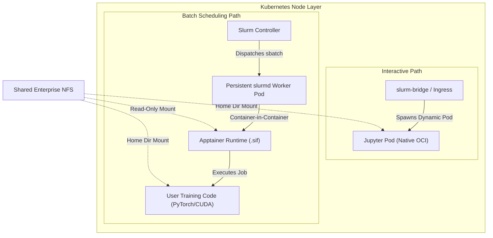
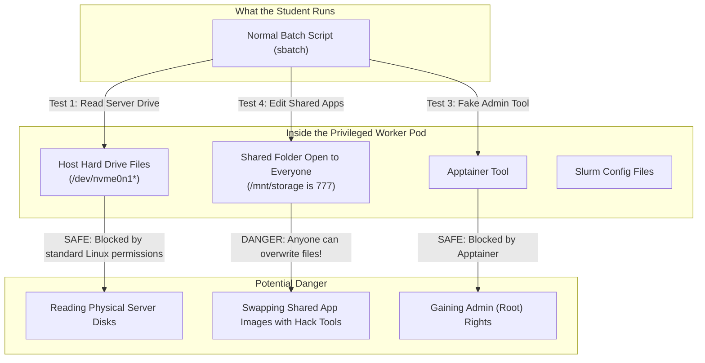

# Batch Job Imaging & Container Runtime Trade-Off Analysis

> **Document Status:** Architectural Decision Record (ADR) & Technical Reference  
> **Related Documents:**  
> - [Tech Stack Decisions](./TECH_STACK_DECISION.md)  
> - [System Assessment & Planning Report](./SYSTEM_ASSESSMENT_AND_PLANNING_REPORT.md)  
> - [Environment Assessment](./ENVIRONMENT_ASSESSMENT.md)

---

## 1. Executive Summary & Context

The AI Sandbox operates on a hybrid **Slurm-on-Kubernetes (Slinky)** platform designed to support multi-tenant student AI workloads on NVIDIA L40 GPU hardware. Workloads on the platform fall into two distinct lifecycle profiles:

1. **Interactive Workloads:** Web-based, short-to-medium duration sessions (JupyterLab, VS Code Server) requiring dynamic ingress routing, sub-5-second startup times, and instant resource reclamation.
2. **Batch Workloads:** Headless, asynchronous, long-running computational scripts (deep learning model training, hyperparameter tuning, batch dataset generation) submitted via Slurm (`sbatch`).

In standard Kubernetes, workloads are scheduled by spawning dynamic OCI pods on demand. In Slurm-on-Kubernetes, however, batch jobs are scheduled into a set of **pre-existing, persistent `slurmd` worker daemon pods**. 

This document details the architectural dilemma of running heterogeneous user environments inside static worker pods and provides a formal trade-off analysis justifying our decision to adopt the **Dual-Path Strategy (OCI for Interactive + Privileged Apptainer for Batch)**.

---

## 2. The Core Architectural Dilemma



### The Slinky Constraint
In traditional bare-metal Slurm, the host OS kernel and filesystem are immutable, and users can load environment modules or invoke Singularity/Apptainer containers natively. 

In Slinky:
- The worker node is already a **container (Kubernetes Pod)** running the `slurmd` daemon.
- A user submitting an `sbatch` job runs bash commands inside that existing container.
- We cannot dynamically alter or replace the outer Kubernetes Pod container definition per batch job without breaking Slurm's job queueing and scheduler guarantees.
- We must provide students with full isolation (isolated glibc, CUDA libraries, Python packages) without causing severe metadata bottlenecks on shared storage.

---

## 3. Options Considered & Evaluated

### Option 1: Dynamic Python Environments on Shared NFS (`venv` / Conda)
* **Description:** The base `slurmd` image contains minimal Python tools. Students create and activate virtual environments or Conda environments within their persistent NFS home directories (`/home/<user>/miniconda3/envs/...`).
* **Pros:**
  * Intuitive and familiar to students.
  * No root/privileged container access needed.
* **Failure Modes & Cons:**
  * **NFS Metadata Storm:** Deep learning environments (PyTorch, torchvision, transformers) contain 50,000 to 100,000+ tiny files. When multiple students run training loops or start environments simultaneously, the resulting flood of NFS `getattr`, `lookup`, and `readlink` calls degrades the central storage server, bottlenecking the entire cluster.
  * **System Library Coupling:** Cannot isolate non-Python dependencies (e.g., custom CUDA toolkit releases, specific `libc.so` or `libnccl.so` versions) from the underlying `slurmd` base image.

### Option 2: Environment Modules / Lmod on Shared Filesystem
* **Description:** System administrators install pre-compiled software stacks on a shared NFS export (`/opt/modules/`) and expose them via `module load`.
* **Pros:**
  * Standard paradigm in traditional bare-metal supercomputing.
  * Centralized administrator control over package versions.
* **Failure Modes & Cons:**
  * **Architectural Anti-Pattern:** Layering traditional module trees inside an ephemeral, containerized Kubernetes worker undermines cloud-native immutability.
  * **Zero User Customization:** Students cannot bring custom packages or alter system libraries without administrator intervention.
  * **Host Coupling:** Tightly couples all workloads to the shared glibc and driver versions baked into the `slurmd` pod image.

### Option 3: Docker-in-Docker (DinD) / Podman OCI Nesting
* **Description:** Run a nested container engine inside the `slurmd` pod to allow batch scripts to execute native OCI container images (`docker run` or `podman run`).
* **Pros:**
  * Reuses standard OCI/Docker container images across both interactive and batch workflows.
* **Failure Modes & Cons:**
  * **Storage & Daemon Overhead:** DinD requires a background daemon, overlay-on-overlay filesystem handling, and significant disk consumption for layer unpacking inside ephemeral worker disks.
  * **Rootless GPU Passthrough Complexity:** Rootless Podman configuration inside a Kubernetes pod with NVIDIA GPU container toolkit bindings is notoriously brittle and prone to driver initialization failures.

### Option 4: Rootless / Unprivileged Apptainer Nesting (User Namespaces / Sysbox)
* **Description:** Use Apptainer in unprivileged mode relying on Linux user namespaces (`--userns`) or specialized runtimes like Sysbox inside the `slurmd` pod.
* **Pros:**
  * Excellent containment without granting `privileged: true` to the `slurmd` Kubernetes Pods.
  * Single-file squashfs `.sif` image format.
* **Failure Modes & Cons:**
  * **NVIDIA Driver & Device Passthrough Failure:** Accessing `/dev/nvidia*`, NVML, and specialized hardware hooks (e.g., NVIDIA L40 Ada Lovelace driver bindings) across unprivileged nested user namespaces within a container pod fails reliably without custom SUID binaries or complex node kernel modifications.

### Option 5: Dual-Path Strategy — Native OCI for Interactive + Privileged Apptainer for Batch (Adopted)
* **Description:**
  1. Interactive sessions run as native OCI containers scheduled directly via Kubernetes.
  2. Batch jobs run via Apptainer `.sif` images executed inside `slurmd` pods configured with `securityContext: { privileged: true }`.
* **Pros:**
  * **Zero NFS Small-File Overhead:** `.sif` is a single monolithic squashfs archive; reading from it generates contiguous block reads rather than thousands of metadata lookups.
  * **Complete CUDA & OS Encapsulation:** Students can package arbitrary Ubuntu/Debian bases, CUDA toolkits, and Python versions in a single portable `.sif` file.
  * **Deterministic GPU Passthrough:** Apptainer's `--nv` flag cleanly binds host NVIDIA driver libraries into the container.

---

## 4. Trade-Off Comparison Matrix

| Evaluation Dimension | Option 1: Conda on NFS | Option 2: Lmod Modules | Option 3: DinD / Podman | Option 4: Rootless Apptainer | Option 5: Privileged Apptainer (Adopted) |
| :--- | :--- | :--- | :--- | :--- | :--- |
| **NFS Metadata Health** | ❌ Severe degradation | ⚠️ Moderate load | ✅ Local disk cache | ✅ Single-file squashfs | ✅ **Single-file squashfs (Optimal)** |
| **GPU / Driver Passthrough** | ⚠️ Host-coupled | ⚠️ Host-coupled | ❌ Highly brittle | ❌ Driver binding errors | ✅ **Direct `--nv` hardware binding** |
| **User Environment Isolation** | ❌ Python only | ❌ None | ✅ Complete OS/OCI | ✅ Complete OS/.sif | ✅ **Complete OS/.sif** |
| **Pod Startup Latency** | ❌ 5–15 min | ✅ <1 sec | ⚠️ Layer extract delay | ✅ <2 sec | ✅ **<2 sec** |
| **Cluster Security Posture** | ✅ Unprivileged | ✅ Unprivileged | ⚠️ Nested root daemon | ✅ High containment | ⚠️ **Requires `privileged: true` on slurmd** |
| **Operational Maintenance** | ⚠️ High (debug envs) | ❌ High (admin builds)| ❌ High (daemon crashes)| ❌ Extreme (driver bugs) | ✅ **Low (Standardized templates)** |

---

## 5. Architectural Rationale & Accepted Trade-Offs

We selected **Option 5 (Privileged Apptainer for Batch)** for the following reasons:

1. **Storage Protection:** Preserving NFS IOPS is a survival requirement for the AI Sandbox. The single-file `.sif` squashfs container design eliminates file lookup storms.
2. **GPU Determinism:** Running the outer `slurmd` pod as `privileged: true` guarantees uninterrupted access to the NVIDIA L40 hardware, CUDA drivers, and DCGM monitoring tools across nested execution.
3. **Curriculum Portability:** Apptainer `.sif` images built by students can be executed unmodified on national tier-1 supercomputers or other HPC facilities.

### Conscious Trade-Offs & Security Mitigations

* **Accepted Risk:** Granting `privileged: true` to the Slinky `slurmd` NodeSet pods.
* **Mitigation Strategy:**
  1. **Strict Kubernetes RBAC:** The `slurmd` service account is strictly prohibited from interacting with the Kubernetes API server.
  2. **Storage Boundary Isolation:** Dynamic NFS PVCs isolate student directories, preventing cross-tenant filesystem traversal.
  3. **Network Policies:** Restrict outbound cluster traffic from `slurmd` pods to authorized services (Slurm controller, NFS server, internal package mirrors).

---

## 6. Batch Job Implementation Pattern

Standard student `sbatch` scripts are structured as follows:

```bash
#!/bin/bash
#SBATCH --job-name=llm-finetune
#SBATCH --partition=gpu
#SBATCH --gres=gpu:1
#SBATCH --cpus-per-task=8
#SBATCH --mem=32G
#SBATCH --time=02:00:00
#SBATCH --output=/home/%u/logs/%j.out

# Path to the immutable Apptainer container image on shared storage
CONTAINER_IMAGE="/mnt/shared_datasets/containers/pytorch-ngc-latest.sif"

# Execute user training script inside the container with GPU passthrough
apptainer exec --nv \
    --bind /home/$USER:/home/$USER \
    --bind /mnt/shared_datasets:/mnt/shared_datasets:ro \
    "$CONTAINER_IMAGE" \
    python3 /home/$USER/workspace/train_lora.py
```

---

## 7. Security Threat Analysis & Real-World Test Results

To make sure our setup is safe, we tested what happens when batch worker pods run in "privileged mode" (`privileged: true`). We wanted to see what a curious or malicious student could do from a normal batch job script (`sbatch`).

> **Testing Policy:** All tests were non-destructive. No files or cluster settings were permanently changed.

### 7.1 What We Tested & What We Found



#### Test 1: Trying to Read the Physical Server's Hard Drive
* **The Fear:** In privileged mode, the container can see the physical server's actual hard drives (`/dev/nvme0n1`). Could a student script read raw hard drive sectors to steal passwords, secrets, or other students' files?
* **What Happened:** **BLOCKED (Safe).** Standard Linux file permissions protect the drive. Only the `root` user can read raw disk files. A normal student script gets `Permission denied`.
* **The Hidden Risk:** If a user finds any bug that gives them `root` inside the container, they can immediately read the physical machine's entire hard drive because the disk files are exposed.

#### Test 2: Trying to Peek into Other Students' Private Folders Using Apptainer
* **The Fear:** Could a student use Apptainer's folder-linking feature (`--bind`) to sneak into another student's private folder or read protected system keys (`/etc/munge/munge.key`)?
* **What Happened:** **BLOCKED (Safe).** Apptainer still follows Linux folder permissions. If a folder is locked to `user2`, `user1` gets `Permission denied` even if they try to link it into their container.
* **The Minor Risk:** General configuration files that are marked "readable by everyone" (like general Slurm configs and notification webhook links) can be read.

#### Test 3: Trying to Fake Being Root with `--fakeroot`
* **The Fear:** Could a student use Apptainer's "fakeroot" feature to pretend to be an administrator and change system settings?
* **What Happened:** **BLOCKED (Safe).** Apptainer's helper tool detected that the student was not listed in the approved user list (`/etc/subuid`) and rejected the command immediately.

#### Test 4: Tampering with Shared Apps and Datasets (Image Poisoning)
* **The Fear:** Can a student modify or delete the shared container images (like `jupyterlab.sif` or shared Python tools) that all other students rely on?
* **What Happened:** **VULNERABLE (Real Risk Found!).** The shared folder (`/mnt/storage` and `/mnt/storage/common/software`) was set to "open to everyone" (`777` permissions). Any student script could overwrite, replace, or delete shared tools and insert malicious code into apps used by the whole class.

#### Test 5: Trying to Spy on Network Traffic
* **The Fear:** Because the container has network administration rights, could a script spy on network messages between cluster components?
* **What Happened:** **BLOCKED (Safe).** Normal student programs cannot open raw network sniffing sockets (`Operation not permitted`).

---

## 8. Simple Fixes to Lock Down the System

To keep using our Apptainer batch setup while fixing the security gaps found in our tests, we recommend these straightforward fixes:

1. **Lock Down the Shared Software Folder (High Priority):**
   * Change the owner of `/mnt/storage/common` and its subfolders to `root`.
   * Set permissions to **read-only for students** (`755` / `444` for files). This stops anyone from tampering with or replacing shared container images.
2. **Make Shared Data Read-Only by Default:**
   * In batch script templates, automatically attach shared datasets as read-only (`--bind /mnt/storage/common:...:ro`).
3. **Block Unnecessary Outbound Connections (Network Firewall):**
   * Add a simple Kubernetes network rule that stops worker pods from talking directly to the cluster's internal database (MariaDB) and the main Kubernetes API, allowing them only to talk to the Slurm controller and the file storage server.


