# WP3-1-2: Capacity Planning & Workload Profiling

This document outlines the workload profiling, partition design, resource quotas, and autoscaling configurations required to support a fair multi-user AI engineering environment for students.

---

## 🔧 Job Definition Catalog — From Capabilities to Resource Requirements

This section derives concrete resource requirements from the platform's functional capabilities, explaining the "why" behind the numbers in the workload catalog.

### Job: LLM Inference Server

> **Capability:** Local LLM inference (Ollama, vLLM)

**What it does:** Serves small-to-mid models (1B–13B parameters) for application access or interactive chat. Students use this to test prompt engineering, evaluate model behavior, and provide backends for their applications.

**Resource Profile:**

| Resource | Requirement | Reasoning |
| :--- | :--- | :--- |
| CPU | 4 cores | Required for managing API request concurrency and orchestrating model loading. |
| Memory | 32 GB | Accommodates model weight overhead and provides headroom for high-concurrency KV caches. |
| GPU | 1x NVIDIA L40 (48GB) | Runs on the dedicated inference GPU. Ample VRAM for unquantized models or large context windows. |
| Storage | 50 GB | High-speed cache for multiple model weights and session logs. |
| Network | Standard | API communication between student applications and the model server. |

**Target Software & Models:**
- **Tools:** Ollama, vLLM
- **Tier 1 (1B-3B):** Phi-3 Mini (2.3GB Q4), Llama 3.2 1B (1.3GB Q4)
- **Tier 2 (7B-8B):** Llama 3.1 8B (4.7GB Q4 / 8.5GB Q8), Mistral 7B (4.1GB Q4 / 7.7GB Q8)
- **Tier 3 (13B-14B):** Llama 2 13B (7.4GB Q4 / 14GB Q8), Phi-3 Medium 14B (7.9GB Q4)

**References:**
1. [Ollama Llama 3.1 Model Tags](https://ollama.com/library/llama3.1/tags)
2. [Ollama Phi-3 Model Tags](https://ollama.com/library/phi3/tags)
3. [vLLM Engine Configuration Parameters](https://docs.vllm.ai/en/latest/configuration/engine_args/)

### Job: Vector DB Service

> **Capability:** Vector database hosting (Qdrant, Milvus)

**What it does:** Hosts an embedding database for similarity search and retrieval. Students use it to build search engines, recommendation systems, or RAG backends.

**Resource Profile:**

| Resource | Requirement | Reasoning |
| :--- | :--- | :--- |
| CPU | 2 cores | Sufficient for handling indexing and similarity search queries at student pilot scale. |
| Memory | 8 GB | Based on in-memory index requirements for typical student datasets (~1M vectors). |
| GPU | None | CPU-based indexing is adequate for the intended student workloads. |
| Storage | 50 GB | Persistence for vector collections, metadata, and snapshots. |
| Network | Standard | Local cluster access for RAG applications. |

**Target Software & Models:**
- **Tools:** Qdrant, Milvus
- **Vector Specs:** 1,000,000 vectors at 768 or 1536 dimensions.

**References:**
1. [Qdrant Sizing Guide - Memory Estimation](https://qdrant.tech/documentation/guides/sizing/)

### Job: Interactive Prototyping Session

> **Capability:** Interactive development (JupyterLab, VS Code)

**What it does:** Provides a browser-based IDE for coding, data exploration, and model development. This is the entry point for most student projects.

**Resource Profile:**

| Resource | Requirement | Reasoning |
| :--- | :--- | :--- |
| CPU | 2 cores | Standard interactive coding and lightweight script execution. |
| Memory | 8 GB | OS overhead plus local IDE memory requirements. |
| GPU | None | CPU-only for code development and debugging. |
| Storage | 20 GB | Student home directory and local scratch space. |
| Network | Standard | Web UI access via Traefik proxy. |

**Target Software & Models:**
- **Tools:** JupyterLab, VS Code, Bash

**References:**
1. [Project Increment 13 - Capacity Planning Specs](INCREMENT_LOG.md)

### Job: Small Model Fine-Tuning

> **Capability:** Small model training (PyTorch on GPU)

**What it does:** Executes Parameter-Efficient Fine-Tuning (PEFT) like LoRA or QLoRA on a single GPU. Students adapt pre-trained models to specific tasks or niche datasets.

**Resource Profile:**

| Resource | Requirement | Reasoning |
| :--- | :--- | :--- |
| CPU | 4 cores | Handling dataset tokenization and parallel data loading. |
| Memory | 16 GB | Model state buffering and dataset memory mapping. |
| GPU | 1x NVIDIA L40 (shared, 8GB VRAM) | Time-sliced access. Fits 4-bit (QLoRA) training of 7B/8B models with small context length. |
| Storage | 100 GB | Dataset storage and multi-epoch checkpointing. |
| Network | Standard | Dataset downloads from Hugging Face. |

**Target Software & Models:**
- **Tools:** PyTorch, Hugging Face PEFT/BitsAndBytes
- **Models:** Llama 3 8B, Mistral 7B (Fine-tuning via QLoRA)

**References:**
1. [Hugging Face PEFT Conceptual Guide](https://huggingface.co/docs/peft/main/en/conceptual_guides/lora)
2. [BitsAndBytes 4-bit Quantization](https://huggingface.co/docs/bitsandbytes/main/en/main)

### Job: Heavy Batch Training

> **Capability:** Heavy batch training (single-GPU)

**What it does:** Long-running single-GPU training for complex models. Multi-GPU sharding is not possible in this shared environment. Used for intensive research projects.

**Resource Profile:**

| Resource | Requirement | Reasoning |
| :--- | :--- | :--- |
| CPU | 16 cores | High-speed data throughput to keep multiple GPUs saturated. |
| Memory | 64 GB | Large batch sizes and optimizer state (Adam) overhead. |
| GPU | 1x NVIDIA L40 (capped at 24GB VRAM) | Uses a max of 50% of the shared GPU to prevent starving interactive users. |
| Storage | 500 GB | Large-scale datasets (e.g., ImageNet, RedPajama) and frequent checkpoints. |
| Network | 10+ Gbps | Required for efficient NCCL communication during weight syncing. |

**Target Software & Models:**
- **Tools:** PyTorch Distributed, DeepSpeed, Accelerate
- **Models:** 7B+ models for full-parameter training.

**References:**
1. [Model Training Memory Requirements (Hugging Face)](https://huggingface.co/docs/transformers/v4.20.1/en/perf_train_gpu_one)

### Job: Data Pipeline Job

> **Capability:** Data preprocessing (Pandas, Spark)

**What it does:** Batch ETL tasks, feature engineering, and dataset cleaning. Prepares raw data for model consumption at scale.

**Resource Profile:**

| Resource | Requirement | Reasoning |
| :--- | :--- | :--- |
| CPU | 8 cores | Parallel processing of multi-part data files. |
| Memory | 32 GB | Efficient in-memory manipulation of large data frames. |
| GPU | None | Data cleaning is primarily a CPU-bound operation. |
| Storage | 200 GB | Staging raw data and outputting processed formats (Parquet/TFRecord). |
| Network | High | Throughput to the shared cluster filesystem. |

**Target Software & Models:**
- **Tools:** Pandas, Apache Spark, Dask, Ray Data

**References:**
1. [Apache Spark Resource Sizing Recommendations](https://spark.apache.org/docs/latest/tuning.html)

### Job: RAG Application Stack

> **Capability:** RAG pipeline (LLM + Vector DB)

**What it does:** Combines an LLM server with a Vector DB to provide end-to-end Retrieval-Augmented Generation. This represents a complete, production-ready AI application.

**Resource Profile:**

| Resource | Requirement | Reasoning |
| :--- | :--- | :--- |
| CPU | 6 cores | Aggregate load of serving the model and managing the vector index. |
| Memory | 40 GB | Combined overhead of LLM weights, KV cache, and in-memory vector indexing. |
| GPU | 1x NVIDIA L40 (48GB) | Runs on the dedicated inference GPU. Provides ample VRAM for model+index. |
| Storage | 100 GB | Combined model cache and vector persistence. |
| Network | Standard | Internal service-to-service orchestration. |

**Target Software & Models:**
- **Tools:** LangChain, LlamaIndex, Ollama, Qdrant
- **Stack:** Llama 3.1 8B (Q8) + Qdrant (1M vectors)

**References:**
1. Combined requirements from LLM Inference and Vector DB Service specs.

---

## 📋 Workload Profile Catalog

Students run a diverse set of tasks ranging from basic notebook execution to intensive deep learning training runs. Below is the catalog of profiled workload types:

| Workload Type | Run Mode | CPU Resources | Memory | GPU Resources | Duration Limit | Typical Tool / Executable | Job Definition Ref |
| :--- | :--- | :--- | :--- | :--- | :--- | :--- | :--- |
| **Interactive Prototyping** | Interactive | 2 Cores | 8 GB | None | 4 Hours | JupyterLab, VS Code, Bash | [Interactive Prototyping Session](#job-interactive-prototyping-session) |
| **Small Model Training** | Interactive | 4 Cores | 16 GB | 1x NVIDIA L40 (8GB limit) | 4 Hours | PyTorch, JupyterLab | [Small Model Fine-Tuning](#job-small-model-fine-tuning) |
| **LLM Inference Server** | Interactive | 4 Cores | 32 GB | 1x NVIDIA L40 | 12 Hours | Ollama, vLLM, Qdrant | [LLM Inference Server](#job-llm-inference-server) |
| **Vector DB Setup** | Interactive | 2 Cores | 8 GB | None | 12 Hours | Qdrant, Milvus | [Vector DB Service](#job-vector-db-service) |
| **Heavy Batch Training** | Batch | 16 Cores | 64 GB | 1x NVIDIA L40 (24GB limit) | 7 Days | `sbatch` (Python training script) | [Heavy Batch Training](#job-heavy-batch-training) |
| **Data Preprocessing** | Batch | 8 Cores | 32 GB | None | 24 Hours | `sbatch` (Pandas, Spark) | [Data Pipeline Job](#job-data-pipeline-job) |

---

## Budget-Conscious CPU Node Recommendations & Performance Suitability

Based on the workload profiles above, we can strategically expand the cluster's CPU capacity to support 100 concurrent students without breaking the budget. 

### CPU Node Recommendation for 100 Users
If 100 students log in to perform **Interactive Prototyping**, they each request 2 virtual CPU cores (totaling 200 virtual cores). 
*   **The Math:** Using our **4:1 CPU overcommit strategy** (accounting for 90% idle time while reading/typing), we only need **50 physical CPU cores** to comfortably support all 100 users simultaneously for interactive work.
*   **Recommendation:** To safely provide these 50 cores while also leaving ample headroom for OS overhead, control plane services, and background `batch-cpu` data preprocessing tasks, we recommend purchasing **three affordable 32-core servers**. This provides a total of 96 physical cores. It comfortably absorbs the interactive burst load and ensures smooth system stability for 100 concurrent users across all task types without breaking the budget.

### Performance Suitability Assessment on CPU Nodes
In formal systems engineering, "QoS" often refers strictly to network traffic shaping. When assessing how workloads map to compute hardware, we evaluate **Performance Suitability** and **SLA Compliance**. When running the cataloged workloads strictly on the recommended CPU nodes (without GPU acceleration), the suitability varies drastically:

| Workload Type | Hardware Suitability | Assessment |
| :--- | :--- | :--- |
| **Interactive Prototyping** | **Optimal** | Code editing and light data exploration run perfectly well on shared, overcommitted CPUs. |
| **Data Preprocessing** | **Optimal** | Tasks like Pandas and Spark are CPU-bound and will fully utilize the physical cores efficiently. |
| **Vector DB Setup** | **Satisfactory** | In-memory indexing works fine on CPUs for student-sized datasets (~1M vectors), though search latency might be slightly higher than GPU-accelerated environments. |
| **LLM Inference Server** | **Unacceptable** | Running an LLM (like Llama 3) purely on CPU yields extremely high latency (e.g., 1-2 tokens per second), violating acceptable SLAs for real-time applications. |
| **Small Model Training** | **Unacceptable** | CPU-only PyTorch training is computationally unfeasible for modern neural networks. |
| **Heavy Batch Training** | **Unacceptable** | Cannot be executed without high-end GPU accelerators. |

**Conclusion:** The addition of exactly 3 affordable CPU nodes flawlessly handles 100% of the interactive prototyping and data prep for 100 students. However, to maintain acceptable performance SLAs, GPU-dependent tasks (Inference and Training) must be strictly routed to dedicated GPU nodes via the `inference` and `batch-gpu` partitions.

---

## 🧩 Partition Design & Quality of Service (QoS)
We define four distinct Slurm/Slinky partitions with specific QoS rules (PriorityTiers and Preemption) to enforce fair sharing and prioritize interactivity.

```mermaid
gantt
    title Partition Access & Priority Schedule
    dateFormat  HH:mm
    axisFormat %H:%M
    
    section interactive
    Student Coding/Testing :active, 00:00, 04:00
    
    section batch-cpu
    CPU Batch Tasks        :active, 00:00, 24:00
    
    section batch-gpu
    Heavy Deep Learning    :active, 00:00, 48:00
    
    section inference
    LLM API Servers        :active, 00:00, 12:00
```

1.  **`interactive` (Default):**
    *   **Purpose:** Live student environments (Jupyter, VS Code).
    *   **Scheduling Priority:** High (`PriorityTier=2`). Preemption enabled over batch jobs (via `PreemptMode=SUSPEND`) if cluster is full.
    *   **Max Job Duration:** 4 hours.
    *   **Resource Limits:** Max 4 CPUs, 16GB RAM, and max 1 GPU (capped at 8GB VRAM) per job.
2.  **`batch-cpu`:**
    *   **Purpose:** Long-running CPU data prep or non-GPU model training.
    *   **Scheduling Priority:** Medium (`PriorityTier=1`, `PreemptMode=SUSPEND`).
    *   **Max Job Duration:** 24 hours.
    *   **Resource Limits:** Max 16 CPUs and 64GB RAM per job.
3.  **`batch-gpu`:**
    *   **Purpose:** Deep learning training runs requiring high GPU performance.
    *   **Scheduling Priority:** Medium (`PriorityTier=1`, `PreemptMode=SUSPEND`).
    *   **Max Job Duration:** 7 days.
    *   **Resource Limits:** Max 1 GPU (capped at 24GB VRAM), 16 CPUs, and 64GB RAM per job.
4.  **`inference`:**
    *   **Purpose:** Hosted LLM/embedding inference services.
    *   **Scheduling Priority:** Highest (`PriorityTier=3`). These endpoints must remain persistently available and will not be preempted by batch or interactive workloads.
    *   **Max Job Duration:** 12 hours (continuous renewal).
    *   **Resource Limits:** Max 1 GPU (typically L40) and 32GB RAM per job.

> ⚠️ **Deployment Prerequisite for Suspend-Based Preemption (Slinky):**
> For suspend-based preemption to function on shared nodes, `slurmd` must enforce resource isolation via cgroups v2 at the individual job level. This requires **Slurm 25.11+**. On older versions, per-job suspension is ineffective. You must ensure `slurmd` runs 25.11+ and `cgroup.conf` is properly configured with `CgroupPlugin=cgroup/v2` and strict constrain flags.

---

## 🔒 Resource Quotas Per Student/Project (Virtual vs. Physical Mapping)

To support many students on limited hardware, the limits below represent **virtual allocations**. Because of overcommitting and partitioning, the sum of all active user quotas can exceed physical cluster capacity.

*   **Student (Individual Sandbox):**
    *   **Max Concurrent Jobs:** 3
    *   **Max CPU Cores (Total):** 8 Virtual Cores *(maps to ~2 physical cores under 4:1 overcommit)*
    *   **Max Memory (Total):** 32 GB Virtual RAM *(maps to ~16 GB physical RAM under 2:1 overcommit)*
    *   **Max GPUs (Total):** 1 Virtual MIG Slice / vGPU *(e.g., a `1g.10gb` slice; students do not get a full physical GPU)*
    *   **Shared Storage Quota:** 50 GB per user (enforced via PVC/Filesystem quotas)
*   **Project Group (Collaborative Research / Batch):**
    *   **Max Concurrent Jobs:** 10
    *   **Max CPU Cores (Total):** 32 Virtual Cores *(maps to ~8 physical cores)*
    *   **Max Memory (Total):** 128 GB Virtual RAM *(maps to ~64 GB physical RAM)*
    *   **Max GPUs (Total):** Max 24GB VRAM slice (no dedicated physical GPUs allowed)
    *   **Shared Storage Quota:** 200 GB per project (enforced via PVC/Filesystem quotas)

---

## 📈 Autoscaling Policy

To balance energy efficiency/cloud costs with student waiting times, the worker nodes (implemented as Slinky `NodeSets`) follow an elastic autoscaling policy:

### 1. CPU NodeSet (`slurmd-cpu`)
*   **Minimum Replicas:** 1 (always on to handle portal requests and basic tasks immediately).
*   **Maximum Replicas:** 8 (prevents cluster resource starvation).
*   **Scale-Out Trigger:** Queue pending time > 2 minutes for `interactive` or `batch-cpu` jobs.
*   **Scale-In Trigger:** Node idle time > 15 minutes (graceful shutdown of worker pod).

### 2. GPU NodeSet (`slurmd-gpu`)
*   **Minimum Replicas:** 1 (must remain on 24/7 to host the persistent LLM inference endpoint).
*   **Maximum Replicas:** 1 (hard hardware limit; only one shared GPU worker node exists).
*   **Scale-Out Trigger:** Any pending job targeting the `batch-gpu` or `inference` partitions.
*   **Scale-In Trigger:** Node idle time > 10 minutes.

---

## 🎓 Sandbox-Specific Architectural Policies

Given the unique usage patterns of a university AI sandbox (where interactive coding and API usage dominate long-running batch training), the following software-defined policies govern the architecture:

### 1. The Interactive-First Model
The cluster is tuned for hundreds of students writing code and prompting LLMs simultaneously, rather than a few students running week-long data pipelines.
*   **LLM API Protection:** To prevent 100 students from overwhelming the single persistent LLM inference server (GPU #1), we standardize on 8B parameter models (e.g., Llama 3.1 8B). This leaves ~35GB of VRAM strictly for the KV Cache, preventing latency spikes during mass concurrent usage. Additionally, Traefik acts as an API Gateway to enforce request rate limits.
*   **Shared GPU Execution:** If students want to load their own custom models inside their Jupyter notebooks rather than use the API, they are routed to the shared GPU (GPU #2). By strictly capping `interactive` GPU requests to 8GB VRAM slices, 3-6 students can simultaneously time-slice the hardware without causing Out-Of-Memory (OOM) crashes.

### 2. Hardware Topology vs. Interactive Pods
It is a common misconception to scale `slurmd` NodeSets to match the number of students. In this architecture, they are deliberately mapped 1:1 to physical servers.
*   **Interactive Sessions (slurm-bridge):** When a student requests a Jupyter notebook, `slurm-bridge` dynamically spawns a brand new, independent Kubernetes Pod for that student. We do not need a `slurmd` replica per student.
*   **Batch Jobs & Topology (slurmd):** Background `sbatch` jobs run *inside* the `slurmd` NodeSet pods. We map these NodeSets 1:1 with physical hardware (e.g., 3 CPU servers = 3 replicas) so Slurm's scheduler accurately understands the physical boundaries of the motherboard. If we split a 32-core server into thirty-two 1-core pods, Slurm would force multi-core tasks to span across the network, destroying shared-memory performance.
