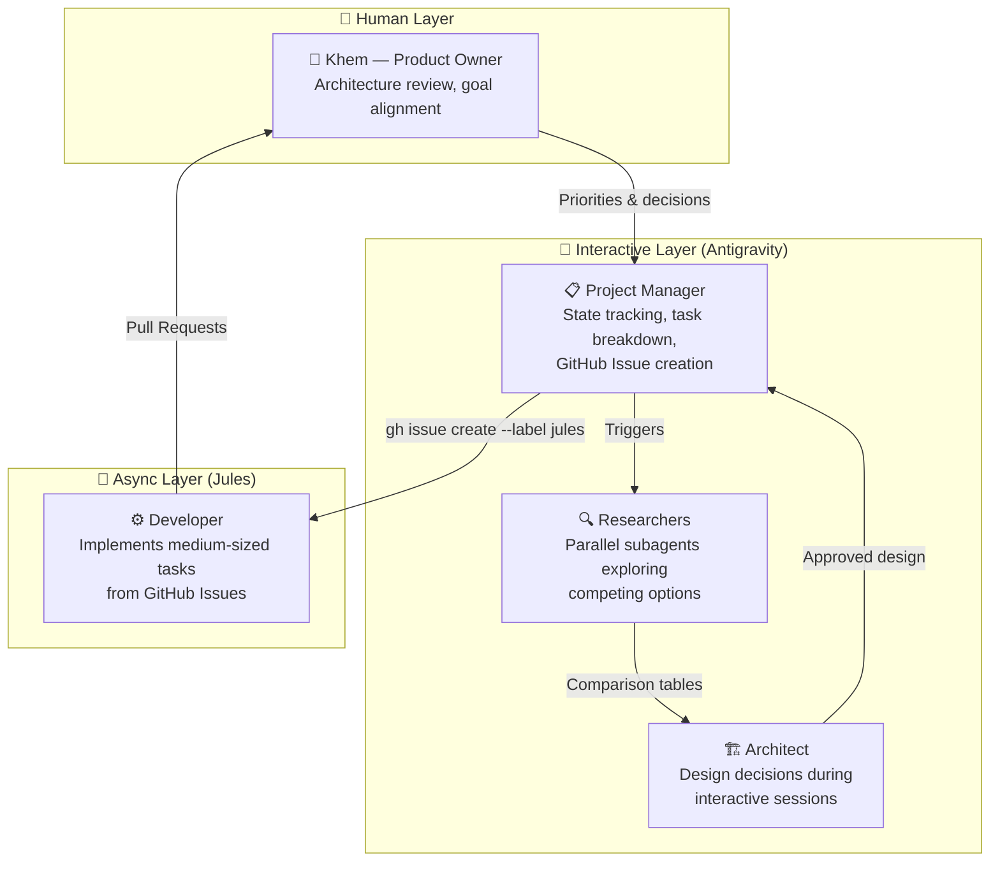

# AI Sandbox Development Workflow Guide

This guide establishes the continuous development loop for the human lead (**Khem**), the interactive AI pair programmer (**Antigravity**), and the asynchronous coding agent (**Jules**).

> **Design Principles:** Event-driven cycles (no fixed sprints), sequential execution (one thing at a time), architecture-level human review, automated test gates for everything else.

---

## 1. Roles & Architecture



### 🧑 Khem — Product Owner (Human)
*   **When active:** Start of every cycle + PR review gate
*   **Does:** Set priorities, make architecture decisions, review Jules PRs (architecture level), physical testing, final merge authority.
*   **Does NOT:** Write code, review every line of code, manage git branches, chase formatting/lint issues.

### 📋 Antigravity — Project Manager (Primary Mode)
*   **When active:** During every interactive session.
*   **Responsibilities:** Track state across sessions ("where were we?"), break work packages into medium-sized tasks, identify blockers and dependencies, create Jules handoff issues via `gh` CLI, maintain [INCREMENT_LOG.md](file:///home/khemi/workspace/ai_sandbox/docs/INCREMENT_LOG.md) and [WORK_PACKAGES.md](file:///home/khemi/workspace/ai_sandbox/docs/WORK_PACKAGES.md).

### 🏗️ Antigravity — Architect (Design Mode)
*   **When active:** When a task involves non-trivial design choices.
*   **Responsibilities:** Identify design decisions, spawn parallel researcher subagents for competing options, compile comparison tables, ensure consistency with overall architecture, define acceptance criteria and test requirements.

### 🔍 Antigravity — Researcher (Subagents)
*   **When active:** Spawned by Architect when there's a fork-in-the-road decision.
*   **Responsibilities:** Deep-dive one specific option, read docs, check compatibility, return structured findings.
*   **Constraint:** Multiple researchers run in parallel for competing choices (e.g., Researcher A explores vLLM, Researcher B explores Ollama). Bounded to a single option each. Question-driven, not open-ended.

### ⚙️ Jules — Developer (Async)
*   **When active:** Automatically picks up GitHub Issues labeled `jules`.
*   **Responsibilities:** Implement the task per Issue specification, run automated checks (build, lint, vet), create PR referencing `closes #issue_number`, update INCREMENT_LOG.md.
*   **Workflow:** Operates on Google Cloud VMs via `jules.google.com`. PRs target the `development` branch.

---

## 2. The Development Cycle

Six phases, executed **sequentially**, triggered when Khem is available (**event-driven**, no fixed sprints):

```
 ┌──────────────────────────────────────────────────────────┐
 │               ONE DEVELOPMENT CYCLE                      │
 │                                                          │
 │  ① ORIENT ──▶ ② DESIGN ──▶ ③ HANDOFF ──▶ ④ BUILD       │
 │    (sync)      (sync)       (sync)       (async)        │
 │      ▲                                     │             │
 │      │         ⑥ REVIEW ◀── ⑤ VERIFY  ◀───┘             │
 │      │          (sync)      (automated)                  │
 │      └──────────────┘                                    │
 │                 next cycle                                │
 └──────────────────────────────────────────────────────────┘
```

### ① ORIENT — "Where were we? What's next?"
**Who:** Khem + Antigravity (PM mode) | **Trigger:** Khem opens an interactive session.

1.  PM runs the **Context Recovery Protocol** (see Section 4).
2.  Check: any open Jules PRs to review first?
3.  Check: any blockers from last cycle?
4.  Khem states what they want to focus on.
5.  PM proposes the next actionable task.
6.  **Output:** Agreement on what this cycle tackles.

### ② DESIGN — "How should we build this?"
**Who:** Khem + Antigravity (Architect mode + Researcher subagents) | **Trigger:** Orient phase identifies a task.

1.  Architect identifies design decisions needed.
2.  For fork-in-the-road decisions: spawn parallel researcher subagents.
3.  Researchers return → Architect compiles comparison table.
4.  Khem makes the call.
5.  Architect defines: files/functions to create or modify, acceptance criteria (tests), architecture boundaries (what NOT to touch).
6.  **Output:** Approved design with clear scope.

### ③ HANDOFF — "Create the Jules task"
**Who:** Antigravity (PM mode) creates, Khem approves | **Trigger:** Design phase complete.

1.  PM drafts a GitHub Issue using the template (see Section 3).
2.  Khem reviews the issue body.
3.  PM runs: `gh issue create --label "jules" --title "..." --body "..."`
4.  **Output:** GitHub Issue ready for Jules.

### ④ BUILD — "Jules implements"
**Who:** Jules (async, on cloud VM) | **Trigger:** Jules detects new issue with `jules` label.

1.  Jules works autonomously on its cloud VM.
2.  Creates a PR referencing `closes #issue_number`.
3.  Runs automated checks.
4.  **Meanwhile:** Khem is free. No waiting required.
5.  **Output:** PR targeting `development` branch.

### ⑤ VERIFY — "Do the tests pass?"
**Who:** Automated (CI / Jules self-check) | **Trigger:** PR created.

1.  Automated tests run (build, lint, vet, verification suite).
2.  Jules confirms acceptance criteria from the Issue.
3.  **Output:** Pass/fail status on the PR.

### ⑥ REVIEW — "Is the architecture right?"
**Who:** Khem + Antigravity (PM mode) | **Trigger:** Khem returns to an interactive session and sees a PR.

1.  Khem reviews PR at **architecture level only** (not line-by-line).
2.  Antigravity helps analyze: "does this match what we designed?"
3.  If good → merge, update WORK_PACKAGES.md status.
4.  If not → comment on PR, Jules revises (or fix interactively).
5.  Update INCREMENT_LOG.md.
6.  **Output:** Merged code or revision request → next cycle.

---

## 3. GitHub Issue Template for Jules

Every Jules task is a **medium-sized logical function** — one clear unit of work per Issue:

```markdown
## Context
[Which work package this belongs to, and why we're doing it now]

## Task
[One logical function — clear description of what to build]

## Specification
### Create
- `path/to/file.go` — [what it should contain and do]

### Modify
- `path/to/existing.go`
  - [ ] Specific change 1
  - [ ] Specific change 2

### Do NOT Touch
- [files out of scope — architecture boundaries]

## Acceptance Criteria
- [ ] `go build ./...` passes
- [ ] `go vet ./...` clean
- [ ] [Specific functional test]
- [ ] INCREMENT_LOG.md updated

## Design Context
[Brief rationale — why this approach over alternatives]

## Branch
- Branch from: `development`
- PR target: `development`
```

---

## 4. Context Recovery Protocol

Since cycles are **event-driven** (Khem may return after days or weeks), every interactive session starts with PM running this check (~30 seconds):

1.  **WORK_PACKAGES.md** — current status of all work packages.
2.  **Open PRs** — did Jules finish anything while we were away? (`gh pr list`)
3.  **Open Issues** — is Jules still working on something? (`gh issue list --label "jules"`)
4.  **INCREMENT_LOG.md** — what was the last thing completed?
5.  **Summarize to Khem** — "Here's where we are, here's what I recommend."

---

## 5. Git & Branching Strategy

### Branch Naming Conventions
*   **`main` (Production Branch):** Stable, production-ready. Only Khem merges here.
*   **`development` (Integration Branch):** Active staging. Feature branches merge here.
*   **Feature Branches (`feature/*`):** Active development. Branch from `development`, merge back via PR.
*   **Jules' Branches (`agent/jules/*`):** Created by Jules for tasks from GitHub Issues. PRs target `development`.
*   **Antigravity's Branches (`agent/antigravity/*`):** For larger interactive changes.

### Pull Request Rules
1.  **No direct push** to `main` or `development` by any agent.
2.  **Verification required** before requesting review (build, lint, tests).
3.  **Detailed PR descriptions:** What changed, why, how to verify, linked Issue number.

---

## 6. The Increment Log Protocol

After completing a task or merging a PR, the active agent **must** append a new entry to [INCREMENT_LOG.md](file:///home/khemi/workspace/ai_sandbox/docs/INCREMENT_LOG.md).

### Rules:
1.  **Mandatory** after every task completion or PR merge.
2.  **Focus on "why" and "how to test"**, not just "what."
3.  **Include clickable file links** using the `file://` scheme.

---

## 7. Jules Automated Routine Tasks

In addition to Issue-driven development tasks, Jules runs these recurring maintenance tasks via `jules.google.com`:

### 🔄 Weekly Infrastructure Stability Check
> *"Run `./scripts/verify-infrastructure.sh`. If it fails, inspect logs, fix configuration, verify the script succeeds, and open a PR."*

### 🔄 Weekly Code Formatting and Linting
> *"Run `go fmt ./portal/...` and `go vet ./portal/...`. Resolve issues and commit in a PR."*

### 🔄 Repository Cleanup
> *"Analyze git branches. Archive merged branches as tags with `archive/` prefix, prune stale references, clean up the branch list."*
