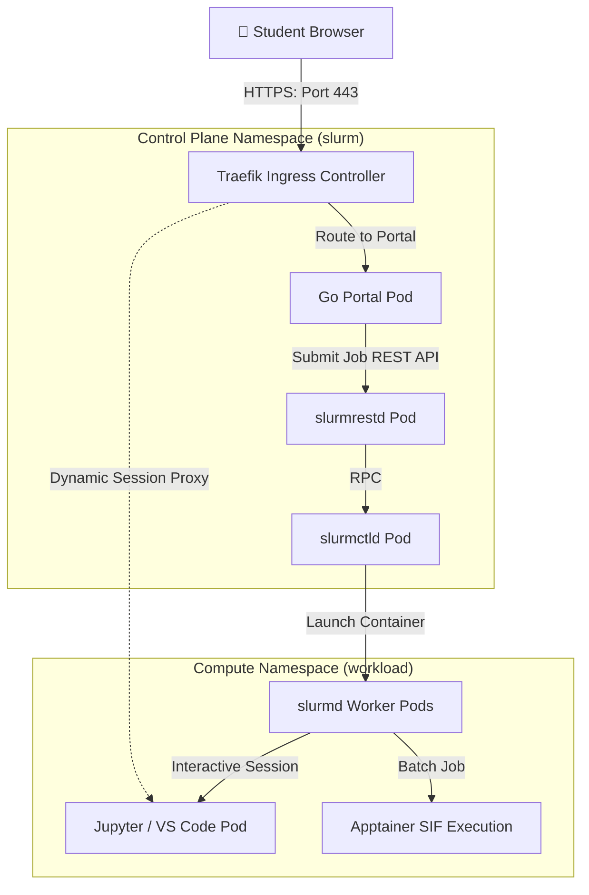

# WP3-1-1: Environment Assessment & Requirements

This document outlines the target environments and hardware specifications for the AI Sandbox, establishing requirements for both the local development Kind cluster and the production physical HPC cluster with GPU acceleration.

---

## 🗺️ Target Environment Specification

```mermaid
graph TD
    subgraph "Local Development (Kind)"
        Host[Docker Host / Laptop] --> NodeCP[Control Plane Node Pod]
        Host --> NodeW1[Worker Node 1 Pod]
        Host --> NodeW2[Worker Node 2 Pod]
        StorageLocal[Local Folder: ./storage] -->|Bind Mount| Nodes[/mnt/storage]
    end

    subgraph "Production Environment (Physical HPC)"
        Infra[K8s Management Nodes] --> ControllerNode[HPC Controller Node]
        HPCWorkers[HPC Compute Nodes] --> NodeCPU[CPU Compute Nodes]
        HPCWorkers --> NodeGPU[GPU Compute Nodes]
        NFS[Enterprise NFS / CephFS] -->|CSI Driver| StorageHPC[/mnt/storage]
    end
```

### 1. Local Development Environment (Kind)
*   **Infrastructure Platform:** Kind (Kubernetes in Docker) running on standard engineering laptops.
*   **Operating System Support:** Linux (Ubuntu 22.04+), macOS (Intel/Apple Silicon via Docker Desktop/Colima), or Windows (via WSL2).
*   **Container Runtime:** Docker Engine or `containerd`.
*   **Node Configuration:** Single control-plane node and two worker nodes simulated as Docker containers.
*   **Storage Access:** Local directory bind-mounted from host into the Kind nodes to simulate a cluster-wide shared filesystem.

### 2. Production HPC Environment
*   **Infrastructure Platform:** Physical bare-metal server cluster managed by a hybrid Kubernetes + Slurm architecture.
*   **Control Plane:** Dedicated Kubernetes management nodes running high-availability control planes.
*   **Compute Nodes:** Heterogeneous compute worker pools divided into CPU-only and GPU-accelerated servers.
*   **Shared Storage:** Enterprise-grade network attached storage (NFS or CephFS) providing high-throughput `ReadWriteMany` (RWX) access across all compute nodes.

---

## 📊 Hardware Requirements Matrix

The following table defines the hardware allocation and provisioning boundaries required per role to support multi-tenant student workloads.

| Node / Role | CPU Architecture | Recommended Cores | RAM | Storage / Disk | GPU Requirements |
| :--- | :--- | :--- | :--- | :--- | :--- |
| **Control Plane Node** | x86_64 or arm64 | 4 Cores | 8 GB | 50 GB NVMe | None |
| **Portal / Control Plane Pods** | x86_64 or arm64 | 2 Cores | 4 GB | Shared PVC access | None |
| **Interactive CPU Worker Node** | x86_64 | 32 Cores | 128 GB | 500 GB Local SSD (Scratch) | None |
| **Batch GPU Compute Node** | x86_64 | 64 Cores | 512 GB | 2 TB Local NVMe (Scratch) | 8x NVIDIA L40S or H100 (80GB) |
| **Inference Server Node** | x86_64 | 16 Cores | 128 GB | 1 TB Local SSD (Model Cache) | 2x NVIDIA L4 (24GB) or A100 |

---

## 🔌 Network Topology Diagram

The connection diagram below illustrates the flow of a user request from the browser down to the individual scheduled workloads running inside the cluster.



---

## 🔍 Gap Analysis: Kind Prototype ➡️ Production Cluster

This gap analysis highlights key technical differences and migration steps needed to transition the current local Kind development environment to the physical production HPC environment.

| Feature Area | Kind Development Prototype | Production HPC Environment Target | Migration / Action Required |
| :--- | :--- | :--- | :--- |
| **GPU Access** | CPU-emulated workloads only (no physical GPU resources). | Native physical GPU passthrough (NVIDIA L4/L40S/A100). | Deploy **NVIDIA GPU Operator** on production Kubernetes cluster; configure node labeling and taints. |
| **Storage CSI** | Local host volume mounts simulated via `hostPath` PV. | High-performance enterprise storage (NFS/CephFS). | Configure an enterprise **CSI Driver** (e.g., NFS-Client provisioner or Ceph-CSI) with dynamic volume sizing. |
| **Identity & Authentication** | Mock JWT identities and static UID generation (1001-1004). | University LDAP / Active Directory / Single Sign-On (OIDC). | Integrate portal JWT signer with OAuth2/SSO provider; synchronize UID/GID mapping with directory server. |
| **Autoscaling** | Static worker pods defined in Helm values.yaml. | Dynamic scaling based on partition queue and load. | Integrate Slinky NodeSet controller with the **Kubernetes Cluster Autoscaler** to provision bare-metal worker nodes. |
| **Network Isolation** | Single shared network without strict boundary rules. | Dynamic Kubernetes NetworkPolicies. | Define ingress/egress NetworkPolicies restricting container communication to control plane portal and internet only. |
