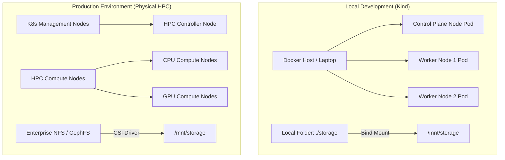
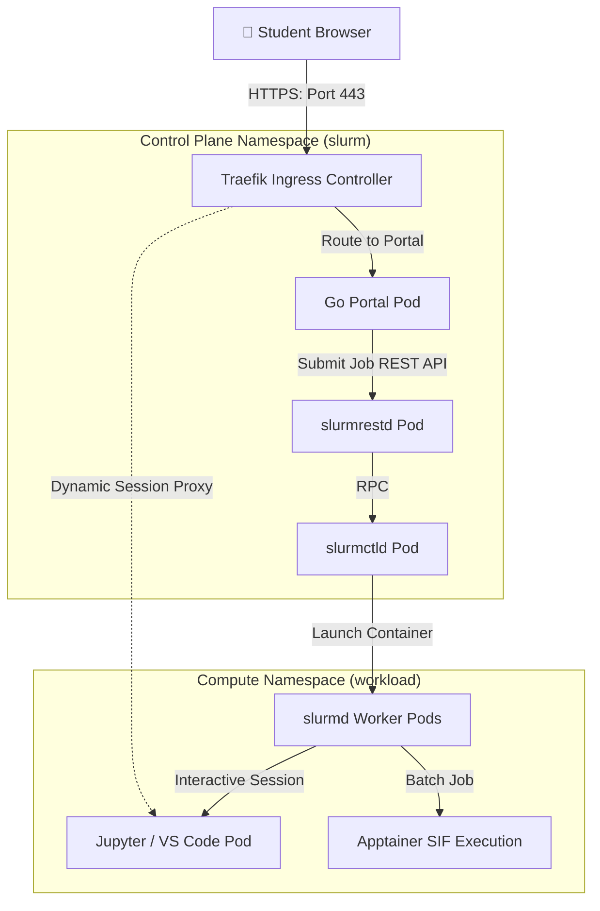

# WP3-1-1: Environment Assessment & Requirements

This document outlines the target environments and hardware specifications for the AI Sandbox, establishing requirements for both the local development Kind cluster and the production physical HPC cluster with GPU acceleration.

---

## 🗺️ Target Environment Specification

### 1. Local Development Environment (Kind)
*   **Infrastructure Platform:** Kind (Kubernetes in Docker) running on standard engineering laptops.
*   **Operating System Support:** Linux (Ubuntu 22.04+), macOS (Intel/Apple Silicon via Docker Desktop/Colima), or Windows (via WSL2).
*   **Container Runtime:** Docker Engine or `containerd`.
*   **Node Configuration:** Single control-plane node and two worker nodes simulated as Docker containers.
*   **Storage Access:** Local directory bind-mounted from host into the Kind nodes to simulate a cluster-wide shared filesystem.

### 2. Production HPC Environment
*   **Infrastructure Platform:** Physical bare-metal server cluster managed by a hybrid Kubernetes + Slurm architecture.
*   **Control Plane:** Dedicated Kubernetes management nodes running high-availability control planes.
*   **Compute Nodes:** Heterogeneous compute worker pools divided into CPU-only and GPU-accelerated servers.
*   **Shared Storage:** Enterprise-grade network attached storage (NFS or CephFS) providing high-throughput `ReadWriteMany` (RWX) access across all compute nodes.

---

## 📊 Hardware Requirements Matrix & Utilization Rationale

Instead of sizing physical servers to match the theoretical sum of all users' peak needs, the AI Sandbox architecture optimizes for high resource density and sharing. The recommendations below assume a student pilot size of **50–100 concurrent users** using the following design rationales:

### 💡 Estimation & Overcommit Rationale
1.  **CPU & Memory Overcommit (Interactive Nodes):**
    *   *Behavior:* Interactive coding sessions (JupyterLab/VS Code) are highly bursty. Students spend most of their session typing, reading, or debugging, leaving the CPU idle ~90% of the time.
    *   *Strategy:* We apply a **4:1 CPU overcommit ratio** and a **2:1 memory overcommit ratio** at the Kubernetes resource level. For 100 students allocated 2 cores each, a single 48-core physical node can easily manage the load.
2.  **GPU Partitioning (Multi-Instance GPU - MIG):**
    *   *Behavior:* Standard model prototyping (e.g., training small classifiers or running inference on a 7B LLM) does not require a full 80GB high-end GPU.
    *   *Strategy:* We leverage NVIDIA **MIG (Multi-Instance GPU)** or **vGPU** technology to partition a single high-end physical card (e.g., A100 or L40S) into 7 distinct virtual instances (e.g., `1g.10gb` slices). This lets 7 students share a single physical card with hardware-level memory boundaries and no interference.
3.  **Queue-Based Batch Scheduling:**
    *   *Behavior:* Heavy training runs (Deep Learning models) run at 100% capacity and cannot be overcommitted.
    *   *Strategy:* Instead of dedicated hardware per student, these run on a shared pool of nodes. Slurm schedules these sequentially using fair-share queues. If all GPUs are busy, jobs queue up rather than crashing the system.

### 🖥️ Optimized Cluster Allocations
The table below maps these utilization principles to the physical/virtual node roles:

| Node / Role | Typical Physical Spec (What to Look For in Your HPC) | Allocation / Sharing Model | Target Workloads Accommodated |
| :--- | :--- | :--- | :--- |
| **K8s Control Plane** | 1x VM with 4 Cores, 8 GB RAM, 50 GB NVMe | Shared among all management pods | Go Portal, database, Traefik proxy, Slurm control plane daemons. |
| **Interactive CPU Worker Node** | 1x Server with 32–64 Cores, 128–256 GB RAM | Overcommitted (4:1 CPU, 2:1 Mem) | Supports up to 50–70 concurrent student notebooks (`interactive` partition). |
| **Interactive GPU Worker Node** | 1x Server with 16–32 Cores, 128 GB RAM + 2x NVIDIA L4 (24GB) or 1x A100 (80GB) | MIG partitioned (up to 7 slices per GPU) | Small-scale model prototyping, local LLM running, vector databases. |
| **Batch GPU Compute Node** | 1-2x Servers with 32–64 Cores, 256–512 GB RAM + 4x NVIDIA A100/H100 | Dedicated allocation (No overcommit, Slurm queued) | Heavy model training scripts, parallel hyperparameter searches (`batch-gpu` partition). |

---

## 🔌 Network Topology Diagram

The connection diagram below illustrates the flow of a user request from the browser down to the individual scheduled workloads running inside the cluster.

---

## 🔍 Gap Analysis: Kind Prototype ➡️ Production Cluster

This gap analysis highlights key technical differences and migration steps needed to transition the current local Kind development environment to the physical production HPC environment.

| Feature Area | Kind Development Prototype | Production HPC Environment Target | Migration / Action Required |
| :--- | :--- | :--- | :--- |
| **GPU Access** | CPU-emulated workloads only (no physical GPU resources). | Native physical GPU passthrough (NVIDIA L4/L40S/A100). | Deploy **NVIDIA GPU Operator** on production Kubernetes cluster; configure node labeling and taints. |
| **Storage CSI** | Local host volume mounts simulated via `hostPath` PV. | High-performance enterprise storage (NFS/CephFS). | Configure an enterprise **CSI Driver** (e.g., NFS-Client provisioner or Ceph-CSI) with dynamic volume sizing. |
| **Identity & Authentication** | Mock JWT identities and static UID generation (1001-1004). | University LDAP / Active Directory / Single Sign-On (OIDC). | Integrate portal JWT signer with OAuth2/SSO provider; synchronize UID/GID mapping with directory server. |
| **Autoscaling** | Static worker pods defined in Helm values.yaml. | Dynamic scaling based on partition queue and load. | Integrate Slinky NodeSet controller with the **Kubernetes Cluster Autoscaler** to provision bare-metal worker nodes. |
| **Network Isolation** | Single shared network without strict boundary rules. | Dynamic Kubernetes NetworkPolicies. | Define ingress/egress NetworkPolicies restricting container communication to control plane portal and internet only. |
