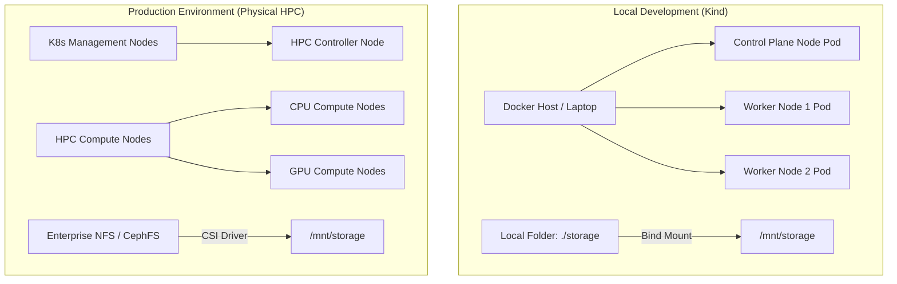
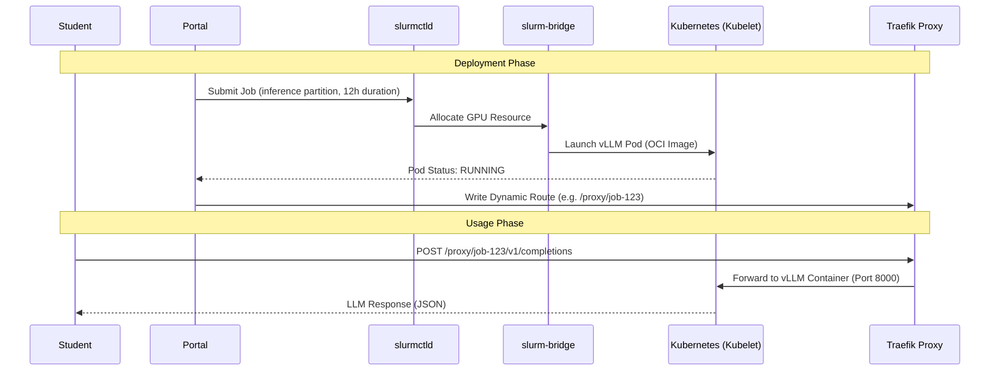
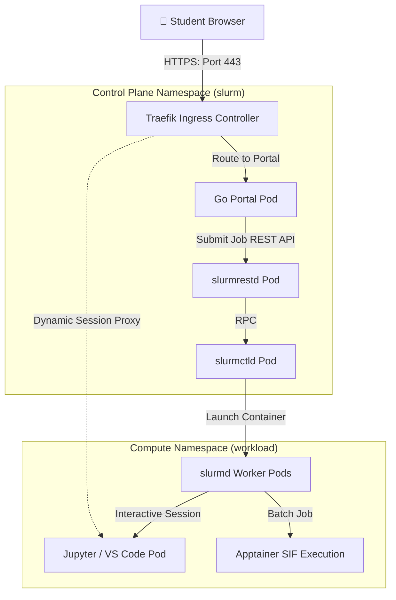

# WP3-1-1: Environment Assessment & Requirements

This document outlines the target environments and hardware specifications for the AI Sandbox, establishing requirements for both the local development Kind cluster and the production physical HPC cluster with GPU acceleration.

---

## 🗺️ Target Environment Specification

### 1. Local Development Environment (Kind)
*   **Infrastructure Platform:** Kind (Kubernetes in Docker) running on standard engineering laptops.
*   **Operating System Support:** Linux (Ubuntu 22.04+), macOS (Intel/Apple Silicon via Docker Desktop/Colima), or Windows (via WSL2).
*   **Container Runtime:** Docker Engine or `containerd`.
*   **Node Configuration:** Single control-plane node and two worker nodes simulated as Docker containers.
*   **Storage Access:** Local directory bind-mounted from host into the Kind nodes to simulate a cluster-wide shared filesystem.

### 2. Production HPC Environment
*   **Infrastructure Platform:** Physical bare-metal server cluster managed by a hybrid Kubernetes + Slurm architecture.
*   **Control Plane:** Dedicated Kubernetes management nodes running high-availability control planes.
*   **Compute Nodes:** Heterogeneous compute worker pools divided into CPU-only and GPU-accelerated servers.
*   **Shared Storage:** Enterprise-grade network attached storage (NFS or CephFS) providing high-throughput `ReadWriteMany` (RWX) access across all compute nodes.

---

## 🏗️ Why Slinky for a University AI Sandbox

The selection of Slinky (Slurm-on-Kubernetes) as the architectural foundation for the AI Sandbox is a strategic decision to address the unique pressures of a university research and teaching environment. This hybrid model combines the rigorous resource management of traditional HPC with the agility of modern cloud-native infrastructure.

### 1. The University Sandbox Problem Space
University environments face a "triple threat" of workload diversity that standard K8s or Slurm clusters struggle to handle in isolation [1]:
*   **Mixed Workload Types:** Students require long-running batch training (7+ days), short-lived interactive notebook sessions (4 hours), and persistent shared services like LLM inference endpoints and vector databases.
*   **Fair Multi-tenant Access:** Supporting 50–100 students on a single cluster requires strict quota enforcement and fair-share algorithms to prevent "noisy neighbors" from hogging expensive GPU resources [4].
*   **Heterogeneous Hardware:** The cluster must efficiently manage a mix of CPU-only nodes, L4/L40S GPUs for inference, and H100 GPUs for high-end training, often requiring different orchestration strategies for each [2].

### 2. Why Slurm (The Scheduler)
Slurm remains the industry standard for HPC due to its sophisticated scheduling logic that Kubernetes' default scheduler lacks [7]:
*   **Fair-Share Scheduling:** Ensures that students who have used fewer resources recently are prioritized, preventing a single research group from monopolizing the cluster [4].
*   **GRES & MIG Management:** Native support for Generic RESources (GRES) and Multi-Instance GPU (MIG) allows the platform to slice a single A100/H100 into 7 isolated instances, maximizing student density [5].
*   **Partition-Based Isolation:** Logic-level separation (interactive vs. batch vs. inference) allows for different preemption and priority rules on the same physical hardware [2].

### 3. Why Kubernetes (The Infrastructure)
Kubernetes provides the operational "fabric" that makes the cluster resilient and easy to manage [15]:
*   **Elastic NodeSets:** Slinky allows NodeSets to scale from 0 to N based on Slurm queue depth, enabling a "scale-to-zero" model for expensive GPU nodes that saves significant energy and cost [15][17].
*   **Container-Native Lifecycle:** Replacing Apptainer .sif files with OCI images simplifies the image build/test/deploy pipeline for students and staff [17].
*   **Storage & Network Abstraction:** PVCs and NetworkPolicies provide a standardized way to handle multi-tenant isolation and data persistence across heterogeneous nodes [15].

### 4. Why Slinky Specifically (Slurm + K8s Combined)
Slinky is the first project to offer deep, bi-directional integration between Slurm and Kubernetes rather than just running one on top of the other [17]:
*   **slurm-operator:** Manages Slurm daemons as native Kubernetes pods, eliminating manual OS-level daemon management and configuration drift [16].
*   **slurm-bridge:** Intercepts Slurm allocations to create real Kubernetes pods, giving interactive workloads (like Jupyter) real Slurm job IDs for unified accounting and tracking [16].
*   **Unified Infrastructure:** Administrators manage a single Kubernetes control plane while researchers use familiar Slurm CLI tools, reducing the "learning tax" for new students [2].

---

## ⚙️ Slinky Component Mapping — How Each Workload Type Runs

This section details the lifecycle and component interaction for the three primary workload modes supported by the platform.

### 1. Batch Jobs (Training & Preprocessing)
Batch jobs follow a traditional HPC lifecycle but run inside ephemeral containers.
*   **Lifecycle:** `sbatch` submission → `slurmctld` scheduling → `slurmd` execution in a NodeSet pod → Job completion/cleanup.
*   **Components:** `slurmctld` (decider), `NodeSet` (execution pool), `slurm-bridge` (pod creation).
*   **Isolation:** Bounded by K8s resource `limits` (CPU/Mem) and Slurm `GRES` (GPU).
*   **Student Benefit:** Familiar `#SBATCH` scripts work out of the box; jobs can run for days without interruption.

### 2. Interactive Sessions (Jupyter & VS Code)
Interactive workloads prioritize low latency and web-based access.
*   **Lifecycle:** Portal API submit → `slurmctld` allocation → `slurm-bridge` creates K8s Pod → Traefik sidecar maps dynamic route → Student connects via browser.
*   **Components:** `slurm-bridge` (interceptor), `Traefik` (dynamic ingress), `portal` (orchestrator).
*   **Isolation:** UID-based filesystem isolation via `libnss-extrausers` [11].
*   **Student Benefit:** Instant access to a powerful GPU-backed coding environment through a simple web UI.

### 3. Central Services (LLM Inference & Vector DBs)
These are "Service-Jobs" that provide persistent endpoints for other applications.
*   **Lifecycle:** See diagram below.
*   **Components:** `inference` partition (high priority), `vLLM` / `Ollama` / `Qdrant` OCI images.
*   **Scaling:** Typically fixed-size allocations to ensure 24/7 API availability for student projects.
*   **Student Benefit:** Provides a "Shared LLM" experience; students call an API rather than managing their own model servers.

#### 📊 LLM Inference Service Lifecycle

---

## 📚 Architecture Decision References

1.  **SchedMD Slinky Project.** "Slurm-on-Kubernetes Integration Suite." [Official Documentation](https://slinky.schedmd.com/).
2.  **N. Arnold (AWS).** "Running Slurm on Amazon EKS with Slinky." [AWS Blog, Oct 2025](https://aws.amazon.com/blogs/containers/running-slurm-on-amazon-eks-with-slinky/).
3.  **SchedMD Announcement.** "Introducing Slinky: Slurm on Kubernetes." [Press Release, Nov 2025](https://www.schedmd.com/introducing-slinky-slurm-kubernetes/).
4.  **Slurm Documentation.** "Fair Share Scheduling Algorithm." [SchedMD Docs](https://slurm.schedmd.com/fair_share.html).
5.  **Slurm Documentation.** "Generic Resource (GRES) Scheduling." [SchedMD Docs](https://slurm.schedmd.com/gres.html).
6.  **PEARC Proceedings.** "Challenges in Campus Bridging for AI Research: Mixed Workload Orchestration." (Research context for university HPC).
7.  **HPC Survey.** "Slurm Adoption Rates in the TOP500." [SchedMD Analysis](https://www.schedmd.com/).
8.  **CNCF Survey 2024.** "State of Cloud Native in HPC and AI Workloads." [CNCF Reports](https://www.cncf.io/reports/).
9.  **vLLM Team.** "Deployment Guide for vLLM on Kubernetes." [vLLM Docs](https://docs.vllm.ai/).
10. **Ollama Project.** "Self-hosting Ollama as a Service." [Ollama Documentation](https://ollama.com/).
11. **Increment Log.** "Increment 8: Dynamic User Resolution via libnss-extrausers." [Internal Document](./INCREMENT_LOG.md).
12. **Capacity Planning.** "WP3-1-2: Partition Design & Resource Quotas." [Internal Document](./CAPACITY_PLANNING.md).
13. **Migration Report.** "Current Architecture vs. Slinky." [Internal Document](./slinky_migration_report.md).
14. **SchedMD.** "slurm-operator GitHub Repository." [Source Code](https://github.com/SlinkyProject/slurm-operator).
15. **Kubernetes SIG-Scheduling.** "HPC Workloads on Kubernetes." [Community Documentation](https://kubernetes.io/).
16. **SchedMD.** "slurm-bridge: Unified scheduling of Kubernetes pods via Slurm." [Source Code](https://github.com/SlinkyProject/slurm-bridge).
17. **Slinky Project.** "Slinky Overview and Rationale." [Project Website](https://slinky.ai).

---

## 📊 Hardware Requirements Matrix & Utilization Rationale

Instead of sizing physical servers to match the theoretical sum of all users' peak needs, the AI Sandbox architecture optimizes for high resource density and sharing. The recommendations below assume a student pilot size of **50–100 concurrent users** using the following design rationales:

### 💡 Estimation & Overcommit Rationale
1.  **CPU & Memory Overcommit (Interactive Nodes):**
    *   *Behavior:* Interactive coding sessions (JupyterLab/VS Code) are highly bursty. Students spend most of their session typing, reading, or debugging, leaving the CPU idle ~90% of the time.
    *   *Strategy:* We apply a **4:1 CPU overcommit ratio** and a **2:1 memory overcommit ratio** at the Kubernetes resource level. For 100 students allocated 2 cores each, a single 48-core physical node can easily manage the load.
2.  **GPU Partitioning (Multi-Instance GPU - MIG):**
    *   *Behavior:* Standard model prototyping (e.g., training small classifiers or running inference on a 7B LLM) does not require a full 80GB high-end GPU.
    *   *Strategy:* We leverage NVIDIA **MIG (Multi-Instance GPU)** or **vGPU** technology to partition a single high-end physical card (e.g., A100 or L40S) into 7 distinct virtual instances (e.g., `1g.10gb` slices). This lets 7 students share a single physical card with hardware-level memory boundaries and no interference.
3.  **Queue-Based Batch Scheduling:**
    *   *Behavior:* Heavy training runs (Deep Learning models) run at 100% capacity and cannot be overcommitted.
    *   *Strategy:* Instead of dedicated hardware per student, these run on a shared pool of nodes. Slurm schedules these sequentially using fair-share queues. If all GPUs are busy, jobs queue up rather than crashing the system.

### 🖥️ Optimized Cluster Allocations
The table below maps these utilization principles to the physical/virtual node roles:

| Node / Role | Typical Physical Spec (What to Look For in Your HPC) | Allocation / Sharing Model | Target Workloads Accommodated |
| :--- | :--- | :--- | :--- |
| **K8s Control Plane** | 1x VM with 4 Cores, 8 GB RAM, 50 GB NVMe | Shared among all management pods | Go Portal, database, Traefik proxy, Slurm control plane daemons. |
| **Interactive CPU Worker Node** | 1x Server with 32–64 Cores, 128–256 GB RAM | Overcommitted (4:1 CPU, 2:1 Mem) | Supports up to 50–70 concurrent student notebooks (`interactive` partition). |
| **Interactive GPU Worker Node** | 1x Server with 16–32 Cores, 128 GB RAM + 2x NVIDIA L4 (24GB) or 1x A100 (80GB) | MIG partitioned (up to 7 slices per GPU) | Small-scale model prototyping, local LLM running, vector databases. |
| **Batch GPU Compute Node** | 1-2x Servers with 32–64 Cores, 256–512 GB RAM + 4x NVIDIA A100/H100 | Dedicated allocation (No overcommit, Slurm queued) | Heavy model training scripts, parallel hyperparameter searches (`batch-gpu` partition). |

---

## 🔌 Network Topology Diagram

The connection diagram below illustrates the flow of a user request from the browser down to the individual scheduled workloads running inside the cluster.

---

## 🔍 Gap Analysis: Kind Prototype ➡️ Production Cluster

This gap analysis highlights key technical differences and migration steps needed to transition the current local Kind development environment to the physical production HPC environment.

| Feature Area | Kind Development Prototype | Production HPC Environment Target | Migration / Action Required |
| :--- | :--- | :--- | :--- |
| **GPU Access** | CPU-emulated workloads only (no physical GPU resources). | Native physical GPU passthrough (NVIDIA L4/L40S/A100). | Deploy **NVIDIA GPU Operator** on production Kubernetes cluster; configure node labeling and taints. |
| **Storage CSI** | Local host volume mounts simulated via `hostPath` PV. | High-performance enterprise storage (NFS/CephFS). | Configure an enterprise **CSI Driver** (e.g., NFS-Client provisioner or Ceph-CSI) with dynamic volume sizing. |
| **Identity & Authentication** | Mock JWT identities and static UID generation (1001-1004). | University LDAP / Active Directory / Single Sign-On (OIDC). | Integrate portal JWT signer with OAuth2/SSO provider; synchronize UID/GID mapping with directory server. |
| **Autoscaling** | Static worker pods defined in Helm values.yaml. | Dynamic scaling based on partition queue and load. | Integrate Slinky NodeSet controller with the **Kubernetes Cluster Autoscaler** to provision bare-metal worker nodes. |
| **Network Isolation** | Single shared network without strict boundary rules. | Dynamic Kubernetes NetworkPolicies. | Define ingress/egress NetworkPolicies restricting container communication to control plane portal and internet only. |
