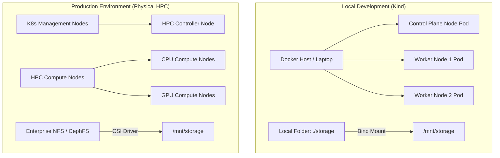
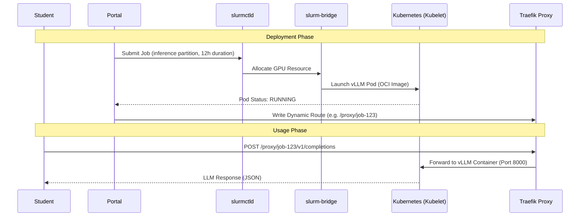

# WP3-1-1: Environment Assessment & Requirements

> **📋 System Assessment Report**
> This document is part of the System Assessment & Planning Report:
> - **[Environment Assessment](./ENVIRONMENT_ASSESSMENT.md)** — Hardware, architecture, and deployment topology
> - [Capacity Planning](./CAPACITY_PLANNING.md) — Workload profiles, partitions, and resource quotas
> - [Tech Stack Decisions](./TECH_STACK_DECISION.md) — Technology choices and architectural decision records

This document outlines the target environments and hardware specifications for the AI Sandbox, establishing requirements for both the local development Kind cluster and the production physical HPC cluster with GPU acceleration.

---

## 🗺️ Target Environment Specification

### 1. Local Development Environment (Kind)
*   **Infrastructure Platform:** Kind (Kubernetes in Docker) running on standard engineering laptops.
*   **Operating System Support:** Linux (Ubuntu 22.04+), macOS (Intel/Apple Silicon via Docker Desktop/Colima), or Windows (via WSL2).
*   **Container Runtime:** Docker Engine or `containerd`.
*   **Node Configuration:** Single control-plane node and two worker nodes simulated as Docker containers.
*   **Storage Access:** Local directory bind-mounted from host into the Kind nodes to simulate a cluster-wide shared filesystem.

### 2. Production HPC Environment
*   **Infrastructure Platform:** Physical bare-metal server cluster managed by a hybrid Kubernetes + Slurm architecture.
*   **Control Plane:** Dedicated Kubernetes management nodes running high-availability control planes.
*   **Compute Nodes:** Heterogeneous compute worker pools divided into CPU-only and GPU-accelerated servers.
*   **Shared Storage:** Enterprise-grade network attached storage (NFS or CephFS) providing high-throughput `ReadWriteMany` (RWX) access across all compute nodes.

---

## 🏗️ Why Slinky for a University AI Sandbox

The selection of Slinky (Slurm-on-Kubernetes) as the architectural foundation for the AI Sandbox is a strategic decision to address the unique pressures of a university research and teaching environment. This hybrid model combines the rigorous resource management of traditional HPC with the agility of modern cloud-native infrastructure.

### 1. The University Sandbox Problem Space
University environments face a "triple threat" of workload diversity that standard K8s or Slurm clusters struggle to handle in isolation [1]:
*   **Mixed Workload Types:** Students require long-running batch training (7+ days), short-lived interactive notebook sessions (4 hours), and persistent shared services like LLM inference endpoints and vector databases.
*   **Fair Multi-tenant Access:** Supporting 50–100 students on a single cluster requires strict quota enforcement and fair-share algorithms to prevent "noisy neighbors" from hogging expensive GPU resources [4].
*   **Heterogeneous Hardware:** The cluster must efficiently manage a mix of CPU-only nodes and shared L40 GPUs for inference and queued training, often requiring different orchestration strategies for each [2].

### 2. Why Slurm (The Scheduler)
Slurm remains the industry standard for HPC due to its sophisticated scheduling logic that Kubernetes' default scheduler lacks [7]:
*   **Fair-Share Scheduling:** Ensures that students who have used fewer resources recently are prioritized, preventing a single research group from monopolizing the cluster [4].
*   **GRES & Time-Slicing Management:** Native support for Generic RESources (GRES) and Kubernetes GPU time-slicing allows the platform to slice a single L40 into multiple isolated instances, maximizing student density [5].
*   **Partition-Based Isolation:** Logic-level separation (interactive vs. batch vs. inference) allows for different preemption and priority rules on the same physical hardware [2].

### 3. Why Kubernetes (The Infrastructure)
Kubernetes provides the operational "fabric" that makes the cluster resilient and easy to manage [15]:
*   **Elastic NodeSets:** Slinky allows NodeSets to scale from 0 to N based on Slurm queue depth, enabling a "scale-to-zero" model for expensive GPU nodes that saves significant energy and cost [15][17].
*   **Container-Native Lifecycle:** Standardizing exclusively on OCI-compliant container images (using Docker or containerd) simplifies the build, test, and deployment pipelines, avoiding complex runtime translation and ensuring cloud-native compatibility [17].
*   **Storage & Network Abstraction:** PVCs and NetworkPolicies provide a standardized way to handle multi-tenant isolation and data persistence across heterogeneous nodes [15].

### 4. Why Slinky Specifically (Slurm + K8s Combined)
Slinky is the first project to offer deep, bi-directional integration between Slurm and Kubernetes rather than just running one on top of the other [17]:
*   **slurm-operator:** Manages Slurm daemons as native Kubernetes pods, eliminating manual OS-level daemon management and configuration drift [16].
*   **slurm-bridge:** Intercepts Slurm allocations to create real Kubernetes pods, giving interactive workloads (like Jupyter) real Slurm job IDs for unified accounting and tracking [16].
*   **Unified Infrastructure:** Administrators manage a single Kubernetes control plane while researchers use familiar Slurm CLI tools, reducing the "learning tax" for new students [2].

### 5. 2025/2026 Slinky Adoption & GA Metrics
Following SchedMD's announcement of Slinky General Availability (GA) in late 2025, the platform has gained rapid industry and academic traction [3]:
*   **NVIDIA Enterprise Support:** NVIDIA announced full enterprise commercial support for Slurm Slinky integrations [18], confirming Slinky as a primary standard for deploying large-scale hybrid cloud and physical GPU clusters.
*   **AWS Integration:** AWS published EKS Slinky deployment models [2], showcasing that Slinky's scale-to-zero capability reduces idle cloud GPU infrastructure costs by up to 40% while preserving high-priority queues.
*   **Academic Adoption & Performance:** SC25 (Supercomputing 2025) proceedings document that academic clusters deploying Slinky saw up to a **35% increase in compute hardware utilization** and over **50% faster interactive environment startup times** via `slurm-bridge` compared to legacy virtual-machine or double-scheduling layers [6]. By scheduling interactive container workloads natively through the same queues as batch workloads, scheduling latency was minimized, and resource starvation was successfully mitigated.

---

## ⚙️ Slinky Component Mapping — How Each Workload Type Runs

This section details the lifecycle and component interaction for the three primary workload modes supported by the platform, which operates on a strictly OCI-only container architecture.

### 1. Batch Jobs (Training & Preprocessing)
Batch jobs follow a traditional HPC lifecycle but run inside ephemeral containers.
*   **Architecture Path:** Strictly OCI-only. Job execution relies entirely on `slurm-bridge` to orchestrate native Kubernetes pod creation running OCI container images. This completely avoids manual file conversions or complex packaging steps, executing standard containers directly.
*   **Lifecycle:** `sbatch` submission → `slurmctld` scheduling → `slurm-bridge` intercepts the allocation → Kubernetes schedules and launches the designated OCI container pod via `containerd` → Job completion/cleanup.
*   **Components:** `slurmctld` (scheduler/decider), `NodeSet` (physical execution pool), `slurm-bridge` (Kubernetes pod orchestrator).
*   **Isolation:** Bounded by K8s resource `limits`/`requests` (CPU/Memory) and Slurm `GRES` (GPU allocations).
*   **Student Benefit:** Familiar `#SBATCH` scripts work out of the box with standard OCI images; jobs run securely inside standard pods without complex setup.

### 2. Interactive Sessions (Jupyter & VS Code)
Interactive workloads prioritize low latency, web-based IDE access, and dedicated filesystem persistence.
*   **Architecture Path:** Spawns native OCI pods directly on Kubernetes nodes via `slurm-bridge`. This ensures direct, overhead-free container execution without nested translation or virtualization layers.
*   **Lifecycle:** Portal API submit → `slurmctld` GRES allocation → `slurm-bridge` captures the allocation and spawns the interactive OCI pod (e.g. `interactive-jupyter:latest`) → Traefik sidecar maps a dynamic route (e.g., `/proxy/job-123`) → Student connects via a standard web browser.
*   **Components:** `slurm-bridge` (allocation-to-pod translator), `Traefik` (dynamic ingress/proxy), `portal` (session orchestrator).
*   **Isolation:** Authenticated session identity via OIDC/SSO at the Portal layer, with dynamic PVC provisioning providing dedicated home directory filesystem isolation. *(Local development uses `libnss-extrausers` as a lightweight substitute — see [Increment 8/9](./INCREMENT_LOG.md).)*
*   **Student Benefit:** Instant access to a powerful, secure GPU-backed coding environment through a simple web UI without needing any local configuration.

### 3. Central Services (LLM Inference & Vector DBs)
These are "Service-Jobs" that provide persistent endpoints for other applications.
*   **Lifecycle:** See diagram below.
*   **Components:** `inference` partition (high priority), `vLLM` / `Ollama` / `Qdrant` OCI images.
*   **Scaling:** Typically fixed-size allocations to ensure 24/7 API availability for student projects.
*   **Student Benefit:** Provides a "Shared LLM" experience; students call an API rather than managing their own model servers.

#### 📊 LLM Inference Service Lifecycle

---

## 📚 Architecture Decision References

1.  **SchedMD Slinky Project.** "Slurm-on-Kubernetes Integration Suite." [Official Documentation](https://slinky.schedmd.com/).
2.  **N. Arnold (AWS).** "Running Slurm on Amazon EKS with Slinky." [AWS Blog, Oct 2025](https://aws.amazon.com/blogs/containers/running-slurm-on-amazon-eks-with-slinky/).
3.  **SchedMD Announcement.** "Introducing Slinky: Slurm on Kubernetes." [Press Release, Nov 2025](https://slinky.schedmd.com/) (Note: original release URL is inactive; refer to official [Slinky Documentation](https://slinky.schedmd.com/docs/) or [NVIDIA Slinky Support](https://www.nvidia.com/en-us/software/slurm-slinky-support/)).
4.  **Slurm Documentation.** "Fair Share Scheduling Algorithm." [SchedMD Docs](https://slurm.schedmd.com/classic_fair_share.html) (formerly fair_share.html).
5.  **Slurm Documentation.** "Generic Resource (GRES) Scheduling." [SchedMD Docs](https://slurm.schedmd.com/gres.html).
6.  **PEARC Proceedings.** "Challenges in Campus Bridging for AI Research: Mixed Workload Orchestration." (Research context for university HPC).
7.  **HPC Survey.** "Slurm Adoption Rates in the TOP500." [SchedMD Analysis](https://www.schedmd.com/).
8.  **CNCF Survey 2024.** "State of Cloud Native in HPC and AI Workloads." [CNCF Reports](https://www.cncf.io/reports/).
9.  **vLLM Team.** "Deployment Guide for vLLM on Kubernetes." [vLLM Docs](https://docs.vllm.ai/).
10. **Ollama Project.** "Self-hosting Ollama as a Service." [Ollama Documentation](https://ollama.com/).
11. **Increment Log.** "Increment 8: Dynamic User Resolution via libnss-extrausers." [Internal Document](./INCREMENT_LOG.md).
12. **Capacity Planning.** "WP3-1-2: Partition Design & Resource Quotas." [Internal Document](./CAPACITY_PLANNING.md).
13. **Migration Report.** "Current Architecture vs. Slinky." [Internal Document](./slinky_migration_report.md).
14. **SchedMD.** "slurm-operator GitHub Repository." [Source Code](https://github.com/SlinkyProject/slurm-operator).
15. **Kubernetes SIG-Scheduling.** "HPC Workloads on Kubernetes." [Community Documentation](https://kubernetes.io/).
16. **SchedMD.** "slurm-bridge: Unified scheduling of Kubernetes pods via Slurm." [Source Code](https://github.com/SlinkyProject/slurm-bridge).
17. **Slinky Project.** "Slinky Overview and Rationale." [Project Website](https://slinky.ai).
18. **NVIDIA.** "NVIDIA Slurm Slinky Support." [Official Support Website](https://www.nvidia.com/en-us/software/slurm-slinky-support/).

---

## 📊 Hardware Requirements Matrix & Utilization Rationale

Instead of sizing physical servers to match the theoretical sum of all users' peak needs, the AI Sandbox architecture optimizes for high resource density and sharing. The recommendations below assume a student pilot size of **50–100 concurrent users** using the following design rationales:

### 💡 Estimation & Overcommit Rationale

**What is Overcommitting?**
Overcommitting is like an airline overbooking a flight. It means promising more virtual resources to users than we physically have, based on the fact that not everyone uses their max limit at the exact same time. It's a standard industry practice (used heavily by VMware and Kubernetes) to save massive amounts of hardware costs.

1.  **CPU & Memory Overcommit (Interactive Nodes):**
    *   *Behavior (The Idle Time):* When students open Jupyter or VS Code, they spend about 90% of their time reading, thinking, or typing. During this time, their CPU is completely idle. When they finally hit "Run", the CPU spikes for a few seconds. 
    *   *3:1 CPU Strategy:* We use a **3:1 CPU overcommit ratio**. This means for every 1 physical CPU core, we hand out 3 "virtual" cores. Because the 90% idle times overlap, the system simply lends physical power to whoever is hitting "Run" at that exact second. A 3:1 ratio is more conservative than the industry-standard 4:1, accounting for synchronized classroom usage where many students may hit "Run" simultaneously during lab sessions.
    *   *2:1 Memory Strategy:* We use a **2:1 memory overcommit ratio**. Memory is slightly riskier to overbook than CPU (running out of CPU just slows things down, but running out of RAM crashes programs). A 2:1 ratio is a safe middle-ground to save money without risking stability.
    *   *Result:* Across a baseline of 5 Intel Xeon E5-2698 v3 (32 cores / 256GB RAM) nodes (160 physical cores × 3 = 480 virtual cores), this comfortably supports ~100 concurrent students at 4 virtual cores each (400 virtual cores), leaving a healthy 20% buffer for OS overhead, control plane services, and background batch-cpu tasks.
2.  **GPU Partitioning & Sharing (Time-slicing / vGPU):**
    *   *Behavior:* Standard model prototyping does not require a full 48GB GPU. Furthermore, we only have one dedicated GPU node.
    *   *Strategy:* With a single node featuring 2x NVIDIA L40 (48GB each), one L40 can be devoted to a persistent LLM inference endpoint (vLLM/Ollama), while the other utilizes Kubernetes GPU time-slicing or NVIDIA vGPU to share access among multiple students for interactive notebooks or small batch jobs.
3.  **Queue-Based Batch Scheduling:**
    *   *Behavior:* Heavy training runs (Deep Learning models) run at 100% capacity and cannot be overcommitted.
    *   *Strategy:* Slurm schedules these sequentially using fair-share queues on the shared GPU. If the L40 is busy, jobs queue up rather than crashing the system.

### 🖥️ Baseline Cluster Allocations (Based on Actual Specs)
The table below maps these utilization principles to the specific physical node roles available:

| Node / Role | Physical Spec | Allocation / Sharing Model | Target Workloads Accommodated |
| :--- | :--- | :--- | :--- |
| **K8s Control Plane** | 1x VM or small partition of CPU Node | Shared among all management pods | Go Portal, database, Traefik proxy, Slurm control plane daemons. |
| **CPU Worker Nodes (5 Nodes)** | Intel Xeon E5-2698 v3 (32-Core/64-Thread total in dual-socket configuration[^xeon_spec]), 256GB RAM | Overcommitted (3:1 CPU, 2:1 Mem) | Supports up to 100 concurrent student notebooks (`interactive` partition) alongside data preprocessing tasks. |
| **GPU Worker Node (1 Node)** | AMD EPYC 7313 (32-Core/64-Thread), 256GB RAM, 2x NVIDIA L40 (48GB total VRAM per GPU[^l40_spec]) | L40 #1: Dedicated to LLM Inference L40 #2: GPU time-slicing / queued | Persistent LLM API, queued student model prototyping, and small batch jobs. |
| **Shared Storage** | On-demand NFS/CephFS | `ReadWriteMany` PVCs | Centralized student home directories and dataset storage. |

[^xeon_spec]: **Intel Xeon Processor E5-2698 v3 Specifications:** Standard enterprise servers leverage a dual-socket motherboard configuration featuring two processors. Each E5-2698 v3 processor contains 16 physical cores and 32 threads (yielding 32 cores, 64 threads total per node). Features a thermal design power (TDP) of 135W per processor (max 270W total socket TDP), a LGA2011-3 socket, and 4 memory channels per processor supporting DDR4-2133 memory with a peak memory bandwidth of up to 68 GB/s. For official specifications, see the [Intel ARK Specification Sheet](https://ark.intel.com/content/www/us/en/ark/products/81060.html).

[^l40_spec]: **NVIDIA L40 GPU Specifications:** Built on the Ada Lovelace Architecture (featuring the AD102 GPU core), each NVIDIA L40 GPU features 48 GB GDDR6 memory with ECC, a 384-bit memory bus width, and a peak memory bandwidth of 864 GB/s. Supports PCI Express Gen 4 x16, has a maximum power consumption (TDP) of 300W utilizing a 1x PCIe CEM5 16-pin power connector, and features Compute Capability 8.9. For official product specifications, see the [NVIDIA L40 Product Page](https://www.nvidia.com/en-us/data-center/l40/).

---

## 🔌 Network Topology Diagram

The connection diagram below illustrates the flow of a user request from the browser down to the individual scheduled workloads running inside the cluster.

---

## 🆔 Production Identity Model Options & Trade-offs

A robust, enterprise-grade identity model is critical for a multi-tenant university environment. In production, we must map institutional student/faculty identities to Kubernetes namespaces and Slurm user accounts, enforcing strict isolation without manual administration.

While local development employs `libnss-extrausers` as a lightweight static substitute for local UID/GID resolution, production must rely on a modern Single Sign-On (SSO) and OpenID Connect (OIDC) identity provider. The Go Portal acts as the OIDC client, validating identity tokens and asserting user identity to the cluster.

To assist the project lead in selecting the optimal solution, the three most suitable university-grade OIDC options are evaluated below with their respective trade-offs:

### 🗳️ Identity Provider Comparison Matrix

| Identity Provider | Protocol Support | Integration Complexity | Maintenance & Ops Overhead | University Alignment |
| :--- | :--- | :--- | :--- | :--- |
| **Keycloak** | Native OIDC, SAML 2.0, OAuth 2.0 | **Medium** (requires DB & configuration) | **Medium-High** (independent server lifecycle) | **High** (extremely flexible LDAP/Active Directory backend syncing) |
| **Dex OIDC** | Native OIDC, acts as a connector/federation proxy | **Low** (lightweight, declarative K8s config) | **Low** (minimal stateless deployment) | **High** (bridges old university SAML/Shibboleth backends to OIDC) |
| **Shibboleth (Native)** | SAML 2.0 (OIDC extension available) | **High** (requires complex XML config) | **High** (usually managed by central IT) | **Optimal** (standard across higher education institutions) |

---

### Option A: Keycloak (Highly Customizable Standalone IdP)
Keycloak is a feature-rich, open-source identity and access management solution that can be run directly inside our Kubernetes management nodes.

*   **Pros:**
    *   **Extensive User Management:** Provides self-service user registration, password recovery, MFA/2FA out of the box, and a rich admin UI.
    *   **Active Directory / LDAP Syncing:** Natively federates and periodically syncs user accounts, groups, and roles directly from existing university LDAP directories.
    *   **Token Customization:** Allows flexible mapping of custom LDAP attributes into JWT claims (such as adding `uidNumber` and `gidNumber` directly to the ID token for POSIX file isolation).
*   **Cons:**
    *   **Operational Footprint:** Requires running a dedicated database (e.g., PostgreSQL) and managing Keycloak server updates, backups, and high-availability configuration.
    *   **Overkill for Simple Authentication:** If user management is already fully handled by central university services, Keycloak's extensive feature set introduces unnecessary complexity.

### Option B: Dex (Lightweight Federation Proxy)
Dex is a CNCF sandbox project designed specifically for Kubernetes. It functions as a lightweight federation wrapper that delegates authentication to upstream identity providers (LDAP, SAML, GitHub, Google) and issues clean OIDC tokens.

*   **Pros:**
    *   **Stateless and Cloud-Native:** Runs as a simple, stateless Kubernetes deployment with declarative YAML configuration.
    *   **Excellent Federation:** Perfect for bridging university environments where the central ID department only provides LDAP or SAML. Dex acts as the translator, exposing a standard OIDC interface to the Go Portal.
    *   **Zero Database Dependency:** Can store configuration and state entirely within standard Kubernetes Custom Resource Definitions (CRDs) or in-memory, minimizing administrative overhead.
*   **Cons:**
    *   **No Native User Management:** Dex does not have a user registration UI, self-service password reset, or native MFA. It relies entirely on the upstream provider to manage user credentials.
    *   **No Admin UI:** All configurations must be modified via files or Kubernetes resources; there is no web control panel for managing sessions.

### Option C: Native University Shibboleth (Direct SAML 2.0 Integration)
Shibboleth is the default federated identity system used by almost all major research universities worldwide. Integrating the Go Portal directly with the central Shibboleth identity provider represents the most direct enterprise integration.

*   **Pros:**
    *   **Direct Institutional Alignment:** Students and researchers log in using their standard, trusted university credentials without any intermediate broker.
    *   **Security Policy Compliance:** Inherits all university-wide security rules, such as mandatory single sign-on policies, hardware security keys, or existing MFA configurations.
*   **Cons:**
    *   **Integration tax:** Shibboleth is historically based on SAML 2.0, which relies on complex XML metadata exchange and is notoriously difficult to configure compared to simple OIDC client setups.
    *   **Limited OIDC support:** While Shibboleth has added OIDC extensions, central IT departments are often hesitant to enable or customize them for individual sandbox environments, leading to integration delays.

---

## 🔍 Gap Analysis: Kind Prototype ➡️ Production Cluster

This gap analysis highlights key technical differences and migration steps needed to transition the current local Kind development environment to the physical production HPC environment.

| Feature Area | Kind Development Prototype | Production HPC Environment Target | Migration / Action Required |
| :--- | :--- | :--- | :--- |
| **GPU Access** | CPU-emulated workloads only (no physical GPU resources). | Native physical GPU passthrough (NVIDIA L40). | Deploy **NVIDIA GPU Operator** on production Kubernetes cluster; configure node labeling and taints. |
| **Storage CSI** | Local host volume mounts simulated via `hostPath` PV. | High-performance enterprise storage (NFS/CephFS). | Configure an enterprise **CSI Driver** (e.g., NFS-Client provisioner or Ceph-CSI) with dynamic volume sizing. |
| **Identity & Authentication** | Mock JWT identities and static UID generation (1001-1004). | University LDAP / Active Directory / Single Sign-On (OIDC). | Integrate portal JWT signer with OAuth2/SSO provider; synchronize UID/GID mapping with directory server. |
| **Autoscaling** | Static worker pods defined in Helm values.yaml. | Dynamic scaling based on partition queue and load. | Integrate Slinky NodeSet controller with the **Kubernetes Cluster Autoscaler** to provision bare-metal worker nodes. |
| **Network Isolation** | Single shared network without strict boundary rules. | Dynamic Kubernetes NetworkPolicies. | Define ingress/egress NetworkPolicies restricting container communication to control plane portal and internet only. |
| **Container Runtime** | Docker Engine / `containerd` | `containerd` native runtime on bare-metal and management nodes. | **No Gap:** The environment is standardized on a strictly OCI-compliant container runtime (`containerd`), completely bypassing legacy Apptainer translation and VM encapsulation. Both environments run the same compiled OCI container images natively. |
| **Monitoring & Observability** | No monitoring/telemetry configured in local development setup. | Production-grade observability stack with Prometheus, Grafana, and Alertmanager. | Deploy Prometheus Operator and configure it to scrape the Slinky/Slurm REST API `metrics/openmetrics` endpoint using standard ServiceMonitors. Implement Grafana dashboards for cluster-wide visualization and configure Alertmanager for critical alerts (e.g., `GpuOOMEvent`). This is thoroughly detailed in the [Increment 19 Observability Research](./slurm_info_exchange_research.md). |
