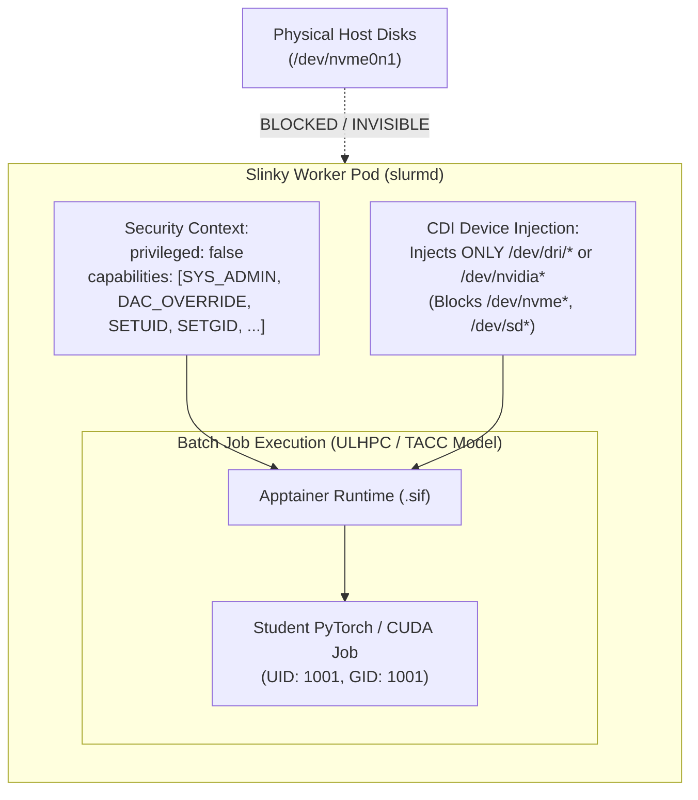

# Real-World HPC Container Privilege & Capability Reference Guide

> **Document Status:** Architectural Research & Security Baseline  
> **Related Documents:**  
> - [Batch Job Imaging & Container Trade-Off Analysis](./BATCH_JOB_IMAGING_TRADE_OFF.md)  
> - [Tech Stack Decisions](./TECH_STACK_DECISION.md)  
> - [System Assessment & Planning Report](./SYSTEM_ASSESSMENT_AND_PLANNING_REPORT.md)  
> - [Capacity Planning & Workload Profiling](./CAPACITY_PLANNING.md)

---

## 1. Executive Summary & Objective

In multi-tenant High-Performance Computing (HPC) and AI cluster environments, container security revolves around the **Principle of Least Privilege**: grant workloads the exact system capabilities required for hardware acceleration and shared filesystem access, while strictly preventing container escapes, host disk snooping, and administrative privilege escalation.

This document researches **five leading real-world HPC systems and architectures** (University of Luxembourg HPC, NERSC Perlmutter, TACC Frontera, CSCS Alps, and SchedMD Slinky on Kubernetes/GKE A3) to benchmark their privilege models, capability sets, and hardware injection strategies. This provides an industry-backed rationale for our `privilege_list` configuration in AI Sandbox.

---

## 2. Cross-Cluster Capability & Privilege Matrix

| HPC Cluster / Architecture | Primary Orchestrator | Container Engine(s) | Privilege Level | Specific Capabilities Allowed | GPU / Accelerator Passthrough Mechanism |
| :--- | :--- | :--- | :--- | :--- | :--- |
| **1. ULHPC (Aion & Iris)** *(University of Luxembourg)* | Slurm | Apptainer / Singularity | **Unprivileged** (`nosuid`, `PR_NO_NEW_PRIVS`) | POSIX UID/GID passthrough; SUID build execution strictly forbidden on compute nodes | Direct host driver binding (`--nv`), PGP/LUKS cryptographic signature verification |
| **2. NERSC (Perlmutter)** *(Lawrence Berkeley National Lab)* | Slurm on Cray EX OS | Apptainer / Singularity, Podman-hpc | **Unprivileged** (`nosuid`, `PR_NO_NEW_PRIVS`) | `CAP_SETUID`, `CAP_SETGID` (via User Namespaces & `/etc/subuid`), `CAP_IPC_LOCK` | Native host driver bind mounts + Cray Slingshot MPI hooks |
| **3. TACC (Frontera / Stampede3)** *(Texas Advanced Computing Center)* | Slurm | Apptainer / Singularity | **Unprivileged** (`allow setuid = no`, `root default capabilities = no`) | Minimal user namespaces; no elevated root capabilities (`capability.json` disabled by default) | Host NVIDIA driver passthrough (`--nv`), Direct bind mounts |
| **4. CSCS (Alps)** *(Swiss National Supercomputing Centre)* | Slurm + vcluster / OCI | Sarus, Enroot + Pyxis | **Unprivileged Process** (Rootless OCI) | `CAP_SYS_ADMIN` (internal user namespace only), `CAP_IPC_LOCK` | **OCI Hooks & CDI-style device injection** for NVIDIA GPUs & Slingshot |
| **5. SchedMD Slinky & Cloud-Native HPC** *(GKE A3 / Kubernetes HPC)* | Slurm Operator (Slinky) on K8s | Apptainer / Enroot in `slurmd` Pods | **Fine-Grained Capabilities** (`privileged: false`) | `SYS_ADMIN`, `DAC_OVERRIDE`, `DAC_READ_SEARCH`, `SETUID`, `SETGID`, `CHOWN`, `FOWNER`, `SYS_CHROOT` | **Container Device Interface (CDI)** (`cdi.enabled=true`) via NVIDIA GPU Operator |

---

## 3. Deep-Dive: Real-World HPC Clusters & Security Rationales

### 3.1 University of Luxembourg HPC — ULHPC (Aion & Iris Clusters)

* **Cluster Profile:** The ULHPC facility operates the **Iris** and **Aion** supercomputers, featuring heterogeneous CPU/GPU partitions (NVIDIA V100/A100), InfiniBand fabrics, and multi-tier storage (Lustre/GPFS and NFS).
* **Container Runtime:** Apptainer / Singularity (loaded via `module load tools/Apptainer`).

#### Privilege & Capability Model:
1. **Strict Non-Privileged Execution:** Container processes execute under the user's authentic POSIX identity (`$UID:$GID`). Daemons with root privileges (like Docker) are strictly prohibited on compute nodes.
2. **Execution Flag Hardening:** Containers run with `PR_NO_NEW_PRIVS` and container root filesystems are mounted `nosuid`, eliminating SUID binary privilege escalation inside user containers.
3. **Cryptographic Verification & Encryption:** Supports PGP-signed container verification and encrypted `.sif` containers (LUKS/RSA) for sensitive scientific and medical workloads without granting root privileges to the runtime.
4. **Decoupled Image Build vs. Runtime Execution:** Container builds (`sudo apptainer build`) are completely blocked on compute nodes and login nodes. Users are instructed to build images on their local workstations or CI/CD runners and upload immutable `.sif` archives.

#### Security & Operational Rationale:
* **Multi-Tenant Shared Storage Integrity:** Prevents root escalation across shared Lustre scratch and NFS project directories.
* **HPC Toolchain Integration:** Leverages direct driver binding (`apptainer run --nv`) and host MPI stack integration (`fosscuda`, `intelcuda`) without altering kernel capabilities on compute nodes.

---

### 3.2 NERSC — Perlmutter (LBNL)

* **Cluster Profile:** 3,072 GPU compute nodes (NVIDIA A100), Cray Slingshot interconnect, Lustre parallel filesystem (`$SCRATCH`), multi-tenant academic and scientific workloads.
* **Container Runtimes:** Apptainer and `podman-hpc`.

#### Privilege & Capability Model:
1. **Unprivileged by Default:** Apptainer runs strictly without SUID root escalation. Containers are executed with the Linux kernel flag `PR_NO_NEW_PRIVS` and mounted with `nosuid`.
2. **User Namespace Mapping:** Uses `/etc/subuid` and `/etc/subgid` with `podman-hpc` to map the user's single host UID to container UID ranges without granting real host root.
3. **Memory Capabilities:** `CAP_IPC_LOCK` is granted selectively or via PAM limits to allow GPU Direct RDMA and MPI memory registration.

#### Security & Operational Rationale:
* **"Integration Over Isolation":** NERSC prioritizes integrating containerized processes with the existing HPC fabric (Lustre file locking, Slurm job cgroups, Slingshot NICs) under the authentic user POSIX UID.
* **Build Segregation:** Users are prohibited from building containers or running unconstrained `docker build` on compute nodes. Image compilation is offloaded to dedicated login/build nodes or CI pipelines to keep compute nodes free of build-time privilege vulnerabilities.

---

### 3.3 TACC — Frontera & Stampede3 (University of Texas at Austin)

* **Cluster Profile:** Top-tier NSF supercomputer with Dell PowerEdge compute nodes, Mellanox HDR InfiniBand, and multi-petabyte GPFS shared storage.
* **Container Runtime:** Apptainer / Singularity (`tacc-apptainer` module).

#### Privilege & Capability Model:
1. **Zero Elevated Root Capabilities:** In `apptainer.conf`, `allow setuid` is disabled in modern partitions in favor of kernel unprivileged user namespaces.
2. **Capability Dropping:** `root default capabilities = no` is explicitly enforced to prevent users inside fakeroot environments from assuming host-level capabilities.
3. **Read-Only System Files:** Configuration files (`apptainer.conf`) are strictly owned by `root:root` with `0644` permissions, audited continuously against modifications.

#### Security & Operational Rationale:
* **Shared GPFS Protection:** Shared parallel storage systems are vulnerable to metadata abuse if rogue root containers manipulate POSIX ACLs or bypass UID root-squash mechanisms.
* **Elimination of SUID Attack Vectors:** Historically, setuid-root container helpers were responsible for several privilege escalation CVEs (e.g., CVE-2021-33622). TACC enforces unprivileged user namespaces and immutable `.sif` execution to remove the SUID helper attack surface entirely.

---

### 3.4 CSCS — Alps Infrastructure (Switzerland)

* **Cluster Profile:** Cloud-native, software-defined supercomputer featuring HPE Cray EX architecture, NVIDIA Grace Hopper GH200 superchips, and multi-tenant virtual cluster partitions.
* **Container Engine:** Sarus and Enroot + Pyxis.

#### Privilege & Capability Model:
1. **OCI Runtime Hooks:** Rather than running privileged daemons or granting blanket host device privileges, CSCS developed **Sarus OCI Hooks**.
2. **Non-Privileged User Execution:** Compute jobs execute with standard user privileges. Hardware device nodes (GPU, NICs) are injected specifically into the container namespace during the container runtime creation phase.
3. **IPC & Network Capabilities:** `CAP_IPC_LOCK` and `CAP_NET_ADMIN` are constrained to container namespaces, preventing cross-tenant packet sniffing or host network reconfiguration.

#### Security & Operational Rationale:
* **Trusted Research Environments (TRE):** CSCS hosts medical and sensitive research data on Alps. Blanket root or host device access (`/dev/*`) is strictly unacceptable.
* **OCI Standardization:** By using OCI hooks (the precursor to CDI), Alps allows portable container images while delegating hardware driver binding to secure host-level hooks that operate before user code executes.

---

### 3.5 SchedMD Slinky & Google Cloud HPC (GKE A3 Mega)

* **Cluster Profile:** Kubernetes-native Slurm orchestration (Slinky) running on Google Cloud GKE A3 clusters with NVIDIA H100/L40 GPUs and GPUDirect Storage.
* **Container Architecture:** Slinky `slurmd` worker Pods hosting nested batch executions and OCI interactive workloads.

#### Privilege & Capability Model:
1. **No `privileged: true` on Pods:** The outer Slinky daemon pod runs with `privileged: false` and `allowPrivilegeEscalation: true`.
2. **Granular Linux Capabilities:**
   - `CAP_SYS_ADMIN`: Needed for mounting nested squashfs `.sif` images, creating user namespaces, and configuring container loop devices.
   - `CAP_DAC_OVERRIDE` & `CAP_DAC_READ_SEARCH`: Required by the Slurm worker daemon to manage jobs, switch user contexts, and inspect spool directories.
   - `CAP_SETUID` & `CAP_SETGID`: Required for transitioning execution context from the daemon UID to the target student UID.
   - `CAP_CHOWN` & `CAP_FOWNER`: Required to ensure job output files and temporary directories are owned by the student user.
   - `CAP_SYS_CHROOT`: Required for Apptainer and container rootfs pivots.
3. **Container Device Interface (CDI):** NVIDIA GPU Operator enables CDI mode (`cdi.enabled=true`). CDI registers YAML/JSON device definitions describing `/dev/nvidia*` nodes and driver libraries.

#### Security & Operational Rationale:
* **Host Block Device Protection:** In Kubernetes, granting `privileged: true` mounts the host's entire `/dev` tree into the pod, exposing physical NVMe drives (`/dev/nvme0n1`, `/dev/sda`) and host cgroups.
* **CDI Granularity:** CDI injects *only* the requested GPU nodes into the unprivileged pod. Even if a container process were compromised, it cannot see or touch the underlying physical host storage.

---

## 4. Synthesis & Architectural Alignment for AI Sandbox

| Security Dimension | Traditional HPC (ULHPC / NERSC / TACC) | Slinky-on-K8s (AI Sandbox `privilege_list`) | Security Guarantee |
| :--- | :--- | :--- | :--- |
| **Daemon Privilege** | Bare-metal host daemon | `privileged: false` Pod on Kubernetes | Pod cannot escape to host Kubernetes node |
| **Linux Capabilities** | Unprivileged + PAM memory limits | 8 Specific Capabilities (`SYS_ADMIN`, `DAC_OVERRIDE`, `SETUID`, etc.) | Minimal surface for nested Apptainer & Slurm daemon operations |
| **GPU Access** | Host driver bind mount (`--nv`) | **Container Device Interface (CDI)** | Passes GPU nodes (`/dev/nvidia*` or `/dev/dri/*`); completely hides physical disks (`/dev/nvme*`) |
| **Build Policy** | Local/CI builds only | Pre-built SIF images on shared storage | Zero build-time root escalation on cluster nodes |
| **Shared Storage** | Strict POSIX permissions on Lustre/GPFS | `root:root` `755`/`644` on `/mnt/storage/common` | Read-only shared software; multi-tenant project isolation |

