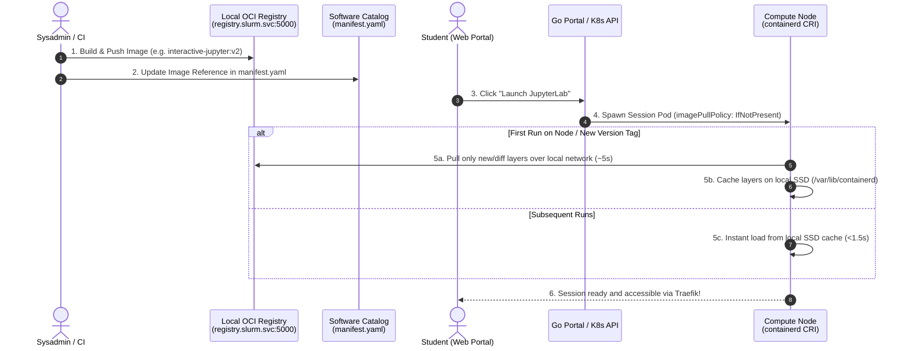
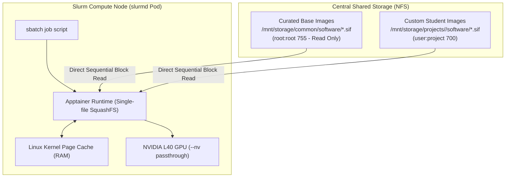

# Container Image Pipelining & Delivery Strategy

> **Document Status:** Architectural Decision Record (ADR) & Technical Specification  
> **Work Package:** [WP3-1-6: Container Environment & Image Pipeline](./WORK_PACKAGES.md#wp3-1-6-container-environment--image-pipeline)  
> **Related Documents:**  
> - [Batch Job Imaging Trade-Off](./BATCH_JOB_IMAGING_TRADE_OFF.md)  
> - [Tech Stack Decisions](./TECH_STACK_DECISION.md)  
> - [Environment Assessment](./ENVIRONMENT_ASSESSMENT.md)  

---

## 1. Executive Summary & Dual-Path Scope

The AI Sandbox operates on a hybrid **Slurm-on-Kubernetes (Slinky)** architecture with a strict dual-path execution model:

1. **Interactive Workloads:** Web-based, short-to-medium duration sessions (JupyterLab, VS Code Server, TTYD Web Terminal) scheduled as dynamic Kubernetes Pods via `slurm-bridge` and exposed through Traefik ingress.
2. **Batch Workloads:** Headless, long-running computational scripts (deep learning training, hyperparameter search, data preprocessing) submitted via Slurm (`sbatch`) and executed inside persistent `slurmd` worker daemon pods using Apptainer (`.sif`).

This document defines the **end-to-end image delivery and lifecycle pipeline** for both paths, establishing how container images are stored, versioned, updated, and distributed across multi-node physical and virtual clusters.

---

## 2. Interactive Workload Imaging Architecture (OCI + On-Demand Pull)



### 2.1 Core Architectural Decisions

1. **In-Cluster Local OCI Registry (`registry:2`):**
   * A lightweight, official distribution registry deployed in the `slurm` namespace (`registry.slurm.svc.cluster.local:5000`), backed by a persistent volume claim (`registry-pvc`).
   * Eliminates dependencies on external public container registries (Docker Hub rate limits, GitHub authentication credentials).
   * Operates over high-speed intra-cluster network interfaces (1Gbps–10Gbps).

2. **On-Demand Pulling (Pre-Pull DaemonSet Dropped):**
   * **Decision:** We explicitly reject the Pre-pull DaemonSet pattern in favor of **native On-Demand Pulling** (`imagePullPolicy: IfNotPresent`).
   * **Rationale:**
     * **Eliminates Maintenance Overhead:** Removes extra DaemonSet manifests, lifecycle sync scripts, and rolling update race conditions.
     * **Prevents Kubelet Garbage Collection Thrashing:** Avoids background battles between Kubelet disk janitor cleaning idle images and DaemonSets re-downloading them.
     * **Disk Conservation on Dedicated Batch Nodes:** Prevents dedicated GPU compute nodes from wasting NVMe storage caching unneeded interactive browser tools.

3. **Layer-Cached Incremental Updates:**
   * Because OCI images share common Linux and CUDA base layers, subsequent updates (e.g., adding `scikit-learn` or `matplotlib`) only generate small top-level diff layers (100–300 MB).
   * Compute nodes download only the changed layers on first launch, completing updates in **under 5–10 seconds** over the local network.

### 2.2 Image Versioning & Update Workflows

Administrators have two supported modes for rolling out updates to interactive tools:

#### Mode A: Semantic / Immutable Versioning (Recommended)
* **Image Reference:** `registry.slurm.svc:5000/interactive-jupyter:v1.1`
* **Workflow:**
  1. Admin builds and pushes the updated image with a new version tag:
     ```bash
     docker build -t registry.slurm.svc:5000/interactive-jupyter:v1.1 images/jupyterlab/
     docker push registry.slurm.svc:5000/interactive-jupyter:v1.1
     ```
  2. Admin updates the `image` field in `storage/common/software/jupyterlab/manifest.yaml`:
     ```yaml
     image: "registry.slurm.svc:5000/interactive-jupyter:v1.1"
     ```
  3. Next time any student launches JupyterLab, nodes detect the new tag, pull the small diff layer on demand, and cache it.

#### Mode B: Floating Tag (`:latest`) with Dynamic Verification
* **Image Reference:** `registry.slurm.svc:5000/interactive-jupyter:latest`
* **Pod Spec:** `imagePullPolicy: Always`
* **Workflow:**
  1. Admin builds and pushes to the floating tag without touching any `manifest.yaml` files.
  2. On each launch, the compute node performs a fast SHA256 layer hash check against the local registry. If changed, it updates the layer automatically.

### 2.3 Curated Interactive Image Catalog

The sandbox maintains three curated OCI images under `images/`:

| Application | Base Image | Key Packages & Tooling | Purpose |
| :--- | :--- | :--- | :--- |
| **JupyterLab** | `jupyter/scipy-notebook` | `libnss-extrausers`, Python 3.11, PyTorch, Scipy, Matplotlib | Interactive data science and exploratory prototyping |
| **VS Code Server** | `codercom/code-server` | `libnss-extrausers`, Git, Python extension, shell utilities | Full browser-based IDE development |
| **Interactive Bash** | `ubuntu:24.04` | `libnss-extrausers`, `ttyd`, `tmux`, `htop`, `curl`, `wget` | Lightweight web-based terminal for CLI workflows |

---

## 3. Batch Workload Imaging Architecture (Apptainer + Direct NFS Streaming)



### 3.1 Core Architectural Decisions (Locked in: Option 1)

1. **Direct NFS Streaming (Zero Node Staging Overhead):**
   * **Decision:** All `.sif` container images reside on the central shared storage filesystem (`/mnt/storage/`) and are executed directly via `apptainer exec` across all `slurmd` compute nodes without intermediate node-local NVMe staging or Prolog scripts.
   * **Rationale:**
     * **Eliminates Staging Scripts & State:** Zero Slurm Prolog/Epilog synchronization scripts to debug or maintain.
     * **No Node Disk Eviction Complexity:** No need to build LRU cache cleaners or monitor node-local NVMe disk filling up.
     * **Sequential I/O Efficiency:** Because an Apptainer `.sif` image is a single monolithic SquashFS file, the Linux kernel streams it in 128KB contiguous blocks rather than millions of tiny NFS metadata operations (avoiding the small-file storm of raw `venv`/Conda).
     * **Kernel Page Caching:** Once a node reads `.sif` blocks from NFS, they are automatically cached in the compute node's RAM page cache, making repetitive execution blazing fast.

2. **Security & Permission Lockdown:**
   * **Curated Shared Software (`/mnt/storage/common/software/`):**
     * Owned strictly by `root:root` with permissions `755` (directories) and `644` (files).
     * Students and batch jobs have strictly read-only access, preventing image tampering, accidental deletion, or image poisoning across tenants.
   * **Private Student Software (`/mnt/storage/projects/<project>/software/`):**
     * Owned by `UID:GID` (e.g., `1001:1001`) with permissions `700`, isolating custom student images to authorized project members only.

3. **Standard Batch Job Submission Pattern:**
   Student `sbatch` scripts invoke Apptainer with read-only binds for common assets and read-write binds for their project workspaces:

   ```bash
   #!/bin/bash
   #SBATCH --job-name=pytorch-train
   #SBATCH --partition=batch-gpu
   #SBATCH --gres=gpu:1
   #SBATCH --cpus-per-task=8
   #SBATCH --mem=32G
   #SBATCH --time=02:00:00
   #SBATCH --output=/mnt/storage/projects/%u/logs/%j.out

   # Path to immutable curated image on shared NFS
   CONTAINER_IMAGE="/mnt/storage/common/software/pytorch.sif"

   # Execute training script inside Apptainer with GPU passthrough
   apptainer exec --nv \
       --bind /mnt/storage/common:/mnt/storage/common:ro \
       --bind /mnt/storage/projects/$SLURM_JOB_ACCOUNT:/workspace \
       "$CONTAINER_IMAGE" \
       python3 /workspace/train.py
   ```

---

## 4. Curated Batch Image Catalog

| Image Name | Source / Recipe | Primary Tooling | Target Partitions |
| :--- | :--- | :--- | :--- |
| **`pytorch.sif`** | NVIDIA NGC (`nvcr.io/nvidia/pytorch`) | PyTorch, torchvision, torchaudio, CUDA 12.x, cuDNN, DeepSpeed | `batch-gpu` |
| **`python.sif`** | Official Python / Scipy Base | Python 3.11, NumPy, Scipy, Pandas, Scikit-learn, Ray | `batch-cpu` |

---

## 5. Summary Matrix: Dual-Path Execution Model

| Dimension | Interactive Path (Jupyter / VS Code) | Batch Path (PyTorch / Compute) |
| :--- | :--- | :--- |
| **Execution Primitive** | Dynamic Kubernetes Pod (via `slurm-bridge`) | Apptainer `.sif` inside persistent `slurmd` pod |
| **Image Format** | Standard OCI Container Image | Monolithic SquashFS `.sif` archive |
| **Image Storage** | In-cluster OCI Registry (`registry:5000`) | Shared NFS storage (`/mnt/storage/common/software`) |
| **Distribution / Pulling** | On-demand pull (`imagePullPolicy: IfNotPresent`) | Direct NFS streaming into Linux page cache |
| **Update Mechanism** | Build $\rightarrow$ Push to Registry $\rightarrow$ Update `manifest.yaml` | Build/Copy `.sif` directly to `/mnt/storage/common/software/` |
| **Security Boundary** | Kubernetes Pod isolation & Traefik subpath routing | `libnss-extrausers` numeric UID + `root:root` `755` software dir |
