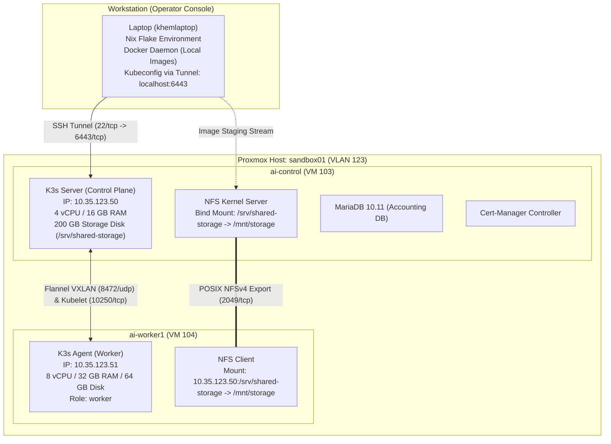

# Proxmox Backend Migration Guide & Runbook: Milestone 2

> **Document Status:** Single Source of Truth for AI Sandbox Migration to Proxmox VE  
> **Target Scope:** Milestone 2 Backend Infrastructure (WP3-1-4 through WP3-1-8)  
> **Replaces:** `docs/HANDOFF.md` & `docs/PROXMOX_VERIFICATION_STEPS.md`  
> **Last Updated:** 2026-09-21

---

## 1. Scope & Objective

The objective of this migration is to transition the AI Sandbox **Milestone 2 backend platform** from the local development Kind cluster onto a 2-node virtualized cluster in Proxmox VE. 

Milestone 2 encompasses exclusively the backend infrastructure blocks:
* **WP3-1-4:** Slinky Deployment & Orchestrator Integration (CRDs, Operator, Slurm daemons, Slurm Bridge)
* **WP3-1-5:** Slurm Policy & Resource Accounting (MariaDB, `slurmdbd`, TRES limits, QoS, fair-share)
* **WP3-1-6:** Container Environment & Custom Images (`slurmctld-custom`, `slurmd-custom` with Apptainer)
* **WP3-1-7:** Shared Storage, Datasets & Models (POSIX hierarchy, permissions, dataset seeding, scratch cleanup)
* **WP3-1-8:** Network & Security Baseline (Zero-trust NetworkPolicies, Traefik TLS, RBAC confinement)

*Note: User-facing frontend enhancements (WP3-1-12+), LLM inference server (WP3-1-9), and MLflow (WP3-1-11) belong to subsequent milestones and are explicitly out of scope for this migration.*

---

## 2. Roles, Responsibilities & Operational Rules

### 2.1 Separation of Concerns
* **Khem (Operator & Accountable Lead):** Holds all credentials, SSH keys, and sudo privileges. Solely responsible for executing commands on the VMs, approving manifest changes, and managing Proxmox hypervisor snapshots.
* **Antigravity (Senior Systems Architect & Co-Pilot):** Audits manifests, identifies edge cases, stress-tests architectural choices, generates diffs, drafts automation scripts, and provides validated step-by-step instructions. Does not possess direct SSH or Proxmox access.

### 2.2 Security Rules on Shared Infrastructure
1. **Zero Passwordless Sudo:** To preserve system security on a shared university VLAN, no unrestricted `NOPASSWD` rules are added to `/etc/sudoers`. Administrative commands requiring root run interactively with explicit sudo authentication.
2. **Minimal Ingress Exposure:** The Kubernetes API (`6443/tcp`) is accessible externally strictly via encrypted SSH local port forwarding, preventing unauthorized probing from other VMs on VLAN 123.
3. **No Unreviewed Scripts on Production Nodes:** The VMs act strictly as runtime substrates. No direct manual editing of manifests on VMs; all changes originate from this repository.

---

## 3. Cluster Topology & Network Architecture

### 3.1 Hypervisor & Node Allocation
* **Hypervisor:** University Proxmox VE cluster (`sandbox01`).
* **Network:** VLAN 123, subnet `10.35.123.0/24`. Default gateway: `10.35.123.254`.



### 3.2 VM Specifications

| Hostname | VM ID | IP Address | vCPU | RAM | Disk Layout | Primary Roles |
|---|---|---|---|---|---|---|
| `ai-control` | 103 | `10.35.123.50` | 4 | 16 GB | 32 GB OS (`/`)<br/>200 GB Storage (`/srv/shared-storage`) | K3s Server, NFS Server, MariaDB, Slurmctld, Slurmdbd, Slinky Operator |
| `ai-worker1` | 104 | `10.35.123.51` | 8 | 32 GB | 64 GB OS (`/`) | K3s Agent, Slurm Compute Worker (`slurmd`) |

### 3.3 Firewall (UFW) State
* **`ai-control`:**
  * `22/tcp`: ALLOW from Anywhere (Admin access).
  * `6443/tcp`: ALLOW from `10.35.123.51` (K3s worker join).
  * `10250/tcp`, `8472/udp`, `2049/tcp`: ALLOW from `10.35.123.51` (Kubelet, Flannel, NFS).
  * Pod/Service CIDRs (`10.42.0.0/16`, `10.43.0.0/16`): ALLOW.
* **`ai-worker1`:**
  * `22/tcp`: ALLOW from Anywhere.
  * `10250/tcp`, `8472/udp`: ALLOW from `10.35.123.50`.
  * Pod/Service CIDRs: ALLOW.

---

## 4. Established Remote Operations Workflow

To keep the VMs clean and maintain a single source of truth, development and deployment operate under the **Remote Control Center** pattern:

```
Local Repo (ai_sandbox) ──[kubectl / helm]──> SSH Tunnel (localhost:6443) ──> ai-control K3s
```

### 4.1 Shell & Tunnel Management (`flake.nix`)
The Nix development shell (`nix develop`) manages tooling and tunnel lifecycle:
* **`ptunnel`:** Starts a background SSH port-forward (`localhost:6443` $\rightarrow$ `10.35.123.50:6443`).
* **`ptunnel-stop`:** Terminates the active background tunnel.
* **Kubeconfig:** Automatically exported as `$HOME/.kube/config-proxmox`, connecting to `https://127.0.0.1:6443`.

### 4.2 Image Staging Strategy (Zero-Registry, Least-Privilege)
Because K3s uses containerd without a local Docker daemon, custom images (`slurmctld-custom`, `slurmd-custom`) are transferred via the shared storage:
1. Export tarball from local Docker daemon over SSH to `/mnt/storage/` on `ai-control`.
2. Import tarball into containerd's `k8s.io` namespace interactively via `sudo k3s ctr -n k8s.io images import`.
3. Delete the temporary tarball from `/mnt/storage/` to conserve disk space.

---

## 5. Proxmox Snapshot Strategy & Checkpoints

> [!IMPORTANT]
> **Golden Rule of Snapshots:** Always snapshot and roll back **BOTH VMs together** with RAM **unchecked** (clean disk-level consistency). The `ai-control` snapshot captures the 200 GB disk, so reverting reverts the shared filesystem as well.

| Checkpoint Name | State Captured | Status | Trigger / When to Take |
|---|---|---|---|
| `pre-k8s` | Base OS, UFW, disk mount, no k3s | 🟢 Done | Historical baseline |
| `k8s-ready` | K3s installed, 2 nodes joined, system pods ready | 🟢 Done | Before applying repo manifests |
| `core-infra-ready` | Storage PV/PVCs bound, Cert-Manager, MariaDB healthy | 🟢 Done | Before Slinky install |
| `slurm-deployed` | Slinky operator, slurmctld, slurmd running, accounting initialized | 🟢 Done | After Slurm sanity checks pass |
| `backend` (`m2-complete`) | All WP3-1-4 to WP3-1-8 verified, test suites passing | 🟢 Done | Final Milestone 2 baseline |

---

## 6. Migration Status Tracker

| Stage | Component / Task | Work Package | Status | Verification Evidence |
|---|---|---|---|---|
| **0** | OS & Storage Baseline (NFS `/mnt/storage`) | WP3-1-7 | 🟢 Verified | Files visible across both VMs; permissions verified |
| **1** | K3s Bootstrap & Remote Kubeconfig | Foundation | 🟢 Verified | `ai-control` & `ai-worker1` `Ready` via `ptunnel` |
| **2** | Storage Layer & Multi-Node RWX | WP3-1-7 | 🟢 Verified | `test-node-cp` wrote / `test-node-worker` read `cross_pod.txt` |
| **3** | Core Infrastructure (Cert-Manager & MariaDB) | WP3-1-5 | 🟢 Verified | `cert-manager-*` (3/3) & `mariadb-0` (1/1) `Running` |
| **4** | Custom Slurm Image Transfer | WP3-1-6 | 🟢 Verified | Custom images side-loaded into containerd on both VMs |
| **5** | Slinky Operator & Slurm Cluster Deploy | WP3-1-4 | 🟢 Verified | `slurm-operator`, `slurm-controller-0`, `slurmd` pods healthy |
| **6** | Slurm Accounting, QoS & Slurm Bridge | WP3-1-5 | 🟢 Verified | MariaDB initialized, 4 QoS tiers registered, bridge running |
| **7** | Shared Storage Layout & Dataset Seeding | WP3-1-7 | 🟢 Verified | `verify-storage.sh` passed 6/6 tests |
| **8** | NetworkPolicies, Security Baseline & Tests | WP3-1-8 | 🟢 Verified | `verify-security.sh` passed 7/7 tests |

---

## 7. Step-by-Step Execution Runbook

### Step 0: Take Snapshot `core-infra-ready` (Current Checkpoint)
In the Proxmox Web UI:
1. Snapshot VM 104 (`ai-worker1`) $\rightarrow$ Name: `core-infra-ready`, RAM: unchecked.
2. Snapshot VM 103 (`ai-control`) $\rightarrow$ Name: `core-infra-ready`, RAM: unchecked.

---

### Step 1: Transfer & Import Custom Slurm Images (WP3-1-6)

#### 1.1 Export images from laptop to `/mnt/storage`
From your **local laptop terminal**:
```bash
# Export controller & restapi images
docker save slurmctld-custom:latest | ssh admin_ai@10.35.123.50 "cat > /mnt/storage/slurmctld-custom.tar"
docker save slurmrestd-custom:latest | ssh admin_ai@10.35.123.50 "cat > /mnt/storage/slurmrestd-custom.tar"

# Export worker image
docker save slurmd-custom:latest | ssh admin_ai@10.35.123.50 "cat > /mnt/storage/slurmd-custom.tar"
```

#### 1.2 Import on `ai-control`
In an SSH session on `ai-control`:
```bash
sudo k3s ctr -n k8s.io images import /mnt/storage/slurmctld-custom.tar
sudo k3s ctr -n k8s.io images import /mnt/storage/slurmrestd-custom.tar
sudo k3s ctr -n k8s.io images list | grep custom
```

#### 1.3 Import on `ai-worker1`
In an SSH session on `ai-worker1`:
```bash
sudo k3s ctr -n k8s.io images import /mnt/storage/slurmd-custom.tar
sudo k3s ctr -n k8s.io images list | grep custom
```

#### 1.4 Clean up tarballs
```bash
ssh admin_ai@10.35.123.50 "rm -f /mnt/storage/*.tar"
```

---

### Step 2: Deploy Slinky Operator & CRDs (WP3-1-4)
From your **local laptop terminal** (inside `nix develop`):
```bash
helm install slurm-operator-crds oci://ghcr.io/slinkyproject/charts/slurm-operator-crds \
  --namespace slinky \
  --create-namespace

helm install slurm-operator oci://ghcr.io/slinkyproject/charts/slurm-operator \
  --namespace slinky \
  --wait

kubectl wait -n slinky --for=condition=available deployment/slurm-operator --timeout=180s
```

---

### Step 3: Deploy Slurm Cluster & Slurm Bridge (WP3-1-4 & WP3-1-5)

#### 3.1 Install Slurm Cluster
```bash
helm install slurm oci://ghcr.io/slinkyproject/charts/slurm \
  --namespace slurm \
  --create-namespace \
  -f k8s/values.yaml

kubectl wait --for=condition=ready pod/slurm-controller-0 -n slurm --timeout=300s
```

#### 3.2 Initialize Accounting & QoS Limits
```bash
./scripts/setup-accounting.sh
```

#### 3.3 Generate Bridge Token & Deploy Slurm Bridge
```bash
BRIDGE_TOKEN=$(kubectl exec -n slurm slurm-controller-0 -c slurmctld -- scontrol token lifespan=unlimited | cut -d= -f2 | tr -d '\r')
kubectl create secret generic slurm-bridge-token -n slurm \
  --from-literal=auth-token=$BRIDGE_TOKEN \
  --dry-run=client -o yaml | kubectl apply -f -

helm install slurm-bridge oci://ghcr.io/slinkyproject/charts/slurm-bridge \
  --namespace slurm \
  -f k8s/slurm-bridge-values.yaml \
  --wait
```

#### 3.4 Register Worker Node with Slinky
```bash
kubectl label node ai-worker1 scheduler.slinky.slurm.net/external-node=true --overwrite
kubectl annotate node ai-worker1 scheduler.slinky.slurm.net/external-node-partitions=interactive,batch-cpu,batch-gpu,inference --overwrite
kubectl exec -n slurm slurm-controller-0 -c slurmctld -- scontrol update PartitionName=interactive Nodes=ai-worker1,slurmd-cpu-[0-1],slurmd-gpu-0
```

#### 3.5 Sanity Verification
```bash
kubectl exec -n slurm slurm-controller-0 -c slurmctld -- sinfo
kubectl exec -n slurm slurm-controller-0 -c slurmctld -- srun -N1 hostname
```
* **Pass Criteria:** `sinfo` displays partitions in `idle` or `up` state. `srun` executes and returns a worker hostname.

---

### Step 4: Storage Layout & Dataset Seeding (WP3-1-7)

#### 4.1 Initialize Hierarchy & Seed Data
Execute on `ai-control`:
```bash
ssh admin_ai@10.35.123.50 "bash -s" < scripts/init-storage.sh
ssh admin_ai@10.35.123.50 "bash -s -- --test-mode" < scripts/seed-models.sh
ssh admin_ai@10.35.123.50 "bash -s -- --test-mode" < scripts/seed-datasets.sh
```

#### 4.2 Deploy Ephemeral Scratch Cleanup CronJob
From your **laptop terminal**:
```bash
kubectl apply -f k8s/clean-scratch-cronjob.yaml
```

#### 4.3 Run WP3-1-7 Verification Suite
```bash
./scripts/verify-storage.sh
```
* **Pass Criteria:** All 6 storage test scenarios report `[PASS]`.

---

### Step 5: Network Policies & Security Hardening (WP3-1-8)

#### 5.1 Generate Ingress TLS & Security ConfigMap
```bash
./scripts/generate-certs.sh
kubectl apply -f k8s/traefik-security-configmap.yaml
```

#### 5.2 Apply Zero-Trust NetworkPolicies
```bash
kubectl apply -f k8s/network-policies/
```

#### 5.3 Run WP3-1-8 Automated Verification Suite
```bash
./scripts/verify-security.sh
```
* **Pass Criteria:** All 7 security verification phases report `[PASS]`.

---

### Step 6: Final Milestone 2 Snapshot Checkpoint
All verification suites passed, and final baseline snapshots have been created:
1. Snapshot VM 104 (`ai-worker1`) $\rightarrow$ Name: `backend`, RAM: unchecked. (🟢 Done)
2. Snapshot VM 103 (`ai-control`) $\rightarrow$ Name: `backend`, RAM: unchecked. (🟢 Done)

Milestone 2 backend migration to Proxmox is officially complete and locked in!
