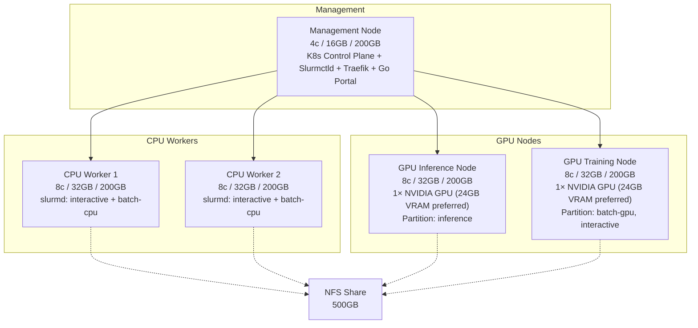

# AI Sandbox: Staging Environment Specification

**Purpose:** This document defines the bare-metal VM request for the Staging/Integration environment. It is designed to validate the Slinky (Slurm-on-Kubernetes) architecture, GPU time-slicing, vLLM inference serving, and NFS integrations before moving to the full production scale defined in the `SYSTEM_ASSESSMENT_AND_PLANNING_REPORT.md`.

> [!IMPORTANT]
> **This environment is FOR TESTING ONLY.** The goal is to validate whether the baseline architecture functions correctly on an HPC-like cluster — not to serve production user load. Resource sizing reflects the minimum needed to exercise scheduling, GPU partitioning, and storage provisioning logic, not the capacity requirements of the full 100-student deployment.

## 1. Staging Topology Overview

To properly test multi-node scheduling, GPU partition isolation, and proper control plane separation, the staging environment utilizes a 5-node topology:

- **1× Management Node:** Dedicated to Kubernetes control plane, Traefik, Slurm controllers, and the Go Portal.
- **2× CPU Worker Nodes:** To validate parallel job scheduling (e.g., Slurm dispatching a job across multiple nodes) and CPU overcommit logic.
- **1× GPU Inference Node:** To validate the central vLLM inference service and Slurm `inference` partition routing.
- **1× GPU Training Node:** To validate NVIDIA GPU Operator time-slicing, student QLoRA training jobs, and Slurm `batch-gpu`/`interactive` partition routing.
- **1× NFS Share:** To validate dynamic student storage provisioning via `nfs-subdir-external-provisioner`.

## 2. Virtual Machine Request Specs

### 2.1 Management / Control Plane Node (1× VM)
- **Role:** Kubernetes API server, etcd, Traefik Ingress Controller, Slurmctld, slurmrestd, Go Portal.
- **Specs:** 4 Cores, 16 GB RAM, 200 GB Local SSD
- **Rationale:** No student workloads run here. Dedicating management services to their own node ensures they communicate with workers over the network properly, uncovering any networking/DNS issues missed in a single-node `kind` cluster. 200 GB disk provides headroom for etcd data, container images, and logs without risk of disk pressure.

### 2.2 CPU Worker Nodes (2× VMs)
- **Role:** `slurmd` workers executing `interactive` and `batch-cpu` jobs.
- **Specs (per VM):** 8 Cores, 32 GB RAM, 200 GB Local SSD
- **Rationale:** Having *two* nodes is critical for testing multi-node Slurm scheduling — verifying that `sbatch` can dispatch parallel tasks across separate physical nodes. 8 cores per node provides enough headroom to validate the 3:1 CPU overcommit logic (8 physical → 24 virtual cores per node). 32 GB RAM supports testing Interactive Prototyping (8 GB) and Data Pipeline (32 GB) workload profiles concurrently.

### 2.3 GPU Inference Node (1× VM)
- **Role:** Hosting the central vLLM inference service (Slurm `inference` partition).
- **Specs:** 8 Cores, 32 GB RAM, 200 GB Local SSD
- **GPU:** 1× NVIDIA GPU with CUDA support
  - **Preferred:** ≥ 24 GB VRAM — allows testing both Q4 and Q8 quantized 8B models with comfortable KV cache headroom.
  - **Minimum Acceptable:** 16 GB VRAM — sufficient for Q4 quantized 8B models only (e.g., Llama 3.1 8B Q4_0 at ~5 GB weights + ~8-10 GB KV cache).
- **Rationale:** Validates that the central vLLM inference server can load and serve quantized LLMs, that Traefik can route API requests to the inference endpoint, and that the Slurm `inference` partition correctly routes jobs to this node. The 200 GB disk accommodates the vLLM container image (~10 GB) plus cached model weights (5-15 GB per quant variant).

### 2.4 GPU Training Node (1× VM)
- **Role:** Student GPU workloads — QLoRA fine-tuning and interactive GPU prototyping (Slurm `batch-gpu` and `interactive` partitions).
- **Specs:** 8 Cores, 32 GB RAM, 200 GB Local SSD
- **GPU:** 1× NVIDIA GPU with CUDA support
  - **Preferred:** ≥ 24 GB VRAM — supports 3 concurrent time-sliced sessions at 8 GB each, providing a meaningful concurrency test.
  - **Minimum Acceptable:** 16 GB VRAM — supports 2 concurrent time-sliced sessions at 8 GB each. Validates the mechanism but with minimal concurrency.
- **Rationale:** Validates NVIDIA GPU Operator time-slicing configuration, Slurm GRES scheduling with `MaxTRESPerJob` VRAM caps, and that QLoRA training of 8B models (~6.7 GB VRAM per the capacity planning) runs correctly inside the 8 GB VRAM partition limit. The 200 GB disk is critical here — the NGC PyTorch base image alone is 15 GB+, and test datasets and checkpoints consume additional space.

### 2.5 Shared Storage
- **Role:** Student home directories and shared datasets.
- **Specs:** 500 GB NFS Share
- **Rationale:** Validates the `nfs-subdir-external-provisioner`. Ensures Kubernetes dynamically creates and mounts per-student PVC sub-directories correctly, and that a shared read-only dataset volume (`ReadOnlyMany`) can be mounted across all worker pods simultaneously.

## 3. Testing Scope & Known Limitations

### What This Environment Validates
1. **Slinky Scheduling:** Multi-node `sbatch` dispatch, partition routing (`interactive`, `batch-cpu`, `batch-gpu`, `inference`), and QoS priority enforcement.
2. **GPU Partition Isolation:** Inference and training workloads routed to separate GPU nodes via Slurm GRES configuration.
3. **GPU Time-Slicing:** NVIDIA GPU Operator ConfigMap-based time-slicing on the training node, with 8 GB VRAM chunk enforcement.
4. **vLLM Inference:** Central LLM service startup, model loading, OpenAI-compatible API serving, and Traefik reverse proxy routing.
5. **NFS Provisioning:** Dynamic PVC creation per student, read-only shared dataset mounts, and volume lifecycle management.
6. **CPU Overcommit:** Validating 3:1 overcommit scheduling logic on CPU worker nodes.

### What This Environment Does NOT Test
1. **Production Scale:** This is not a load test for 100 concurrent students. Resource sizing validates functionality, not capacity.
2. **Apptainer Batch Execution:** The Dual-Path container runtime strategy (OCI for interactive, Apptainer for batch) is a recent architectural decision and is out of scope for this staging phase.
3. **DCGM / Monitoring Stack:** GPU telemetry exporters and Prometheus scraping are deferred to a later validation phase.
4. **Autoscaling:** The elastic NodeSet autoscaling policy requires cloud-provider integration and is not testable on static bare-metal VMs.
5. **GPU Topology Parity:** Production uses 2 GPUs on a single physical node; staging uses 2 separate GPU nodes. Partition routing logic is validated, but intra-node GPU isolation is not.

## 4. Security Requirements

Since these bare-metal VMs will be accessible over the internet:
1. **No Public Control Plane:** Do NOT expose the Kubernetes API (port 6443) or Slurm RPC ports to the public internet.
2. **Access via VPN:** Administrative access should require a VPN (e.g., Tailscale, WireGuard, or University VPN).
3. **Web Gateway:** Only expose HTTP/HTTPS (80/443) via the Traefik Ingress Controller for testing the Portal UI and vLLM API endpoint.

## 5. Summary

| Node | Count | Cores | RAM | Disk | GPU |
| :--- | :---: | :---: | :---: | :---: | :--- |
| Management | 1 | 4 | 16 GB | 200 GB | — |
| CPU Worker | 2 | 8 | 32 GB | 200 GB | — |
| GPU Inference | 1 | 8 | 32 GB | 200 GB | 1× NVIDIA (24 GB VRAM preferred, 16 GB min) |
| GPU Training | 1 | 8 | 32 GB | 200 GB | 1× NVIDIA (24 GB VRAM preferred, 16 GB min) |
| NFS Share | 1 | — | — | 500 GB | — |
| **Totals** | **6** | **36** | **144 GB** | **1.5 TB** | **2 GPUs** |
