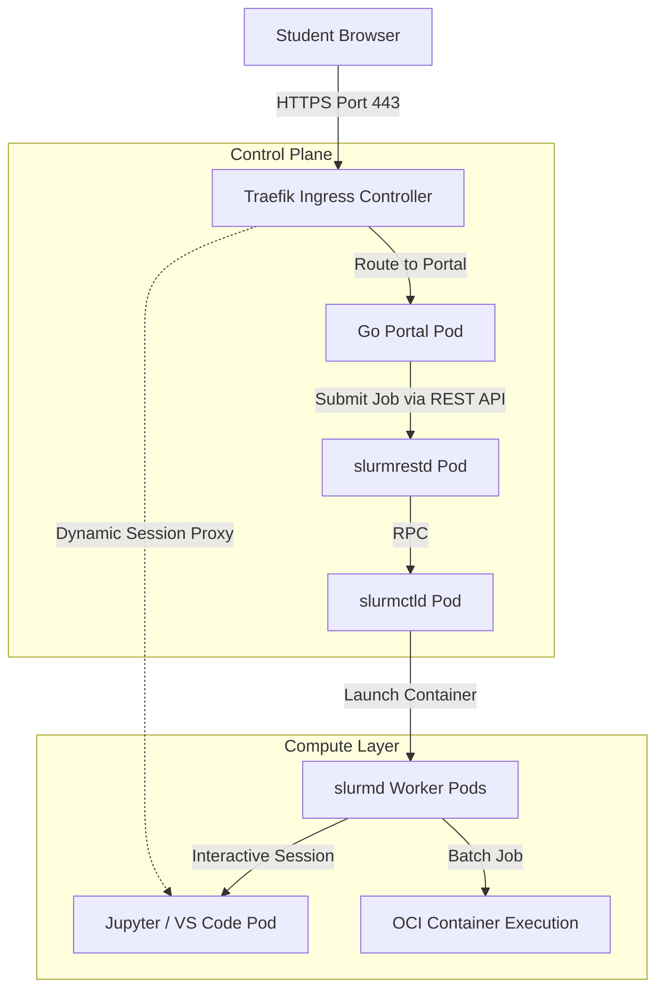

# AI Sandbox: System Assessment & Planning Report

**Document Status:** Milestone Research & Assessment Report  
**Target Audience:** Department Head, Faculty Supervisors, and IT Staff — Computer Engineering Department

This document defines the physical infrastructure, workload capacity, and technology stack for the university AI Sandbox. It serves as the single baseline reference for the project going forward.

---

## Table of Contents

- [1. Platform Overview & Architecture](#1-platform-overview--architecture)
  - [1.1 Why Slinky (Slurm-on-Kubernetes)](#11-why-slinky-slurm-on-kubernetes)
  - [1.2 How a Student Request Flows Through the System](#12-how-a-student-request-flows-through-the-system)
  - [1.3 Workload Types & Their Lifecycle](#13-workload-types--their-lifecycle)
- [2. Hardware & Infrastructure](#2-hardware--infrastructure)
  - [2.1 Physical Hardware Inventory](#21-physical-hardware-inventory)
  - [2.2 GPU Assignment Strategy](#22-gpu-assignment-strategy)
  - [2.3 Storage & Student Identity](#23-storage--student-identity)
- [3. Capacity Planning & Resource Quotas](#3-capacity-planning--resource-quotas)
  - [3.1 Resource Overcommit Strategy](#31-resource-overcommit-strategy)
  - [3.2 Partition Design & Scheduling Queues](#32-partition-design--scheduling-queues)
  - [3.3 Workload Profile Catalog](#33-workload-profile-catalog)
  - [3.4 Per-Student Resource Quotas](#34-per-student-resource-quotas)
- [4. Technology Stack Decisions](#4-technology-stack-decisions)
  - [4.1 Container Runtime Strategy](#41-container-runtime-strategy)
  - [4.2 LLM Inference Runtime](#42-llm-inference-runtime)
  - [4.3 Vector Database](#43-vector-database)
  - [4.4 RAG Orchestration Framework](#44-rag-orchestration-framework)
  - [4.5 ML Training & Fine-Tuning Stack](#45-ml-training--fine-tuning-stack)
  - [4.6 Data Pipeline Framework](#46-data-pipeline-framework)
  - [4.7 Container Image Strategy](#47-container-image-strategy)
  - [4.8 GPU Sharing Mechanism](#48-gpu-sharing-mechanism)
  - [4.9 Monitoring & Observability](#49-monitoring--observability)
- [5. Conclusion](#5-conclusion)

---

## 1. Platform Overview & Architecture

The AI Sandbox is built on a hybrid platform called **Slinky (Slurm-on-Kubernetes)**. It is designed to support 50–100 students running a mix of interactive coding sessions, data preprocessing jobs, and deep learning training at the same time.

### 1.1 Why Slinky (Slurm-on-Kubernetes)

University AI sandboxes have a unique challenge: they need to handle very different types of work at the same time — short interactive sessions (a student writing code in Jupyter), long overnight training jobs, and always-on shared services (like a shared LLM API). A standard Kubernetes cluster alone or a standard Slurm cluster alone cannot handle all of these well.

**Slinky combines both:**

| Problem | Kubernetes Alone | Slurm Alone | Slinky (Combined) |
| :--- | :--- | :--- | :--- |
| **Fair resource sharing between students** | No built-in fair-share logic | Excellent fair-share scheduler | ✅ Slurm handles scheduling |
| **GPU time-slicing for multiple students** | Basic support only | Limited container support | ✅ Full GRES + time-slicing |
| **Web-based Jupyter pod access** | Native | Not supported | ✅ slurm-bridge creates real K8s pods |
| **Elastic scaling (scale to zero)** | Native | Not supported | ✅ Slinky NodeSets auto-scale |
| **Container image management (OCI/Docker)** | Native | Not supported | ✅ Kubernetes manages images |

**Recent validation:** Following Slinky's General Availability (GA) release in late 2025, NVIDIA announced full enterprise support for Slinky, and AWS published official EKS deployment models. Academic clusters using Slinky have reported a 35% increase in hardware utilization and 50% faster interactive session startup times compared to older approaches.

### 1.2 How a Student Request Flows Through the System



**Key components:**
- **Traefik:** The front door. All student traffic enters here. It also provides dynamic session proxying — routing `/proxy/job-123` to a specific student's Jupyter session.
- **Go Portal:** The management web app. It handles login (via Authentik SSO), then communicates with Slurm to start and stop student sessions.
- **Slinky / Slurm Controller:** The brain of the scheduler. It decides who gets which resources, in what order, and for how long.
- **slurm-bridge:** A key Slinky component that translates a Slurm job allocation into a real Kubernetes pod, giving interactive sessions a proper container environment.

### 1.3 Workload Types & Their Lifecycle

#### Interactive Sessions (Jupyter / VS Code)
When a student requests a Jupyter session, the Go Portal submits a job to Slurm → `slurm-bridge` creates a new pod → Traefik creates a unique URL for that student → the student opens their browser and starts coding. When the session ends or the time limit is reached, the pod is removed and resources are freed.

#### Batch Jobs (Training & Data Processing)
Students submit batch scripts using standard `sbatch` commands. Slurm queues the job and runs it inside an isolated container when resources are available. No web browser needed — the job runs in the background and the student can check results later.

#### Central Services (LLM API / Vector DB)
These are always-on services running in a high-priority queue. Students call them as an API rather than managing their own model servers. This is cost-efficient because all students share one central LLM instead of each student spinning up their own.

---

## 2. Hardware & Infrastructure

### 2.1 Physical Hardware Inventory

| Role | Hardware | RAM | Count | Purpose |
| :--- | :--- | :--- | :--- | :--- |
| **CPU Compute Nodes** | Intel Xeon E5-2698 v3, 32-Core / 64-Thread (dual-socket) | 256 GB | 5 nodes (expandable) | Interactive sessions, data preprocessing, portal control plane |
| **GPU Accelerator Node** | AMD EPYC 7313, 32-Core / 64-Thread (dual-socket) + 2x NVIDIA L40 48GB VRAM | 256 GB | 1 node | LLM inference, model training, GPU-accelerated student workloads |
| **Shared Storage** | Enterprise NFS (on-demand provisioning) | — | — | Student home directories, shared datasets |

**NVIDIA L40 Technical Notes:**
- Built on Ada Lovelace architecture (AD102 GPU)
- 48 GB GDDR6 memory, 864 GB/s memory bandwidth
- PCIe Gen4 x16, 300W TDP
- **Important:** The L40 does **NOT** support MIG (Multi-Instance GPU) hardware partitioning. MIG is only available on Hopper (H100), Blackwell (B100), and Ampere (A100) GPUs. GPU sharing on the L40 must use software-level time-slicing — see Section [4.8](#48-gpu-sharing-mechanism).

### 2.2 GPU Assignment Strategy

| GPU | Assignment | Scheduling Partition | Notes |
| :--- | :--- | :--- | :--- |
| **GPU #1 (L40 — 48GB)** | Dedicated to Central LLM Inference API | `inference` (always-on, highest priority) | Serves all students as a shared API endpoint 24/7 |
| **GPU #2 (L40 — 48GB)** | Shared among student interactive & batch jobs | `interactive` (8GB cap) / `batch-gpu` (24GB cap) | Time-sliced using Kubernetes GPU time-slicing |

### 2.3 Storage & Student Identity

**Authentication (Who is this student?):**  
The Sandbox delegates identity entirely to the university's existing **Authentik** server using standard OIDC (OpenID Connect). The Go Portal redirects students to the central Authentik login page. After successful login and MFA, Authentik returns a signed JWT token to the Portal. No separate identity database or LDAP sync is needed inside the Sandbox.

**Storage Isolation (Each student gets their own space):**  
After login, the Portal automatically provisions a private storage folder for the student using the Kubernetes `nfs-subdir-external-provisioner`. Each student's Jupyter pod mounts only their own private NFS folder (e.g., at `/home/jovyan`). This is enforced at the Kubernetes volume level — it is not possible for one student to access another student's files.

**Shared Dataset Storage (Avoiding duplicate copies of large models):**  
A single read-only shared volume is mounted across all pods at `/mnt/shared_datasets`. Large base models and training datasets are stored here once and shared by all students. Because it is `ReadOnlyMany`, students cannot accidentally delete or modify the shared files.

---

## 3. Capacity Planning & Resource Quotas

### 3.1 Resource Overcommit Strategy

**What is overcommitting?**  
Overcommitting means allocating more virtual resources than we physically have, based on the fact that students are not all using their maximum allocation at the exact same moment. This is standard practice in cloud computing (used by AWS, Google Cloud, and most university HPC centers).

| Resource | Strategy | Rationale |
| :--- | :--- | :--- |
| **CPU (Interactive Nodes)** | 3:1 overcommit | Students spend most of their time reading or typing — the CPU is idle over 90% of the time. A 3:1 ratio is more conservative than the industry-standard 4:1, accounting for synchronized classroom use where multiple students hit "Run" at once. |
| **Memory (Interactive Nodes)** | 2:1 overcommit | Running out of RAM causes crashes (unlike CPU which just slows down), so a safer 2:1 ratio is used. |
| **GPU VRAM** | No overcommit | GPU memory is strictly partitioned via Slurm `MaxTRESPerJob` to prevent Out-Of-Memory (OOM) crashes. |

**The math for 100 students:**
```
5 CPU nodes × 32 physical cores = 160 physical cores
160 × 3 (overcommit) = 480 virtual cores available
100 students × 4 virtual cores each = 400 virtual cores needed
480 - 400 = 80 virtual cores of headroom (20% buffer)
```
This comfortably supports 100 concurrent students with 20% headroom for OS overhead and background jobs.

### 3.2 Partition Design & Scheduling Queues

The cluster is divided into four scheduling queues (Slurm partitions), each with its own priority and resource limits:

| Partition | Priority | Max Duration | Resource Limits | Purpose |
| :--- | :--- | :--- | :--- | :--- |
| `inference` | Highest (Tier 3) | Persistent / Renewable | 1 full GPU (#1), 32GB RAM | Always-on central LLM API — cannot be preempted |
| `interactive` | High (Tier 2) | 2 Hours | 4 CPUs, 16GB RAM, 8GB VRAM | Live student Jupyter/VS Code sessions — preemption disabled |
| `batch-cpu` | Medium (Tier 1) | 24 Hours | 16 CPUs, 64GB RAM, no GPU | Long-running data preprocessing jobs |
| `batch-gpu` | Medium (Tier 1) | 7 Days | 16 CPUs, 64GB RAM, 24GB VRAM | Deep learning training runs |

> **Why preemption is disabled on `interactive`:** Killing an active Jupyter session loses all variables in memory (data loaded, model weights, training state). This would be disruptive in a classroom environment. Instead, resource fencing via `MaxTRESPerJob` ensures no single batch job can consume all GPU resources, so interactive sessions can always get their 8GB VRAM slice.

### 3.3 Workload Profile Catalog

The resource limits below are the hard caps applied per individual job:

| Workload Type | Run Mode | CPU | Memory | GPU (L40 VRAM) | Time Limit | Primary Tools |
| :--- | :--- | :--- | :--- | :--- | :--- | :--- |
| **Interactive Prototyping** | Interactive | 4 Cores | 8 GB | None | 2 Hours | JupyterLab, VS Code |
| **Small Model Fine-Tuning** | Interactive | 4 Cores | 16 GB | 8 GB (shared GPU #2) | 2 Hours | PyTorch, HuggingFace PEFT |
| **Central LLM Inference API** | Central Service | 4 Cores | 32 GB | Full GPU #1 (48GB) | Persistent | Triton / vLLM |
| **Data Preprocessing** | Batch | 8 Cores | 32 GB | None | 24 Hours | Pandas, Dask, Polars |
| **Heavy Batch Training** | Batch | 16 Cores | 64 GB | 24 GB (shared GPU #2) | 7 Days | PyTorch, Accelerate |

### 3.4 Per-Student Resource Quotas

| Quota Type | Limit | Notes |
| :--- | :--- | :--- |
| **Max concurrent jobs** | 3 | Prevents one student from holding all resources |
| **Max total virtual CPUs** | 8 cores | Maps to ~2.6 physical cores under 3:1 overcommit |
| **Max total RAM** | 32 GB | Maps to ~16 GB physical RAM under 2:1 overcommit |
| **Max GPU** | 1 time-sliced vGPU (8GB slice) | No student gets a full physical GPU |
| **Storage quota** | 50 GB per student | Enforced via PVC/filesystem quotas |

---

## 4. Technology Stack Decisions

This section documents each major technology choice, the alternatives that were considered, and the justification for the final decision.

> **How to read these tables:** The selected option is always listed as **Option A** (left column). Status labels: **Decided** = final choice made; **Open** = still pending a decision.

---

### 4.1 Container Runtime Strategy

**Status: Decided**

Traditional university HPC clusters use Apptainer (formerly Singularity) to run containers as `.sif` files on bare-metal. In our Slinky architecture, Apptainer creates a nested container problem (a container running inside a Kubernetes pod), which causes performance and security issues. This decision locks in a single, unified container standard.

| Evaluation Criterion | Option A: Dual-Path (Privileged Apptainer) | Option B: Dual-Path (Rootless/Sysbox) | Option C: Native OCI-Only via slurm-bridge |
| :--- | :--- | :--- | :--- |
| **GPU Integration** | **Flawless:** `privileged: true` allows seamless NVIDIA GPU passthrough for batch jobs. | **Broken:** Unprivileged namespaces conflict heavily with proprietary NVIDIA drivers. | **N/A:** Destroys native Slurm batch capabilities entirely. |
| **Kubernetes Node Security** | **Poor:** `slurmd` pods have full root access to the underlying worker node. | **Excellent:** Execution contained in user-space. | **Excellent:** Standard K8s OCI boundaries. |
| **Student Experience** | **Excellent:** Apptainer `.sif` files run exactly as they do on standard university HPC clusters. | **Poor:** Job failures due to rootless container restrictions. | **Mixed:** Eliminates `.sif` files, forcing all jobs through Kubernetes. |

**Decision:** We adopt **Option A: Dual-Path Execution (Privileged Apptainer)**. Interactive web-based workloads will run as native OCI containers managed dynamically by `slurm-bridge`. Batch workloads will be submitted as raw bash scripts to the static `slurmd` worker pods and execute using Apptainer `.sif` files. To make container-in-container execution work with full NVIDIA GPU passthrough, the `slurmd` worker pods will be explicitly configured with `securityContext: { privileged: true }`.

**Justification:** While architecturally "impure" and insecure from a strict Kubernetes perspective, using `privileged: true` is the functional industry standard for passing NVIDIA GPUs into nested Apptainer batch jobs. We accept this security tradeoff to ensure robust, bare-metal-speed GPU integration for student AI jobs.

**References:**
1. SchedMD Slinky Project, *Native OCI Container Support via slurm-bridge*, 2025. [SchedMD Slinky](https://slinky.ai/)
2. Apptainer Documentation, *Nesting Containers and Rootless Execution Challenges*, 2024. [Apptainer Docs](https://apptainer.org/docs/user/main/index.html)
3. PEARC Proceedings, *The Shift to Cloud-Native Container Orchestration in Academic HPC Environments*, 2023. [PEARC Library](https://pearc.org/)

---

### 4.2 LLM Inference Runtime

**Status: Open — pending supervisor review**

The Sandbox serves two different types of LLM workloads: (1) a central always-on API shared by all 100 students, and (2) individual students who want to test their own custom fine-tuned models. No single inference engine is the best fit for both cases, so a dual-engine strategy is proposed.

| Evaluation Criterion | Option A: NVIDIA Triton (TensorRT-LLM) | Option B: vLLM | Option C: Ollama |
| :--- | :--- | :--- | :--- |
| **Throughput & Concurrency** | **Absolute Maximum:** Pre-compiled TensorRT engines squeeze peak GPU utilization. Outperforms vLLM at massive concurrent load on L40 GPUs. | **Very High:** Continuous batching and PagedAttention handle many concurrent requests efficiently. | **Moderate:** Good for a single user; performance drops significantly under parallel requests. |
| **Setup Complexity** | **Extremely High:** Models must be compiled Ahead-of-Time (AOT) into TensorRT engine files specific to the L40 hardware before they can be served. This takes 10–20 minutes per model. | **Moderate:** Point at a HuggingFace model folder and start — model loads dynamically. | **Extremely Low:** Single binary, automatic model download, zero configuration. |
| **API Compatibility** | **Complex:** Requires Triton client libraries or a proxy wrapper to expose an OpenAI-compatible API. | **Native OpenAI-compatible:** Works out of the box with standard AI frameworks (LlamaIndex, LangChain). | **Partial:** Basic OpenAI-compatible wrapper available, but not fully standardized. |
| **Memory Optimization** | **Enterprise-grade:** Inflight batching and paged KV cache, rigidly optimized at compile time for the specific model. | **Advanced:** PagedAttention dynamically manages the KV cache to avoid fragmentation. | **Basic:** Standard llama.cpp execution without high-concurrency memory management. |
| **Suitable for Student Custom Models** | **No:** Expecting students to compile TensorRT engine files is not feasible in a classroom environment. | **Yes:** Students can point vLLM at their own fine-tuned model folder and start testing in under 10 seconds. | **Yes:** But lacks the performance and API consistency needed for student application testing. |

**Recommendation — Dual-Engine Strategy:**

- **Central Inference API (GPU #1) → NVIDIA Triton (TensorRT-LLM):** IT administrators compile the standard models (e.g., Llama 3.1 8B) once. Triton then serves them at maximum throughput for all 100 students simultaneously. Administrators absorb the compilation overhead so students never experience it.

- **Student Custom Inference (GPU #2) → vLLM (on-demand pods):** When a student wants to test their own fine-tuned model, the system launches an isolated, temporary vLLM pod that mounts only that student's private NFS folder. vLLM loads the model dynamically with no compilation step. Although a single-user pod does not fully use vLLM's high-concurrency features, vLLM is used here for **API standardization** — code written to call a private vLLM pod uses the exact same API format as the central Triton service, so no code changes are needed when moving from testing to production.

**References:**
1. NVIDIA Corporation, *TensorRT-LLM Architecture and Triton Inference Server*, 2024. [NVIDIA Docs](https://developer.nvidia.com/tensorrt-llm)
2. Woosuk Kwon et al., *Efficient Memory Management for Large Language Model Serving with PagedAttention*, SOSP 2023. [ACM Digital Library](https://dl.acm.org/doi/10.1145/3600006.3613162)
3. vLLM Project Team, *vLLM Benchmarks & Architecture Documentation*, 2024. [vLLM Docs](https://docs.vllm.ai/)

---

### 4.3 Vector Database

**Status: Decided**

Students building RAG (Retrieval-Augmented Generation) applications need a vector database to store and search embeddings. The database will be deployed as a single centralized service shared by all students, rather than one instance per student.

| Evaluation Criterion | Option A: Qdrant | Option B: Milvus |
| :--- | :--- | :--- |
| **Memory Footprint (1M vectors)** | **Low (~3–6 GB RAM):** High-performance Rust implementation with low memory overhead for HNSW index structures. | **High (8GB+ RAM):** Distributed architecture with high JVM/Go runtime overhead even for small datasets. |
| **Kubernetes Deployment Complexity** | **Extremely Simple:** Single binary deployed as a standard Kubernetes StatefulSet with lightweight official Helm charts. | **Highly Complex:** Distributed architecture requiring multiple sidecars — ZooKeeper, etcd, MinIO/Pulsar, separate query/index nodes. |
| **Search Latency** | **Sub-millisecond:** Highly optimized Rust engine provides sub-5ms search latency on CPU nodes for student-scale workloads. | **Sub-millisecond:** Fast, but introduces higher network overhead due to distributed microservice communication. |
| **Integration with AI Frameworks** | **Excellent:** Native Python client with direct integrations for LlamaIndex and LangChain. | **Good:** Large enterprise community, but documentation is focused on large-scale deployments. |
| **Scalability** | **Student-scale:** Excellent for typical sandbox datasets (up to ~1M vectors). Scales to larger collections with optional disk-mapping. | **Enterprise-scale:** Designed for hundreds of millions of vectors — overkill for a sandbox. |

**Decision:** Qdrant, deployed as a centralized always-on service with sufficient dedicated RAM allocation.

**Justification:** Qdrant's single-binary Rust architecture is far simpler to operate than Milvus's distributed system. By running it as a central service with dedicated memory, the vector index stays in memory at all times, avoiding the slow disk read penalty that would occur if each student tried to run their own Qdrant instance on NFS storage.

**Memory sizing (for reference):**
- 1M vectors at 768 dimensions ≈ 5.5 GB RAM (with HNSW index overhead)
- 1M vectors at 1536 dimensions ≈ 11 GB RAM (full in-memory)
- With int8 Scalar Quantization enabled: reduces to ≈ 1.4 GB and 2.8 GB respectively

**References:**
1. Qdrant Team, *Sizing Guide & Memory Estimation Formulas*, 2024. [Qdrant Docs](https://qdrant.tech/documentation/guides/sizing/)
2. Milvus Project, *System Sizing and Deployment Guide*, 2024. [Milvus Docs](https://milvus.io/docs/system_configuration.md)
3. Vector DB Comparison, *Benchmarking Qdrant vs. Milvus Latency and Recall*, 2023. [VectorDB Benchmarks](https://vector-db-benchmark.qdrant.tech/)

---

### 4.4 RAG Orchestration Framework

**Status: Decided**

Students need a Python framework to connect their LLM, vector database, and data sources into a working RAG pipeline.

| Evaluation Criterion | Option A: LlamaIndex | Option B: LangChain |
| :--- | :--- | :--- |
| **Core Design Purpose** | **Data & Retrieval Centric:** Built specifically for ingestion, chunking, indexing, and querying unstructured data. RAG is its primary use case. | **Agent & Workflow Centric:** Built for connecting multiple tools and building multi-step agent chains. RAG is one of many use cases. |
| **Ease of Use for RAG** | **High:** Students can build a full working RAG pipeline in under 10 lines of code with clear, stable APIs. | **Low-to-Medium:** Requires verbose boilerplate code for basic RAG tasks. The API has also changed frequently across versions. |
| **Documentation Quality** | **Excellent:** Clean, focused documentation specifically designed for indexing and retrieval concepts. | **Dense:** Large but often fragmented documentation. Outdated tutorials are easy to find and follow by mistake. |
| **Ecosystem & Stability** | **Large & fast-growing:** Stable APIs, strong focus on RAG-specific improvements. | **Massive:** Largest ecosystem, but frequent breaking changes between versions cause maintenance issues. |

**Decision:** LlamaIndex is the standard framework for all RAG-related curriculum and reference code.

**Justification:** LangChain is fundamentally an agent orchestration tool, not a RAG library. Using LangChain for basic RAG adds unnecessary complexity. LlamaIndex is purpose-built for the exact use case we need and allows students to focus on learning RAG concepts rather than debugging framework boilerplate.

**References:**
1. Jerry Liu, *LlamaIndex: Data Framework for LLM Applications*, 2023. [LlamaIndex Docs](https://docs.llamaindex.ai/)
2. Harrison Chase, *LangChain: Building Applications with LLMs through Composition*, 2023. [LangChain GitHub](https://github.com/langchain-ai/langchain)
3. CNCF, *State of LLM Application Development & Orchestration Tooling*, 2024. [CNCF Reports](https://www.cncf.io/)

---

### 4.5 ML Training & Fine-Tuning Stack

**Status: Decided**

Students performing parameter-efficient fine-tuning (PEFT/QLoRA) of large language models on the shared NVIDIA L40 GPU need a base container image that works out of the box without requiring manual GPU driver setup.

| Evaluation Criterion | Option A: NVIDIA NGC PyTorch (nvcr.io/nvidia/pytorch) | Option B: Upstream Docker Hub PyTorch | Option C: Custom-Built Image |
| :--- | :--- | :--- | :--- |
| **CUDA & GPU Library Completeness** | **Pre-configured:** Includes pre-compiled cuDNN, NCCL, FlashAttention-2, and BitsAndBytes — all fully validated for the L40 GPU. | **Basic:** Standard PyTorch and CUDA toolkit only. Students must manually install acceleration libraries, often hitting compiler errors. | **Manual compilation:** Every optimization library must be compiled from source, matching the exact L40 hardware flags. |
| **Dependency Stability** | **High:** NVIDIA validates the full stack weekly for hardware-level compatibility. | **Moderate:** Community packages — risks of library version mismatches. | **Low:** High maintenance burden; small changes can break the entire build. |
| **Student Experience** | **Excellent:** `peft`, `flash-attn`, and `bitsandbytes` work immediately — no compiler errors. | **Poor:** Students frequently encounter compiler errors trying to install GPU-optimized libraries. | **Good:** Tailored to specific needs, but requires ongoing maintenance by IT staff. |
| **Image Size** | **Large (15GB+):** Due to vendor library inclusion. Mitigated by the DaemonSet pre-puller (see Justification). | **Moderate (6–8GB):** Smaller but missing critical libraries. | **Optimized (4–6GB):** But risks missing undocumented optimization flags. |

**Decision:** Custom image built on top of NVIDIA NGC PyTorch (`nvcr.io/nvidia/pytorch`), with a Kubernetes DaemonSet Image Pre-Puller deployed on all GPU nodes.

**Justification:** The NGC base guarantees all GPU acceleration libraries work on the L40 without any manual setup. The 15GB+ image size is the main drawback — but this is solved by deploying a Kubernetes DaemonSet that permanently pulls and caches the image on all worker nodes. Because the DaemonSet keeps the image "in use," Kubernetes garbage collection will never delete it. This guarantees that student pods start in under 5 seconds regardless of when they log in.

**VRAM sizing for QLoRA training (validation):**
- Quantized 7B/8B model weights at 4-bit precision ≈ 4.0 GB VRAM
- LoRA adapter gradients and optimizer states ≈ 0.2 GB VRAM
- Activations at batch size 1, sequence length 512 ≈ 2.5 GB VRAM
- **Total ≈ 6.7 GB VRAM** — fits within the 8GB VRAM cap for interactive jobs

**References:**
1. NVIDIA Corporation, *NGC Container Catalog — PyTorch Release Notes*, 2024. [NVIDIA NGC](https://catalog.ngc.nvidia.com/orgs/nvidia/containers/pytorch)
2. Tim Dettmers et al., *QLoRA: Efficient Finetuning of Quantized LLMs*, NeurIPS 2023. [arXiv:2305.14314](https://arxiv.org/abs/2305.14314)
3. Hugging Face, *PEFT: Parameter-Efficient Fine-Tuning*, 2024. [Hugging Face PEFT](https://huggingface.co/docs/peft/)

---

### 4.6 Data Pipeline Framework

**Status: Decided**

Students need tools for data preprocessing — cleaning datasets, feature engineering, and preparing data for model training. The question is whether to provide simple in-pod tools or a full distributed cluster framework.

| Evaluation Criterion | Option A: Dask (Single-Node) & Polars | Option B: Ray Data | Option C: Apache Spark on Kubernetes |
| :--- | :--- | :--- | :--- |
| **Learning Curve** | **Very Low:** Polars is similar to Pandas. Dask replicates the familiar Pandas API. Both are taught in standard data science courses. | **Medium:** Requires learning Ray Actor and Dataset concepts. | **High:** Requires understanding JVM, RDDs, and PySpark API paradigms. |
| **Deployment Complexity** | **None:** Runs inside the student's own Jupyter pod — no extra infrastructure needed. | **High:** Requires running a Ray cluster operator on Kubernetes or custom Slurm start commands. | **Extremely High:** Requires Spark Kubernetes Operator, HDFS/S3 storage, JVM/YARN resource management. |
| **Memory Efficiency** | **Excellent:** Polars uses streaming; Dask processes data in partitions without loading the full dataset into RAM. | **Excellent:** Optimized for pipelined ML loading directly into training loops. | **Good:** In-memory RDD caching, but JVM heap overhead wastes significant RAM. |
| **Scalability** | **Single-node:** Efficient for datasets from GB to ~100GB within one pod's memory. | **Multi-node:** Good for large ML pipelines but complex to set up. | **Enterprise-scale:** Designed for petabytes — massive overkill for a sandbox. |

**Decision:** Dask and Polars bundled in Single-Node mode inside the standard Jupyter image. No distributed cluster frameworks will be deployed.

**Justification:** Datasets larger than 100GB are rare in a student AI curriculum. Bundling single-node Dask and Polars directly into the Jupyter image means students have powerful data tools immediately available with zero setup. Students are responsible for managing their own data within their pod's resource limits.

**References:**
1. Matthew Rocklin, *Dask: Parallel Computation with Common Python APIs*, SciPy 2015. [SciPy Proceedings](https://proc.scipy.org/)
2. Polars Development Group, *Polars: Lightning-fast DataFrame Library*, 2024. [Polars Docs](https://docs.pola.rs/)
3. Ray Team, *Ray Data: Scalable Dataset Preprocessing for Machine Learning*, 2024. [Ray Docs](https://docs.ray.io/en/latest/data/data.html)

---

### 4.7 Container Image Strategy

**Status: Decided**

How student pods get their software environment determines how fast they can start working. This decision also affects storage performance, especially for the NFS filesystem.

| Evaluation Criterion | Option A: Pre-baked OCI Image per Job Type | Option B: Single Base Image + Runtime Conda Environments | Option C: Direct Upstream NGC / DockerHub Images |
| :--- | :--- | :--- | :--- |
| **Pod Startup Time** | **Fast (< 5 seconds):** Image is pre-cached on all nodes via DaemonSet. Student pods start instantly. | **Very Slow (5–15 minutes):** Conda resolves dependencies and installs packages from NFS at pod startup — every time. | **Slow (first time only):** 15GB+ images must be pulled from the internet. Subsequent starts are fast once cached. |
| **Reproducibility & Stability** | **Excellent:** Version-pinned images managed via CI/CD. Every student gets exactly the same environment. | **Poor:** Dynamic environment resolution breaks when upstream packages update. Different students may have different environments. | **Fair:** Relies on upstream registry tags that can silently change. |
| **NFS Impact** | **None:** The image is stored in the container cache on the node's local disk — not on NFS. | **Severe:** Conda environments create hundreds of thousands of tiny files on NFS, causing metadata congestion across the entire cluster. | **None:** Images are stored in the container cache. |
| **Student Customization** | **Low:** Custom packages require a new image build, or ephemeral `!pip install` in the notebook session. | **High:** Students can modify their own Conda environments — but changes don't persist across pod restarts without extra setup. | **None:** Locked to upstream image content. |

**Decision:** Pre-baked OCI Image per job type, modeled after Google Colab's approach.

**Justification:** The NFS metadata issue with Conda is the primary rejection reason. When all 100 students start a new session at the same time (start of class), Conda environments on NFS would generate millions of tiny file reads simultaneously, causing system-wide slowdowns. Pre-baked images avoid this entirely because the image is stored in the local node's container cache. For packages not included in the base image, students can use `!pip install` in their notebook for the duration of their session.

**References:**
1. Slinky SchedMD, *Interactive Workload Image Deployment Best Practices*, 2025. [Slinky Docs](https://slinky.ai/)
2. Kubernetes Documentation, *Container Image Pre-pulling and Scavenging*, 2024. [K8s Docs](https://kubernetes.io/docs/concepts/containers/images/)
3. HPC Advisory Council, *Conda-on-NFS Performance Bottlenecks on Shared Storage*, 2023. [HPC Advisory Council](http://www.hpcadvisorycouncil.com/)

---

### 4.8 GPU Sharing Mechanism

**Status: Open — pending University IT license review**

**Important hardware constraint:** The NVIDIA L40 (Ada Lovelace architecture) does NOT support MIG (Multi-Instance GPU) — the hardware-level partitioning available on H100/A100. GPU sharing on the L40 must use a software-level approach.

| Evaluation Criterion | Option A: Kubernetes GPU Time-Slicing | Option B: NVIDIA vGPU (Virtual GPU) |
| :--- | :--- | :--- |
| **VRAM Isolation** | **Soft:** VRAM is shared concurrently between jobs. No hard hardware boundary — over-allocation causes OOM crashes, which are mitigated by Slurm GRES limits. | **Strict (Hard):** Each virtual GPU gets a guaranteed slice of VRAM and compute, enforced at the hardware virtualization level. No noisy-neighbor problem. |
| **Licensing & Cost** | **Free:** Native capability of the open-source NVIDIA GPU Operator for Kubernetes. | **Commercial license required:** Requires paid NVIDIA vGPU enterprise licenses — potentially prohibitive for a university sandbox budget. |
| **Setup Complexity** | **Low:** Configured via a single Kubernetes ConfigMap in the NVIDIA GPU Operator. Standard Kubernetes resource requests work as normal. | **Extremely High:** Requires hypervisor drivers (ESXi or KVM), a licensing server, and complex VM-to-Pod translation layers. |
| **Performance Overhead** | **< 1%:** Direct bare-metal container execution. | **2–5%:** Virtualization layer adds slight memory translation overhead. |

**Recommendation:** Kubernetes GPU Time-Slicing (Option A) for student interactive sessions on GPU #2.

**Justification:** The zero licensing cost and simple deployment make Option A the practical choice for a university environment. The lack of hard VRAM isolation is compensated by strictly capping all student interactive jobs to 8GB VRAM slices via Slurm's `MaxTRESPerJob` configuration. GPU #1 is reserved entirely for the central LLM inference service and is not time-sliced.

**References:**
1. NVIDIA Corporation, *NVIDIA L40 GPU Datasheet*, 2023. [NVIDIA L40](https://www.nvidia.com/en-us/data-center/l40/)
2. NVIDIA Corporation, *GPU Time-Slicing in Kubernetes*, 2024. [NVIDIA GPU Operator Docs](https://docs.nvidia.com/datacenter/cloud-native/gpu-operator/latest/gpu-sharing.html)
3. NVIDIA Corporation, *NVIDIA Virtual GPU (vGPU) Software Licensing Guide*, 2024. [NVIDIA Licensing Docs](https://docs.nvidia.com/grid/index.html)

---

### 4.9 Monitoring & Observability

**Status: Decided**

The Sandbox needs to expose metrics for GPU health, CPU/memory usage, and Slurm queue status — but it is not responsible for storing or visualizing that data long-term.

| Evaluation Criterion | Option A: Lightweight Exporters Only (DCGM + Node Exporter + Slurm OpenMetrics) | Option B: Full Local Prometheus + Grafana Stack | Option C: Direct Slurm REST API Polling in Go Portal |
| :--- | :--- | :--- | :--- |
| **RAM Cost on Sandbox Nodes** | **Negligible:** Small exporter daemonsets that expose metrics at an HTTP endpoint — no data stored locally. | **High:** Prometheus time-series database requires significant dedicated RAM for retention. | **High:** Portal database must store and scale with telemetry data over time. |
| **GPU Telemetry Detail** | **In-depth:** NVIDIA DCGM Exporter captures per-pod GPU temperature, SM utilization, and memory usage. | **In-depth:** Same exporters can be included, but the storage is also kept locally. | **Basic:** Only GRES allocation counts — no physical GPU health metrics. |
| **Integration with University Systems** | **Best fit:** Raw metrics are scraped by the University Central Management Portal's Prometheus server. | **Redundant:** Duplicates what the central system already does. | **Incompatible:** Portal database is not accessible to central systems. |
| **Maintenance Overhead** | **Low:** No database to maintain; exporters are managed by the NVIDIA GPU Operator. | **Medium:** Database retention policies, disk management, and Grafana dashboard maintenance required. | **High:** Custom polling, caching, and alerting must be written and maintained in Go. |

**Decision:** Deploy lightweight exporters only — NVIDIA DCGM Exporter, Prometheus Node Exporter, and Slurm Native OpenMetrics. No local Prometheus database or Grafana will be deployed on the Sandbox.

**Justification:** The AI Sandbox is part of a larger university platform ecosystem. All long-term telemetry storage and dashboards are the responsibility of the Central Management Portal. Running a local Prometheus time-series database inside the Sandbox would waste RAM that is better used for student workloads. The lightweight exporters expose all the raw GPU, node, and queue metrics needed for central scraping with virtually zero resource cost.

**References:**
1. SchedMD Corporation, *Slurm REST API & OpenMetrics Telemetry Specifications*, 2024. [SchedMD Docs](https://slurm.schedmd.com/rest_api.html)
2. NVIDIA Corporation, *NVIDIA DCGM Exporter for Kubernetes Observability*, 2024. [NVIDIA DCGM GitHub](https://github.com/NVIDIA/gpu-monitoring-tools)
3. Prometheus Operator Team, *ServiceMonitor & PrometheusRule CRD Guides*, 2024. [Prometheus Operator Docs](https://prometheus-operator.dev/)

---

## 5. Conclusion

The AI Sandbox architecture is designed to be a fair, stable, and scalable platform for a 50–100 student AI curriculum. The key design principles are:

1. **Slinky as the foundation** — combining Kubernetes elasticity with Slurm's rigorous fair-share scheduling to handle mixed interactive and batch workloads simultaneously.
2. **Two GPU roles** — one GPU dedicated to a permanent shared LLM API for all students, one GPU time-sliced for interactive training and custom model testing.
3. **Identity and storage delegation** — authentication is fully delegated to the university Authentik server, and storage isolation is handled at the Kubernetes volume level, eliminating the need for manual user administration.
4. **Pre-baked OCI images** — ensuring sub-5-second pod startup times by caching images on all nodes, avoiding the NFS metadata bottleneck that Conda environments would cause.
5. **Lightweight monitoring** — exposing metrics for the central system to scrape, rather than running a local database that wastes student RAM.

This document is the agreed baseline. Any changes to hardware, technology choices, or capacity limits going forward should be reflected here as a living record of the platform's state.
