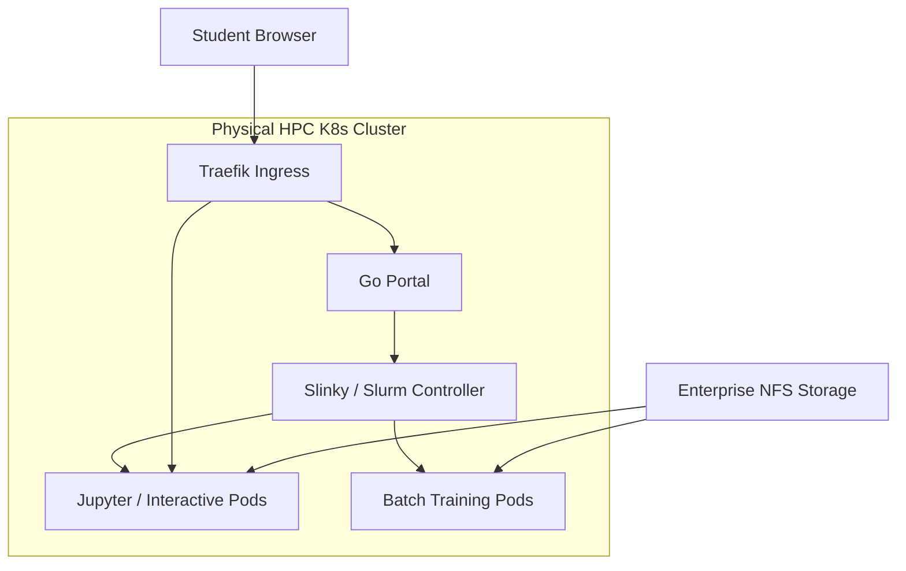

# Tech Stack & Architecture Decisions

> **📋 System Assessment Report**
> This document is part of the System Assessment & Planning Report:
> - [Environment Assessment](./ENVIRONMENT_ASSESSMENT.md) — Hardware, architecture, and deployment topology
> - [Capacity Planning](./CAPACITY_PLANNING.md) — Workload profiles, partitions, and resource quotas
> - **[Tech Stack Decisions](./TECH_STACK_DECISION.md)** — Technology choices and architectural decision records

This document records the core technology stack and architectural decisions for the AI Sandbox, mapping the flow from the user to the physical HPC cluster via the Slinky scheduling suite.

## 1. Reference Architecture

## 2. Core Stack Decisions

### Workload Scheduling & Orchestration: Slinky (Slurm-on-Kubernetes)
*   **Decision:** Use Slinky to bridge Kubernetes and Slurm.
*   **Rationale:** Allows us to leverage Kubernetes for infrastructure management (elastic scaling, OCI images) while maintaining Slurm's superior fair-share and GRES (Generic Resource) scheduling logic for university multi-tenancy.

### Ingress & Routing: Traefik
*   **Decision:** Use Traefik as the Ingress Controller.
*   **Rationale:** Standard, robust solution. Traefik handles dynamic session proxying perfectly (e.g., routing `/proxy/job-123` to a specific dynamically spun-up Jupyter pod) without needing to write custom reverse-proxy logic in the Go Portal.

### Middle Tier: Go Portal
*   **Decision:** Use a custom Go-based portal.
*   **Rationale:** Go is highly performant. The portal will orchestrate API calls to `slurmrestd` and manage the creation of Traefik dynamic routes for interactive sessions. 

### Interactive Environment: Jupyter / VS Code Pods
*   **Decision:** Run Jupyter/VS Code as interactive Slurm jobs within K8s Pods.
*   **Rationale:** Provides instant web-based access to compute.

### Development Environments (Local vs. Prod)
*   **Decision:** `kind` (Kubernetes in Docker) and `Nix` are restricted strictly to local development and reproducible builds.
*   **Rationale:** Local dev simulates the cluster (using `hostPath` for storage). Production will run on the physical bare-metal nodes (Intel Xeons + NVIDIA L40s).

## 3. Storage Layer & Identity Isolation

### Storage Infrastructure: Standard NFS with Subdir Provisioner
*   **Decision:** We will deploy the `nfs-subdir-external-provisioner` (Kubernetes CSI) pointing to a standard Linux NFS server.
*   **Rationale:** This provisioner allows Kubernetes to automatically carve out individual directories on the NFS server whenever a new student logs in, treating them as independent volumes.

### Identity & Isolation: Cloud-Native Dynamic PVCs
*   **Decision:** We are dropping OS-level UID mapping (`libnss-extrausers`). Instead, we will use OIDC/SSO at the Go Portal level. The Portal will instruct Kubernetes to dynamically provision a unique Persistent Volume Claim (PVC) for each student's home directory.
*   **Rationale:** This completely sidesteps the nightmare of syncing LDAP/UIDs across ephemeral pods. From the pod's perspective, it just mounts a volume to `/home/jovyan` (or similar). Kubernetes and the NFS provisioner handle the isolation at the volume level.

### Dataset Sharing: Global Read-Only Mount
*   **Decision:** We will create a single, static Persistent Volume (PV) for shared datasets (e.g., massive AI models, training data).
*   **Rationale:** Every Slinky/Jupyter pod will mount this volume as `ReadOnlyMany` (ROX) at a path like `/mnt/shared_datasets`. This prevents students from accidentally deleting or modifying shared data, while avoiding the cost of duplicating datasets into each student's private directory.

## 4. Application-Layer Stack Decisions

### 4.1: Container Runtime Strategy
**Status:** Decided
**Context:** Transitioning from traditional HPC-centric Apptainer (Singularity) workloads to modern, cloud-native containerized execution in the Slinky-based AI Sandbox. Historically, university clusters have relied on Apptainer to run user-provided `.sif` files on bare-metal. However, in our hybrid Slurm-on-Kubernetes (Slinky) setup, using Apptainer creates complex nesting (containers running inside Kubernetes pods). This introduces substantial performance and security challenges (such as rootless namespace mapping, SUID permission requirements, or complex `proot` workarounds). Furthermore, maintaining two distinct pipelines (OCI images for interactive sessions like Jupyter, and Apptainer files for batch training) doubles the codebase and logic complexity in the Go Portal.
**Options Considered:**
  1. **Dual-Path Execution:** Running interactive workloads via native OCI containers (Kubernetes Pods) and batch workloads via Apptainer `.sif` files executing on bare-metal nodes.
  2. **Pure Apptainer Strategy:** Standardizing all interactive and batch workloads on Apptainer, running them within customized outer pods.
  3. **Native OCI-Only Execution via Slinky `slurm-bridge`:** Standardizing all interactive and batch workloads strictly on native OCI images managed directly by Kubernetes and scheduled via Slurm (Selected).
**Decision:** All job types (both interactive and batch) will run as native OCI containers managed by Slinky's `slurm-bridge`. Apptainer is completely retired from the core execution paths.
**Rationale:** Choosing a unified OCI-only approach completely eliminates container-in-container nesting, security workarounds, and the double maintenance burden of dual execution paths in our custom Go Portal. Utilizing Slinky's native `slurm-bridge` allows us to leverage Kubernetes' standard OCI registry caching, security boundaries, and storage attachments directly while preserving Slurm's fair-share scheduler.
**Consequences:** Students will use standard Dockerfiles (to be built into OCI images via local registries or CI/CD pipelines) instead of Apptainer Definition Files. Any existing Apptainer `.sif` images must undergo a one-time conversion to Docker/OCI format before running on the platform.
**References:**
  1. SchedMD Slinky Project, *Native OCI Container Support via slurm-bridge*, 2025. [SchedMD Slinky](https://slinky.ai/)
  2. Apptainer Documentation, *Nesting Containers and Rootless Execution Challenges*, 2024. [Apptainer Docs](https://apptainer.org/docs/user/main/index.html)
  3. PEARC Proceedings, *The Shift to Cloud-Native Container Orchestration in Academic HPC Environments*, 2023. [PEARC Library](https://pearc.org/)

### 4.2: LLM Inference Runtime
**Status:** Open — pending supervisor review
**Context:** The AI Sandbox provides a persistent shared inference endpoint (configured in the `inference` partition) and individual user inference runtimes to serve small-to-mid size LLMs (e.g., Llama 3.1 8B, Phi-3 14B) on NVIDIA L40 GPUs. We need to evaluate the most appropriate runtime engine, particularly maximizing concurrency for the central shared endpoint.
**Options:**

| Evaluation Criterion | Option A: vLLM | Option B: Ollama | Option C: NVIDIA Triton (TensorRT-LLM) |
| :--- | :--- | :--- | :--- |
| **Throughput & Concurrency** | **Very High:** Achieved via continuous batching and PagedAttention. Excellent for mixed concurrent workloads. | **Moderate:** Excellent for single-user prototyping; struggles to scale throughput under heavy parallel requests. | **Absolute Maximum:** Squeezes maximum hardware utilization via pre-compiled TensorRT engines. Outperforms vLLM at massive concurrency scales on L40 GPUs. |
| **Setup & UX Complexity** | **Moderate:** Requires python environments, configuration of engine args, and manual port routing. | **Extremely Low:** Single binary, simple CLI (`ollama run`), and automatic model downloading with zero config. | **Extremely High:** Models cannot be run instantly; they must be Ahead-of-Time (AOT) compiled into TRT engines specific to the L40 architecture before serving. |
| **Memory Optimization** | **Advanced:** Dynamically manages KV Cache using PagedAttention, avoiding fragmentation. | **Basic:** Relies on standard llama.cpp execution, lacking high-concurrency memory optimizations. | **Enterprise:** Highly optimized inflight batching and paged KV cache, strictly optimized for the specific compiled model. |
| **API Compatibility** | **OpenAI-Compatible:** Native OpenAI API out-of-the-box, making it seamless for standard RAG integrations. | **Proprietary & OpenAI:** Proprietary API endpoints, with basic OpenAI-compatibility wrapper. | **Complex:** Requires Triton client libraries or an additional proxy wrapper layer to perfectly emulate the OpenAI API. |
| **Resource Footprint** | **Heavy:** Claims pre-allocated chunk of VRAM (default 90%) for KV cache. | **Dynamic:** Allocates and frees GPU memory dynamically based on active usage. | **Heavy & Rigid:** Engine and KV cache memory constraints are rigidly defined during the compilation phase. |

**Recommendation:** We propose a **Dual-Engine Strategy** based on the workload origin:
*   **Central Inference API (GPU #1):** If the university demands absolute maximum concurrent throughput, use **Option C (NVIDIA Triton + TensorRT-LLM)**. The administration team will incur the penalty of Ahead-Of-Time (AOT) engine compilation, but gain massive scalability for the shared endpoints.
*   **Student Custom Inference (GPU #2):** For students testing their own custom fine-tuned models in interactive pods, **Option A (vLLM)** is mandatory. Triton requires students to write complex scripts to compile TensorRT engines specific to the L40 hardware, which is completely unfeasible for a learning environment. vLLM allows students to dynamically point to a HuggingFace directory and start serving their model in under 10 seconds.
**References:**
  1. NVIDIA Corporation, *TensorRT-LLM Architecture and Triton Inference Server*, 2024. [NVIDIA Docs](https://developer.nvidia.com/tensorrt-llm)
  2. Woosuk Kwon et al., *Efficient Memory Management for Large Language Model Serving with PagedAttention*, SOSP 2023. [ACM Digital Library](https://dl.acm.org/doi/10.1145/3600006.3613162)
  3. vLLM Project Team, *vLLM Benchmarks & Architecture Documentation*, 2024. [vLLM Docs](https://docs.vllm.ai/)

### 4.3: Vector Database
**Status:** Decided
**Context:** Students build Retrieval-Augmented Generation (RAG) applications requiring a high-performance vector database capable of indexing and querying ~1M vectors (768 or 1536 dimensions) on the CPU/GPU nodes.
**Options:**

| Evaluation Criterion | Option A: Qdrant | Option B: Milvus |
| :--- | :--- | :--- |
| **Memory Footprint (1M vectors)** | **Low (~3GB RAM):** High-performance Rust implementation with extremely low memory overhead for HNSW index structures. | **High (8GB+ RAM):** Distributed architecture with high JVM/Go runtime overhead even for small scale datasets. |
| **K8s Deploy & Ops Complexity** | **Extremely Simple:** Single binary deployed as a standard stateful set. Lightweight, official Helm charts without external dependencies. | **Highly Complex:** Distributed architecture requiring multiple sidecars (ZooKeeper, etcd, MinIO/Pulsar, query/index nodes). |
| **Search Latency (Student Scale)** | **Sub-millisecond:** Highly optimized C++/Rust engine, providing sub-5ms search latency on standard CPU nodes. | **Sub-millisecond:** Fast, but introduces higher network overhead due to distributed microservice communication. |
| **Ecosystem & Community** | **Strong:** Excellent Python client, native integrations with LangChain and LlamaIndex, outstanding developer documentation. | **Very Strong:** Large enterprise community, but documentation is heavily focused on complex, large-scale deployments. |
| **Storage / Indexing Architecture** | **In-Memory & On-Disk:** Highly flexible payload storage, with optional memory-mapping of index vectors on disk (using mmap) to trade speed for memory limits. | **Highly Distributed / Segmented:** Stores indexed data strictly across segregated query/index segments, requiring complex volume orchestration. |

**Decision:** We select **Qdrant** deployed as a centralized, always-on service rather than individual student instances.
**Rationale:** Qdrant's single-binary Rust architecture vastly simplifies Kubernetes operations compared to Milvus. By deploying it as a dedicated central service with sufficient continuous memory allocation, we avoid the heavy IOPS penalty of `mmap`-ing database indices over the standard student NFS mounts, allowing vectors to remain performant in memory while serving all student RAG applications simultaneously.
**References:**
  1. Qdrant Team, *Sizing Guide & Memory Estimation Formulas*, 2024. [Qdrant Docs](https://qdrant.tech/documentation/guides/sizing/)
  2. Milvus Project, *System Sizing and Deployment Guide*, 2024. [Milvus Docs](https://milvus.io/docs/system_configuration.md)
  3. Vector DB Comparison, *Benchmarking Qdrant vs. Milvus Latency and Recall*, 2023. [VectorDB Benchmarks](https://vector-db-benchmark.qdrant.tech/)

### 4.4: ML Training & Fine-Tuning Stack
**Status:** Decided
**Context:** Designing the software stack for single-GPU parameter-efficient training (PEFT/QLoRA) of 7B/8B models on the shared NVIDIA L40 GPU partition.
**Options:**

| Evaluation Criterion | Option A: NVIDIA NGC PyTorch | Option B: Upstream Docker Hub PyTorch | Option C: Pure Custom Built Image |
| :--- | :--- | :--- | :--- |
| **CUDA/Optimization Library Completeness** | **Pre-configured:** Built-in, hyper-optimized libraries (cuDNN, NCCL, FlashAttention-2 pre-compiled) for L40. | **Basic:** Standard PyTorch and CUDA toolkit; requires manual installation of advanced acceleration layers. | **Manual Compilation:** High effort to match vendor optimizations; requires compiling FlashAttention-2 from source. |
| **Image Size / Registry Overhead** | **Very Large (15GB+):** Massive footprints due to deep, multi-framework vendor package inclusion. | **Moderate (6GB–8GB):** Standard runtime size; lacks many of the performance-critical libraries. | **Optimized (4GB–6GB):** Customized layers; but risks missing critical undocumented optimization flags. |
| **Dependency Version Stability** | **High:** Fully validated and tested weekly by NVIDIA for hardware-level compatibility. | **Moderate:** Relies on community-supported packages; potential library-mismatch risks. | **Low:** Maintenance heavy; high risk of "dependency hell" during updates of PEFT/Transformers. |
| **Student UX & Acceleration** | **Excellent:** Works immediately on L40 GPUs; saves students compiling deep learning extensions. | **Fair:** Students face compiler errors when installing libraries like `bitsandbytes` or `flash-attn`. | **Good:** Tailored exactly to course needs; but requires continuous maintenance of build configurations. |

**Decision:** We select **Option A: Custom image built on top of NVIDIA NGC PyTorch (`nvcr.io/nvidia/pytorch`)**, paired mandatorily with a **Kubernetes DaemonSet Image Pre-Puller**.
**Rationale:** The NGC base ensures deep CUDA-level optimizations for the L40 GPU out of the box, saving students from complex compilation errors when using `peft` and `flash-attn`. To mitigate the massive (15GB+) image size and prevent 20-minute startup delays for students, we will deploy a Kubernetes DaemonSet that automatically pulls and caches this massive image onto the local disk of all worker nodes. Because the DaemonSet ensures the image is constantly active on all nodes, Kubernetes garbage collection will not delete it, yielding guaranteed sub-5-second startup times for student pods regardless of which node they are scheduled on.
**References:**
  1. NVIDIA Corporation, *NGC Container Catalog - PyTorch Release Notes*, 2024. [NVIDIA NGC](https://catalog.ngc.nvidia.com/orgs/nvidia/containers/pytorch)
  2. Tim Dettmers et al., *QLoRA: Efficient Finetuning of Quantized LLMs*, NeurIPS 2023. [arXiv:2305.14314](https://arxiv.org/abs/2305.14314)
  3. Hugging Face, *PEFT: Parameter-Efficient Fine-Tuning Documentation*, 2024. [Hugging Face PEFT](https://huggingface.co/docs/peft/)

### 4.5: Data Pipeline Framework
**Status:** Decided
**Context:** Selecting a framework for student-scale data preprocessing (ETL, cleaning, and tokenization) spanning from gigabytes up to 100GB+ datasets on the CPU nodes.
**Options:**

| Evaluation Criterion | Pandas / Polars | Dask | Ray Data | Apache Spark on K8s |
| :--- | :--- | :--- | :--- | :--- |
| **Learning Curve** | **Zero-to-Low:** Pandas is taught in every basic data science course; Polars shares a highly intuitive API. | **Very Low:** Replicates the familiar Pandas API while executing lazily. | **Medium:** Requires learning Ray Actor and Dataset constructs. | **High:** Requires understanding the JVM, RDDs, and PySpark API paradigms. |
| **Deployment Complexity** | **None:** Runs inside standard Python runtime (Jupyter notebook). | **Low-to-Medium:** Works out of the box in a single-node setup; simple to deploy on Slurm using `dask-jobqueue`. | **High:** Requires running a Ray cluster operator on K8s or custom start commands inside Slurm. | **Extremely High:** Requires Spark K8s Operator, HDFS/S3 storage, and JVM/YARN resource managers. |
| **Memory Efficiency** | **Poor (Pandas) / Great (Polars):** Pandas loads entire dataset into RAM; Polars optimizes memory via streaming. | **Excellent:** Processes data in-memory partitions, streaming larger-than-RAM files automatically. | **Excellent:** Optimized for pipelined ML loading, directly feeding training loops. | **Good:** In-memory RDD caching, but suffers from JVM heap memory overhead. |
| **Scalability** | **Single Node Only:** Limited to a single node's physical CPU and RAM limits. | **Multi-Node:** Scalable to large multi-node clusters using Dask schedulers. | **Multi-Node:** Native scaling for deep learning pipelines. | **Enterprise Scale:** Highly robust, but massive overkill for student sandbox datasets. |

**Decision:** We select **Dask and Polars** running strictly in **Single-Node** mode. We will not pursue complex distributed cluster frameworks (like Apache Spark or multi-node Dask via `jobqueue`).
**Rationale:** Massive multi-node datasets (>100GB) are rare in the curriculum context. By bundling single-node Dask and Polars into the standard interactive Jupyter images, students can efficiently process moderately large datasets locally within their pod's memory limits without requiring the massive infrastructure overhead of a distributed compute layer.
**References:**
  1. Matthew Rocklin, *Dask: Parallel Computation with Common Python APIs*, SciPy 2015. [SciPy Proceedings](https://proc.scipy.org/)
  2. Polars Development Group, *Polars: Lightning-fast DataFrame Library*, 2024. [Polars Docs](https://docs.pola.rs/)
  3. Ray Team, *Ray Data: Scalable Dataset Preprocessing for Machine Learning*, 2024. [Ray Docs](https://docs.ray.io/en/latest/data/data.html)

### 4.6: RAG Orchestration Framework
**Status:** Decided
**Context:** Students need an orchestration framework to connect vector databases, data sources, prompt templates, and LLMs into Retrieval-Augmented Generation (RAG) applications.
**Options:**

| Evaluation Criterion | Option A: LangChain | Option B: LlamaIndex |
| :--- | :--- | :--- |
| **Core Paradigm** | **Agent & Workflow Centric:** Designed for building general-purpose, custom multi-agent chains and sequential workflows. | **Data & Search Centric:** Deeply specialized in ingestion, parsing, chunking, indexing, and querying unstructured data. |
| **Abstraction Level** | **Low-to-Medium:** Highly modular and flexible, but often requires writing verbose boilerplate code to accomplish simple RAG tasks. | **High:** Extremely high-level abstractions, allowing students to build a full functional RAG pipeline in under 10 lines of code. |
| **Community & Ecosystem** | **Massive:** Largest ecosystem, extensive third-party plugins, but suffers from frequent breaking changes and api drift. | **Large & Fast Growing:** Outstanding focus on RAG, robust community, and highly stable APIs for data connections. |
| **Documentation & Student UX** | **Dense:** Vast but sometimes fragmented, making it easy for students to get lost in outdated or overly complex tutorials. | **Outstanding:** Clean, cohesive documentation specifically curated for indexing and retrieval concepts. |

**Decision:** We select **LlamaIndex** as the primary framework for all RAG curriculum and reference deployments. LangChain is rejected for core RAG workflows.
**Rationale:** LangChain is fundamentally an agent and workflow orchestration tool, not a dedicated RAG implementation. Attempting to force students to use LangChain for basic RAG introduces unnecessary boilerplate and complexity. LlamaIndex is deeply specialized for data ingestion, chunking, and retrieval, making it the far superior choice for teaching RAG concepts cleanly.
**References:**
  1. Harrison Chase, *LangChain: Building Applications with LLMs through Composition*, 2023. [LangChain GitHub](https://github.com/langchain-ai/langchain)
  2. Jerry Liu, *LlamaIndex: Data Framework for LLM Applications*, 2023. [LlamaIndex Docs](https://docs.llamaindex.ai/)
  3. AI Developer Survey, *State of LLM Application Development & Orchestration Tooling*, 2024. [CNCF Reports](https://www.cncf.io/)

### 4.7: GPU Sharing Mechanism
**Status:** Open — pending decision
**Context:** We need to maximize student density on our single GPU worker node (featuring 2x NVIDIA L40 GPUs with 48GB VRAM each).
- **MIG Feasibility Note:** **CRITICAL:** The NVIDIA L40 (Ada Lovelace architecture) **does NOT support** Multi-Instance GPU (MIG) partitioning. MIG hardware-level carving is strictly limited to compute-specialized NVIDIA Hopper (H100/H200), Blackwell (B100/B200), and Ampere (A100/A30) architectures. Consequently, we must utilize software-defined partitioning.
**Options:**

| Evaluation Criterion | Option A: Kubernetes GPU Time-Slicing | Option B: NVIDIA vGPU (Virtual GPU) |
| :--- | :--- | :--- |
| **VRAM & Compute Isolation** | **None (Soft):** Shares physical GPU cores and VRAM concurrently via round-robin scheduling. Over-allocation of VRAM causes Out-Of-Memory (OOM) crashes. | **Strict (Hard):** Allocates guaranteed portions of VRAM and compute to specific virtual GPUs, preventing "noisy-neighbor" interference. |
| **Licensing & Costs** | **Free:** Native capability of the open-source NVIDIA GPU Operator for Kubernetes. | **Commercial License Required:** Requires expensive enterprise NVIDIA vGPU licenses, which are prohibitive for university sandbox budgets. |
| **Configuration Complexity** | **Low:** Configured via a simple ConfigMap in the NVIDIA GPU Operator; standard K8s resources (e.g., `nvidia.com/gpu: 1`) work natively. | **Extremely High:** Requires custom hypervisor drivers (ESXi/KVM), licensing servers, and complex VM-to-Pod translation layers. |
| **Performance Overhead** | **Negligible (<1%):** Running directly on bare-metal container paths; minimal scheduling latency. | **Low (2%–5%):** Hypervisor virtualization layer adds slight execution and memory translation overhead. |

**Recommendation:** We recommend **Option A: Kubernetes GPU Time-Slicing** for student interactive sessions (routing jobs to the shared GPU #2) due to its zero-cost licensing model and low deployment complexity. Since time-slicing lacks hard VRAM boundaries, we will enforce strict resource limits via **Slurm's GRES partition configuration** (`MaxTRESPerJob`) and monitor utilization in real time to prevent OOM events, while reserving GPU #1 strictly for high-priority persistent inference endpoints.
**References:**
  1. NVIDIA Corporation, *NVIDIA L40 GPU Datasheet*, 2023. [NVIDIA L40 Specs](https://www.nvidia.com/en-us/data-center/l40/)
  2. NVIDIA Corporation, *GPU Time-Slicing in Kubernetes*, 2024. [NVIDIA GPU Operator Docs](https://docs.nvidia.com/datacenter/cloud-native/gpu-operator/latest/gpu-sharing.html)
  3. NVIDIA Corporation, *NVIDIA Virtual GPU (vGPU) Software Licensing Guide*, 2024. [NVIDIA Licensing Docs](https://docs.nvidia.com/grid/index.html)

### 4.8: Monitoring & Observability
**Status:** Decided
**Context:** Deciding on the monitoring stack to collect, alert on, and visualize cluster and user workload metrics across the Slinky Kubernetes pods, Slurm queues, and GPU nodes.
**Options:**

| Evaluation Criterion | Option A: Native Slurm OpenMetrics + Prometheus Operator + DCGM Exporter + Node Exporter | Option B: External Community `slurm_exporter` + Prometheus/Grafana | Option C: Pure Direct Slurm REST API Polling in Go Portal |
| :--- | :--- | :--- | :--- |
| **Deployment & Ops Overhead** | **Low:** Built directly into Slinky's core architecture; utilizes native Slurm 24.11+ OpenMetrics endpoints, DCGM Exporter, and Node Exporter daemonsets. | **Medium:** Requires deploying and maintaining an external translation container (e.g., vpenso) parsing CLI commands. | **High:** Requires writing custom polling, caching, and database storage logic directly inside the Go Portal. |
| **Historical & Trend Analysis** | **Outstanding:** Prometheus serves as a centralized time-series database, enabling multi-month resource tracking (e.g., student GPU-hours). | **Outstanding:** Full Prometheus/Grafana standard storage integrations. | **Poor:** Portal database must be continuously scaled to handle granular time-series telemetry. |
| **Alerting Support** | **Native:** Employs Prometheus Alertmanager to immediately route alerts (GpuOOM, NodeDown) via Webhooks or Slack. | **Native:** Leverages Prometheus Alertmanager. | **Manual:** Requires implementing a custom notification and threshold evaluation engine inside Go. |
| **GPU Telemetry Precision** | **In-Depth:** NVIDIA DCGM Exporter captures granular GPU temperatures, SM utilization, and memory usage per Pod. | **None:** Lacks direct physical GPU health and metrics integration without secondary exporters. | **Basic:** Can retrieve basic allocated GRES counts, but lacks physical GPU core/memory utilization. |

**Decision:** We adopt a hybrid of **Option A**, utilizing **Native Slurm OpenMetrics, NVIDIA DCGM Exporter, and Prometheus Node Exporter** strictly for metric exposure, but we **reject** deploying the heavy Prometheus Operator/Grafana stack locally.
**Rationale:** The AI Sandbox is part of a larger ecosystem and is not responsible for long-term telemetry storage or visualization. Running a local Prometheus time-series database would needlessly consume massive amounts of student RAM. Instead, the Sandbox will run the lightweight Exporters (DCGM for GPUs, Node Exporter for CPU/RAM/Disk, and Slurm OpenMetrics for queues) to expose the raw telemetry. This allows the external Central Management Portal's Prometheus server to scrape the full hardware and scheduling state remotely.
**References:**
  1. SchedMD Corporation, *Slurm REST API & OpenMetrics Telemetry Specifications*, 2024. [SchedMD Docs](https://slurm.schedmd.com/rest_api.html)
  2. NVIDIA Corporation, *NVIDIA DCGM Exporter for Kubernetes Observability*, 2024. [NVIDIA DCGM GitHub](https://github.com/NVIDIA/gpu-monitoring-tools)
  3. Prometheus Operator Team, *ServiceMonitor & PrometheusRule Custom Resource Definition Guides*, 2024. [Prometheus Operator Docs](https://prometheus-operator.dev/)

### 4.9: Container Image Strategy
**Status:** Decided
**Context:** Selecting the optimal strategy to package and deliver various software environments (JupyterLab, PyTorch, RAG tools) to student pods upon job submission.
**Options:**

| Evaluation Criterion | Option A: Pre-baked OCI Image per Job Type | Option B: Single Base Image + Runtime Conda Environments | Option C: Direct Upstream NGC/DockerHub Images |
| :--- | :--- | :--- | :--- |
| **Pod Startup Latency** | **Fast (Cached):** Kubernetes worker nodes cache layers; pods launch in under 5 seconds when image is pre-pulled. | **Extremely Slow:** Dynamic activation of Conda or `pip install` on NFS storage can take 5–15 minutes per pod startup. | **Moderate:** Large upstream sizes (15GB+) must be pulled from external registries over WAN, causing high initial delay. |
| **Maintainability & Drift** | **Excellent:** Managed via central GitHub Actions; version-pinned, reproducible, and tested inside CI. | **Poor:** Dynamic runtimes frequently break due to upstream package updates, leading to non-reproducible run states. | **Fair:** Relies on third-party registry tag updates, risking silent breaking changes in class assignments. |
| **Student Customization** | **Low:** Custom packages require building a new image or dynamically installing packages in ephemeral directories. | **High:** Students can dynamically create and edit their own Conda/pip environments on persistent shared NFS directories. | **None:** Locked to standard upstream image parameters with minimal room for curriculum specialization. |
| **Storage / Registry Overhead** | **Medium:** Requires hosting a local/secure container registry within the university cluster network. | **Low:** Single large image cached on nodes; individual environments stored as file-level directories on NFS. | **None:** Zero local registry storage needed; pulled directly from global hub mirrors. |

**Decision:** We select **Option A: Pre-baked OCI Image per Job Type** mimicking the Google Colab model.
**Rationale:** A Colab-style pre-baked image guarantees sub-5-second startup times by avoiding massive network pulls or network-attached metadata reads. We explicitly reject Conda environments (Option B) on the shared NFS storage, as the hundreds of thousands of tiny files associated with Conda environments would severely bottleneck NFS metadata operations and cause cluster-wide latency during peak startup times (e.g., start of class). For obscure or custom packages, students will utilize ephemeral `!pip install` commands within their notebooks.
**References:**
  1. Slinky SchedMD, *Interactive Workload Image Deployment Best Practices*, 2025. [Slinky Docs](https://slinky.ai/)
  2. Kubernetes Documentation, *Container Image Pre-pulling and Scavenging Configurations*, 2024. [K8s Docs](https://kubernetes.io/docs/concepts/containers/images/)
  3. HPC Advisory Council, *Conda-on-NFS Performance Bottlenecks and Scalability Challenges on Shared Storage*, 2023. [HPC Advisory Council Reports](http://www.hpcadvisorycouncil.com/)
