# WP3-1-6: Container Environment & Image Pipeline — Verification Guide

> **Scope:** This document defines the verification test plan and acceptance criteria for **WP3-1-6: Container Environment & Image Pipeline**. It validates the dual-path execution model:
> 1. **Interactive Path:** Local in-cluster OCI Registry (`registry:5000`) deployment, image publishing, and on-demand pulling for interactive pods (JupyterLab, VS Code, Bash).
> 2. **Batch Path:** Building and executing Apptainer (`.sif`) squashfs images (built from `python.def`) via Direct NFS Streaming inside `slurmd` compute pods.
> 3. **Security & Permissions:** Validating root-owned read-only boundaries on shared software catalogs (`/mnt/storage/common/software`).
>
> **Environment:** Local Kind cluster / CI runner — no physical GPU required (runs in CPU/mock mode with `--nv` fallback).

---

## 1. Test Architecture Overview

```mermaid
flowchart TD
    subgraph InteractiveVerification ["Interactive Path Verification (OCI)"]
        reg["In-Cluster Registry
(localhost:5000 / registry.slurm.svc:5000)"]
        dockerPush["Host docker push"]
        k8sPod["Interactive Pod
(imagePullPolicy: IfNotPresent)"]
        
        dockerPush -->|Push interactive-jupyter| reg
        reg -->|On-Demand Pull| k8sPod
    end

    subgraph BatchVerification ["Batch Path Verification (Apptainer SIF)"]
        defFile["storage/.../hello/python.def"]
        sifBuild["apptainer build python.sif"]
        nfsStore["/mnt/storage/common/software/python.sif
(root:root 755)"]
        slurmdJob["slurmd Worker Pod
(sbatch job execution)"]
        
        defFile --> sifBuild
        sifBuild --> nfsStore
        nfsStore -->|Direct NFS Stream| slurmdJob
    end
```



---

## 2. Test Plan & Execution Steps

### Pre-Requisite: Cluster Bootstrap

```bash
# Clean up and boot cluster
kind delete cluster 2>/dev/null || true
kind create cluster --config k8s/kind-config.yaml
kubectl wait --for=condition=Ready nodes --all --timeout=60s
./scripts/start-slinky.sh
```

---

### Test 1: In-Cluster OCI Registry Deployment & Host Push

**Purpose:** Verify that the internal registry is healthy, persistent, and accessible from both the host (for pushes) and cluster nodes (for pulls).

```bash
# 1. Verify registry pod is Running
kubectl get pods -n slurm -l app=registry

# 2. Build and push curated interactive Jupyter image to local registry
docker build -t localhost:5000/interactive-jupyter:latest images/jupyterlab/
docker push localhost:5000/interactive-jupyter:latest

# 3. Query registry catalog from host
curl -s http://localhost:5000/v2/_catalog
```

**Acceptance Criteria:**
- [ ] Registry pod is in `Running` state under namespace `slurm`.
- [ ] `docker push localhost:5000/interactive-jupyter:latest` exits with code 0.
- [ ] `curl http://localhost:5000/v2/_catalog` returns `{"repositories":["interactive-jupyter"]}`.

---

### Test 2: Interactive Session On-Demand Pull & Instant Launch

**Purpose:** Verify that a Kubernetes interactive session pod can pull from the in-cluster registry on demand and start up cleanly.

```bash
# 1. Apply a test interactive session pod spec referencing the local registry
kubectl run test-interactive-session --image=localhost:5000/interactive-jupyter:latest --image-pull-policy=IfNotPresent --restart=Never -n slurm -- sleep 60

# 2. Wait for pod to be running
kubectl wait --for=condition=Ready pod/test-interactive-session -n slurm --timeout=60s

# 3. Clean up
kubectl delete pod test-interactive-session -n slurm
```

**Acceptance Criteria:**
- [ ] Pod pulls successfully from `localhost:5000/interactive-jupyter:latest` without `ImagePullBackOff` or `x509` TLS certificate errors.
- [ ] Pod transitions to `Running` state.

---

### Test 3: Batch Apptainer SIF Build & Direct NFS Streaming

**Purpose:** Build a lightweight `.sif` image from `storage/projects/project1/software/hello/python.def` and execute an `sbatch` batch job using `apptainer exec` inside a `slurmd` worker pod.

```bash
# 1. Build the lightweight test SIF from python.def
docker run --rm --privileged --entrypoint /bin/bash -v $(pwd)/storage:/mnt/storage slurmd-custom:latest -c "apptainer build /mnt/storage/common/software/python.sif /mnt/storage/projects/project1/software/hello/python.def"

# 2. Submit a batch job executing Python code inside python.sif via Slurm
JOB_ID=$(kubectl exec -n slurm -c slurmctld slurm-controller-0 -- sbatch --parsable --partition=batch-cpu --output=/mnt/storage/slurm-%j.out --wrap="apptainer exec --bind /mnt/storage:/mnt/storage /mnt/storage/common/software/python.sif python3 -c 'import sys; print(\"Apptainer batch execution SUCCESS on Python\", sys.version)'")

echo "Submitted batch job: $JOB_ID"

# 3. Wait for job completion and check logs
sleep 5
kubectl exec -n slurm slurm-worker-slurmd-cpu-0 -c slurmd -- cat /mnt/storage/slurm-${JOB_ID}.out
```

**Acceptance Criteria:**
- [x] `apptainer build` successfully compiles `python.def` into `python.sif`.
- [x] Slurm batch job runs to completion (`COMPLETED` in `sacct` / `squeue`).
- [x] Output log contains `Apptainer batch execution SUCCESS on Python 3.10`.

---

### Test 4: Security & Tampering Protection (Negative Test)

**Purpose:** Ensure student users cannot overwrite, replace, or delete shared `.sif` images in `/mnt/storage/common/software/`.

```bash
# 1. Enforce root ownership on common software directory
docker exec kind-control-plane chown -R root:root /mnt/storage/common/software
docker exec kind-control-plane chmod -R 755 /mnt/storage/common/software
docker exec kind-control-plane chmod 644 /mnt/storage/common/software/python.sif

# 2. Attempt to overwrite python.sif as unprivileged student user (UID 1001)
docker exec -u 1001:1001 kind-worker3 bash -c "echo 'poison' > /mnt/storage/common/software/python.sif" 2>&1 || true

# 3. Verify file was NOT modified
file storage/common/software/python.sif
```

**Acceptance Criteria:**
- [x] Overwrite attempt returns `Permission denied`.
- [x] `python.sif` remains a valid SquashFS image archive.

---

## 3. Consolidated Acceptance Checklist

| Requirement | Test Scenario | Expected Outcome | Status |
| :--- | :--- | :--- | :--- |
| **Local OCI Registry** | Test 1: Push & Catalog | Image pushed and catalog listed on port 5000 | ✅ Passed |
| **Interactive On-Demand Pull** | Test 2: Session Launch | Kubelet pulls on demand, pod reaches `Ready` | ✅ Passed |
| **Apptainer SIF Execution** | Test 3: Sbatch Job | `python.sif` executes Python script over NFS mount | ✅ Passed |
| **Shared Storage Security** | Test 4: Permissions Test | Non-root writes to `/mnt/storage/common/` blocked | ✅ Passed |
