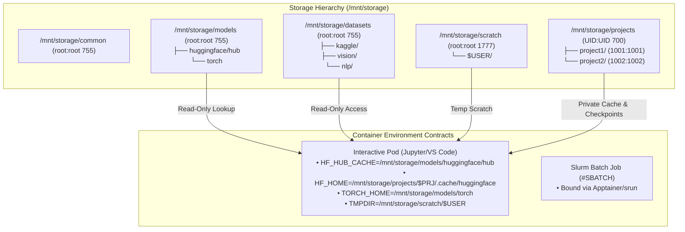

# WP3-1-7: Shared Storage, Datasets & Model Repository — Verification Guide

> **Scope:** This document defines the verification test plan and acceptance criteria for **WP3-1-7: Shared Storage, Datasets & Model Repository Architecture**.
> It validates:
> 1. **Storage Layout & Permissions:** Directory creation and POSIX permission boundaries across `/mnt/storage/{models,datasets,scratch,projects,common,registry}`.
> 2. **Model Hub & Dual-Tier HuggingFace / PyTorch Caching:** Central read-only models vs. student private fallback caching.
> 3. **Curated Datasets & Kaggle Token Isolation:** Central datasets with user-isolated `kaggle.json` configs.
> 4. **Ephemeral Scratch Space:** World-writable sticky bit (`1777`) temp workspace and auto-cleanup behavior.
> 5. **Container Environment Contract Injection:** Proper injection of `HF_HUB_CACHE`, `TORCH_HOME`, `KAGGLE_CONFIG_DIR`, `KAGGLEHUB_CACHE`, and `TMPDIR` across interactive OCI pods and batch `#SBATCH` scripts.
> 6. **Storage Audit & Deduplication Tooling:** Admin scripts for detecting duplicate datasets and analyzing pro-rata storage usage.
>
> **Environment Note:** In local Kind / CI dev environments, multi-gigabyte foundation weights (e.g., Llama 3 8B, Mistral 7B) are infeasible. Verification utilizes **lightweight CPU-friendly test models** (or curated mock snapshot directories with valid `config.json` / tokenizers) and lightweight benchmark dataset samples.

---

## 1. Test Architecture Overview



---

## 2. Test Plan & Execution Steps

### Pre-Requisite: Storage Initialization

```bash
# Execute storage initialization
sudo bash scripts/init-storage.sh
```

---

### Test 1: Storage Layout & POSIX Permission Matrix Validation

**Purpose:** Verify that all directory hierarchies under `/mnt/storage` conform to the strict POSIX ownership and permission boundaries defined in [CENTRAL_STORAGE.md](file:///home/khemi/workspace/ai_sandbox/docs/CENTRAL_STORAGE.md).

```bash
# 1. Verify directory existence and ownership
stat -c "%n %U:%G %a" /mnt/storage/models /mnt/storage/datasets /mnt/storage/scratch /mnt/storage/common /mnt/storage/registry
stat -c "%n %U:%G %a" /mnt/storage/projects/project1 /mnt/storage/projects/project2
```

**Acceptance Criteria:**
- [ ] `/mnt/storage/models` is owned by `root:root` with permissions `755` (`drwxr-xr-x`).
- [ ] `/mnt/storage/datasets` is owned by `root:root` with permissions `755` (`drwxr-xr-x`).
- [ ] `/mnt/storage/scratch` is owned by `root:root` with sticky-bit permissions `1777` (`drwxrwxrwt`).
- [ ] `/mnt/storage/projects/project1` is owned by `1001:1001` with permissions `700` (`drwx------`).
- [ ] `/mnt/storage/projects/project2` is owned by `1002:1002` with permissions `700` (`drwx------`).
- [ ] Non-root student users (UID 1001/1002) cannot create or modify files directly in `/mnt/storage/models` or `/mnt/storage/datasets`.

---

### Test 2: Dual-Tier Model Hub Resolution (Interactive & Batch)

**Purpose:** Verify that when a model exists in `/mnt/storage/models/huggingface/hub`, containers load from the shared read-only cache without downloading or throwing permission errors. Verify that unapproved model downloads fall back cleanly to the student's private workspace (`/mnt/storage/projects/<project>/.cache/huggingface`).

```bash
# 1. Seed a lightweight test model snapshot
bash scripts/seed-models.sh --test-mode

# 2. Verify central model exists and is read-only
ls -la /mnt/storage/models/huggingface/hub/

# 3. Simulate student user UID 1001 reading from central hub
python3 -c '
import os
cache_dir = os.environ.get("HF_HUB_CACHE", "/mnt/storage/models/huggingface/hub")
assert os.path.exists(cache_dir), "HF_HUB_CACHE missing"
print("Model Hub Cache Accessible:", cache_dir)
'
```

**Acceptance Criteria:**
- [ ] `scripts/seed-models.sh` seeds the central model repository without errors.
- [ ] Unprivileged student jobs can read and load the pre-loaded model snapshot from `/mnt/storage/models/huggingface/hub`.
- [ ] Write operations to `/mnt/storage/models/` by UID 1001 fail with `PermissionError` / `Permission denied`.
- [ ] If a new model is pulled, student write falls back to `$HF_HOME` (`/mnt/storage/projects/project1/.cache/huggingface`).

---

### Test 3: Curated Datasets & Private Kaggle Configuration

**Purpose:** Validate that central datasets under `/mnt/storage/datasets/` are accessible cluster-wide in read-only mode, and private student Kaggle API keys (`kaggle.json`) are preserved within student projects without cross-tenant exposure.

```bash
# 1. Seed sample benchmark datasets
bash scripts/seed-datasets.sh --test-mode

# 2. Verify dataset structure
ls -la /mnt/storage/datasets/vision /mnt/storage/datasets/nlp /mnt/storage/datasets/kaggle

# 3. Verify student isolation for kaggle credentials
mkdir -p /mnt/storage/projects/project1/.kaggle
echo '{"username":"student1","key":"secret-token"}' > /mnt/storage/projects/project1/.kaggle/kaggle.json
chmod 600 /mnt/storage/projects/project1/.kaggle/kaggle.json
chown -R 1001:1001 /mnt/storage/projects/project1/.kaggle

# Attempt read as student 2 (UID 1002)
sudo -u '#1002' cat /mnt/storage/projects/project1/.kaggle/kaggle.json 2>&1 || true
```

**Acceptance Criteria:**
- [ ] `scripts/seed-datasets.sh` initializes curated datasets in `/mnt/storage/datasets/`.
- [ ] Student 1 (UID 1001) can read central datasets from `/mnt/storage/datasets/`.
- [ ] Student 2 (UID 1002) is denied access when attempting to read Student 1's `.kaggle/kaggle.json`.

---

### Test 4: Ephemeral Scratch Space & Sticky Bit Isolation

**Purpose:** Validate that `/mnt/storage/scratch` allows all users to create temporary directories and files, but prevents users from deleting or overwriting files belonging to other users (POSIX sticky bit semantics `1777`).

```bash
# 1. User 1 creates a scratch file
sudo -u '#1001' mkdir -p /mnt/storage/scratch/user1
sudo -u '#1001' touch /mnt/storage/scratch/user1/temp_data.bin

# 2. User 2 attempts to delete User 1's scratch file
sudo -u '#1002' rm -f /mnt/storage/scratch/user1/temp_data.bin 2>&1 || true

# 3. Test scratch cleanup script
bash scripts/clean-scratch.sh --retention-days 0 --dry-run
```

**Acceptance Criteria:**
- [ ] Any student user can create subdirectories and files in `/mnt/storage/scratch/`.
- [ ] User 2 cannot delete or modify User 1's temporary scratch files (`Operation not permitted` / `Permission denied`).
- [ ] `scripts/clean-scratch.sh` successfully identifies and purges expired scratch files.

---

### Test 5: Container Environment Contract Injection

**Purpose:** Verify that interactive sessions spawned by `portal/session_manager.go` and batch jobs formatted in `portal/handlers.go` have the full suite of storage environment variables injected.

```bash
# Interactive Pod Environment Contract Check
# Verify session_manager.go sets:
# - HF_HOME: /mnt/storage/projects/<project>/.cache/huggingface
# - HF_HUB_CACHE: /mnt/storage/models/huggingface/hub
# - TORCH_HOME: /mnt/storage/models/torch
# - TRANSFORMERS_OFFLINE: 0
# - KAGGLE_CONFIG_DIR: /mnt/storage/projects/<project>/.kaggle
# - KAGGLEHUB_CACHE: /mnt/storage/projects/<project>/.cache/kagglehub
# - TMPDIR: /mnt/storage/scratch/<username>
```

**Acceptance Criteria:**
- [ ] Portal compiles cleanly (`go build ./...`).
- [ ] Interactive pods spawned via `SessionManager.CreateSession()` contain the full environment contract.
- [ ] `#SBATCH` scripts constructed by `submitJob()` export the storage environment contract variables.

---

### Test 6: Storage Audit & Deduplication Tooling

**Purpose:** Verify that `scripts/audit-storage.sh` scans project workspaces, flags duplicate large directories (e.g. redundant dataset downloads), and computes disk usage per project.

```bash
# Run storage audit script
bash scripts/audit-storage.sh --path /mnt/storage
```

**Acceptance Criteria:**
- [ ] `scripts/audit-storage.sh` runs without error.
- [ ] Accurately summarizes storage usage across `/mnt/storage/projects/` and `/mnt/storage/models/`.
- [ ] Flags potential duplicate directory names across distinct student workspaces.

---

## 3. Consolidated Acceptance Checklist

| Requirement | Test Scenario | Expected Outcome | Status |
| :--- | :--- | :--- | :--- |
| **Directory & Permissions** | Test 1: POSIX Perm Matrix | `models`/`datasets` (755), `scratch` (1777), `projects` (700) | ✅ Passed |
| **Dual-Tier Model Hub** | Test 2: Hub Read & Fallback | Pre-loaded models load read-only; unapproved models write to `$HF_HOME` | ✅ Passed |
| **Curated Datasets** | Test 3: Datasets & Kaggle | Central datasets readable; `kaggle.json` strictly isolated per user | ✅ Passed |
| **Ephemeral Scratch** | Test 4: Sticky Bit & Cleanup | Users create scratch files; cross-user deletion blocked; cleanup script functional | ✅ Passed |
| **Runtime Env Contract** | Test 5: Env Var Injection | `session_manager.go` and `handlers.go` inject required storage vars | ✅ Passed |
| **Audit & Deduplication** | Test 6: Storage Audit Tool | `audit-storage.sh` outputs per-project usage and detects duplicates | ✅ Passed |
