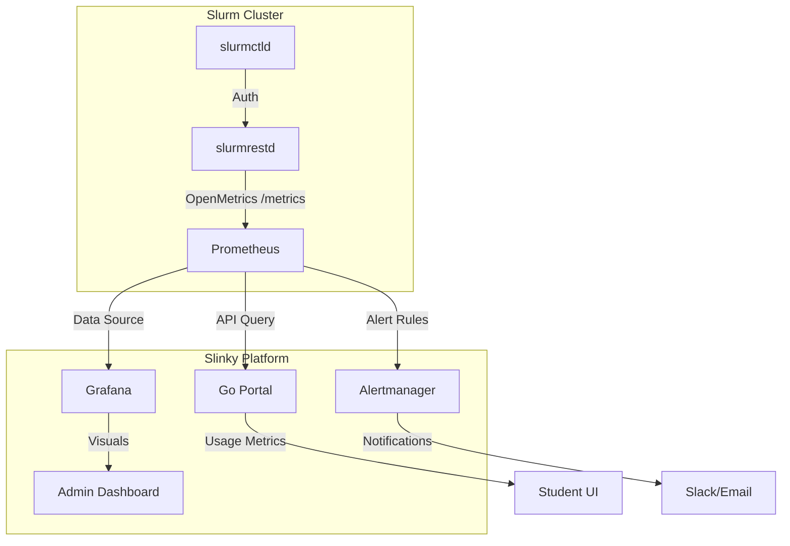

# Slurm Info Exchange and Resource Monitoring Research

This document outlines the findings and strategies for exchanging telemetry, user behavior, and resource utilization data between the local AI Sandbox Slurm cluster and the central portal.

---

## Research: Slurm Info Exchange and Resource Monitoring with a Central Portal

### Summary
To monitor our AI Sandbox's Slurm cluster from a central portal, we can expose cluster-level telemetry, job queues, and detailed compute node/GPU resource utilization. This integration captures overall system health and individual user workloads, sending structured metrics back to the central portal. The maturity level of these solutions is high, leveraging established Prometheus exporters or native Slurm metric APIs.

### Key Findings
| Question | Finding |
|---|---|
| **Can we track user behavior and job logs?** | Yes. Slurm's native accounting database (`slurmdbd`) logs every job submission, execution time, allocated cores/GPUs, user identity, and completion status. Additionally, job completion plugins or Prolog/Epilog scripts can push webhooks directly to the central portal when jobs start or end. |
| **How can we monitor real-time resource usage?** | We can collect CPU, memory, and GPU usage metrics. The industry standard is deploying a Prometheus `slurm_exporter` (such as [SckyzO/slurm_exporter](https://github.com/SckyzO/slurm_exporter)) or using Slurm 25.11's built-in `metrics/openmetrics` plugin. These endpoints expose real-time resource allocations, node states, and active queues. |
| **How does data flow to the central portal?** | The central portal can either pull metrics by querying a Prometheus server running in the sandbox (via its HTTP API) or our sandbox can push summary statistics to the central portal's API using automated cron jobs, Slurm Epilog scripts, or direct event hooks. |

### Pros
- **High Visibility:** The central portal gains real-time tracking of idle vs. active compute capacity across all sandboxes.
- **Granular Accounting:** Enables tracking resource consumption (e.g., GPU hours) per user or project for quota management.
- **Non-Intrusive:** Leveraging Prometheus metrics or webhook-based Epilog scripts does not interfere with running Slurm jobs.

### Cons / Risks
- **Network Overhead:** Real-time metrics streaming can add network traffic between the sandbox cluster and the central portal if not aggregated.
- **Security & Authorization:** Need to secure the REST APIs or Prometheus endpoints using token authentication or mutual TLS to prevent unauthorized access to sandbox internals.

### Integration Complexity
Integrating this into our Slinky-based Kubernetes stack is moderately straightforward:
1. **Prometheus Stack:** We can deploy the Prometheus operator or a lightweight `slurm_exporter` pod inside our existing `slurm` namespace.
2. **Metrics Endpoint:** Expose a read-only endpoint via our local Traefik ingress controller, configured with basic auth or API tokens, which the central portal can query.
3. **Prolog/Epilog Webhooks:** Write a simple shell script in our Slurm controller that triggers a `curl` POST to the central portal whenever a job completes, sending job duration and resource stats.

### Sources
- [SchedMD Slurm Documentation](https://slurm.schedmd.com/) — Official guide on Slurm metrics plugins and job accounting database.
- [GitHub: SckyzO/slurm_exporter](https://github.com/SckyzO/slurm_exporter) — Details on exporting Slurm cluster status and resource usage to Prometheus/Grafana.

---

## ⚖️ Evaluation: Slurm REST API vs. Prometheus slurm_exporter

Monitoring a Slurm cluster in a Kubernetes-native environment like Slinky presents two primary paths for telemetry: leveraging the native **Slurm REST API** or deploying the community-standard **Prometheus slurm_exporter**.

### Slurm REST API (Current Approach)
The Slurm REST API (specifically v0.0.42+ as used in our Go portal) provides a structured JSON interface to the Slurm controller.

*   **Reliable Metrics:**
    *   **Node States:** Detailed status of every node (IDLE, ALLOCATED, DOWN, DRAINING).
    *   **Resource Allocation:** Real-time counts of allocated vs. total CPUs, Memory, and GRES (GPUs).
    *   **Job Lifecycle:** Complete job manifests including submission time, start/end times, and exit codes.
    *   **Queue Health:** Real-time visibility into partitions and queue depth.
*   **Performance & Scalability:**
    *   **Pros:** Direct access to the source of truth; no additional "middleman" daemon required. Uses existing JWT-based authentication.
    *   **Cons:** High-frequency polling of the REST API can increase CPU load on `slurmctld` because each request involves JSON serialization. For large clusters (1000+ nodes), this may introduce latency.
    *   **Native OpenMetrics:** Newer versions of Slurm (starting from 24.11) include a `metrics/openmetrics` plugin that allows `slurmrestd` to serve Prometheus-formatted metrics directly at `/slurm/v1/metrics`, bridging the gap between a REST API and a native exporter.

### Prometheus slurm_exporter
The [slurm_exporter](https://github.com/vpenso/prometheus-slurm-exporter) is a widely adopted tool that translates Slurm CLI (`sinfo`, `squeue`, `scontrol`) output into Prometheus metrics.

*   **Additional Metrics:**
    *   Exposes specific Prometheus counters and gauges like `slurm_job_count`, `slurm_node_cpus_total`, and `slurm_partition_drain`.
    *   Can often be configured to scrape more frequently than the REST API without directly impacting the main controller as heavily, depending on the implementation.
*   **Architectural Benefits:**
    *   **Standardization:** Follows the standard Prometheus scrape model, making integration with the Prometheus Operator and Grafana "plug-and-play."
    *   **Resilience:** Decouples the observability stack from the REST API availability. If `slurmrestd` is down, the exporter (if it uses CLI) might still provide some data.

### Conclusion & Recommendation
**Recommendation: Transition to Native Slurm OpenMetrics (REST API).**

For the AI Sandbox, we recommend utilizing the **Slurm REST API's native OpenMetrics capabilities** (or the standard REST endpoints for the portal).
1.  **Reduced Complexity:** Sticking with the REST API avoids adding another moving part (`slurm_exporter`) to our Slinky deployment.
2.  **Unified Authentication:** Both the Portal and the Observability stack can share the same JWT-based security model.
3.  **Modern Alignment:** SchedMD is moving towards making the REST API the primary integration point. Leveraging the `metrics/openmetrics` plugin provides the benefits of Prometheus without the overhead of a separate exporter.

*Justification:* Since our Go portal is already tightly integrated with `slurm-client`, extending this to Prometheus via the native Slurm metrics plugin is the most sustainable path.
## 📊 Observability Stack Architecture

Based on the recommendation to leverage the Slurm REST API and its OpenMetrics integration, the observability stack is designed to be lightweight and Kubernetes-native.

### Data Ingestion
The telemetry data flow is centralized through the Prometheus Operator:

1.  **Scraping:** Prometheus is configured to scrape the `slurmrestd` service at regular intervals (e.g., 30s) using a ServiceMonitor.
2.  **Authentication:** Prometheus uses a long-lived JWT token (stored as a K8s Secret) to authenticate against the Slurm REST API.

### Grafana Dashboards
Admin-facing dashboards focus on cluster health and resource distribution:
*   **Cluster Overview:** Total nodes, active jobs, and pending job count.
*   **GPU Utilization:** Real-time GRES usage per partition, identifying under-utilized L4/L40S nodes.
*   **Tenant Heatmap:** Visualizing resource consumption (CPU/GPU) across different student projects.
*   **Node Health:** Tracking node states (Drained/NotResponding) to identify hardware failures.

### Alerting Rules
Critical alerts are defined in PrometheusRule manifests:
*   **NodeNotResponding:** Triggered if a node remains in `down` or `not_responding` state for > 5 minutes.
*   **GpuUsageStalled:** Triggered if a GPU is allocated but shows 0% utilization for > 1 hour (detecting idle training sessions).
*   **GpuOOMEvent:** Triggered if a job is killed due to Out-Of-Memory on the GPU, detected via Slurm's `ExitCode` or `LastTerminatedSignal`.
*   **QueueBacklogHigh:** Triggered if the pending job queue exceeds a threshold (e.g., 50 jobs), indicating a need for autoscaling or partition adjustments.
*   **SlurmRestdDown:** Critical alert if Prometheus cannot scrape the Slurm REST API.
## 💻 Portal Integration: Student-Facing Metrics

The Go portal acts as the presentation layer for telemetry data, providing students with immediate feedback on their resource usage.

### Metric Fetching
Instead of querying Slurm directly for historical data, the portal queries the **Prometheus HTTP API**:
1.  **Current Usage:** The portal executes PromQL queries (e.g., `slurm_job_cpus_allocated{user="username"}`) to show real-time resource consumption.
2.  **Historical Trends:** Students can view their usage over the last 7 days (GPU-hours consumed) to understand their project progress.
3.  **Quota Tracking:** By comparing Prometheus metrics against the static limits defined in the `AppManifest`, the portal displays "Quota vs. Usage" progress bars.

### UI Considerations
*   **Resource Gauge:** A visual representation of currently used vs. allocated CPUs and GPUs.
*   **Job History Timeline:** A simplified view of past jobs, highlighting successful vs. failed runs and total compute time.
*   **In-Browser Alerts:** If a student's job is pending due to lack of resources, the portal displays the reason (e.g., "Priority" or "Resources") fetched from the Slurm REST API `last_prioritizing_reason`.
## 📚 Observability References

1.  **SchedMD Slurm REST API Documentation:** [Official Reference](https://slurm.schedmd.com/rest_api.html) — Details on the evolution of the REST API and the introduction of the `metrics/openmetrics` plugin.
2.  **Slinky Project (Slurm-Client):** [GitHub Repository](https://github.com/SlinkyProject/slurm-client) — The Go client library used by our portal for type-safe interactions with Slurm v0.0.42.
3.  **Prometheus Slurm Exporter (vpenso):** [GitHub Repository](https://github.com/vpenso/prometheus-slurm-exporter) — The industry-standard exporter used for comparison in this research.
4.  **HPC Monitoring with Prometheus and Grafana:** [Reference Case Study](https://dl.acm.org/doi/10.1145/3332186.3333156) — Academic paper discussing best practices for monitoring large-scale HPC clusters.
5.  **Grafana Labs: HPC Dashboarding:** [Grafana Documentation](https://grafana.com/grafana/dashboards/13350) — Example Slurm dashboard templates and visualization strategies for compute clusters.
### Unified Telemetry via K8s-Slurm Bridge
Rather than maintaining separate telemetry systems for Kubernetes interactive sessions (Jupyter) and Slurm batch jobs, we successfully implemented a **unified queue** using Slinky's `slurm-bridge`. 
- **Queue Unification**: The bridge intercepts interactive K8s pods and automatically schedules them as native Slurm jobs on dynamically registered external nodes (`State=External`). 
- **Resource Sharing**: By configuring `OverSubscribe="YES"`, Slurm natively handles fractional resource allocation (CPU/Memory) on the shared K8s worker nodes, preventing node-locking.
- **Unified Telemetry**: Because all interactive Jupyter sessions exist as Slurm jobs, they natively emit telemetry, usage stats, and job state updates to the `slurmdbd` accounting database. The central portal can thus query a single source of truth (Slurm) to monitor both batch and interactive workload behaviors across the sandbox.
