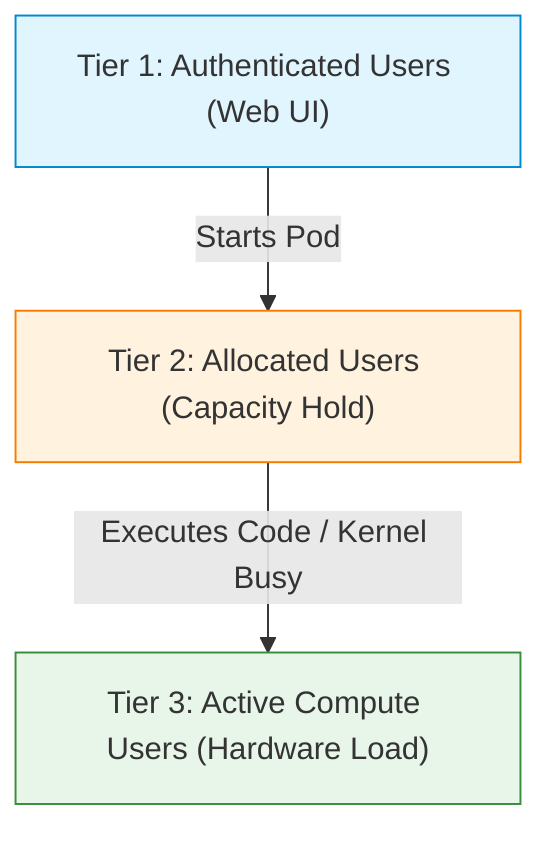

# Slurm & Kubernetes Info Exchange and Resource Monitoring Research

This document outlines the findings and architectural strategies for exchanging telemetry, user behavior, and resource utilization data between the local AI Sandbox cluster (Slinky Slurm-on-Kubernetes) and the university's Central Portal.

---

## 1. Executive Summary & Telemetry Strategy

To monitor our AI Sandbox from the Central Portal, we expose cluster-level telemetry, job queues, container runtime metrics, storage utilization, and detailed GPU hardware performance. 

### Core Architectural Principles:
1. **Lightweight Edge Exporters (Preserve Sandbox RAM):** In accordance with the [System Assessment and Planning Report (Section 4.9)](SYSTEM_ASSESSMENT_AND_PLANNING_REPORT.md#49-monitoring--observability), the AI Sandbox does **not** run a local heavy Prometheus time-series database (TSDB) or local Grafana instances. Every gigabyte of RAM on the cluster is preserved for student workloads (PyTorch, LLMs, Qdrant).
2. **Pull (Scrape) as the Primary Mechanism:** The Central Portal's Prometheus or monitoring service pulls metrics at regular intervals (e.g., 30s–60s) via authenticated HTTP endpoints exposed through our Traefik Ingress. This eliminates failure coupling—if the Central Portal is down or restarting, our sandbox workloads remain completely unaffected.
3. **Push Strictly for Discrete Lifecycle Events:** Pushing (webhooks) is reserved exclusively for one-time job lifecycle transitions (e.g., Slurm Epilog triggering a webhook upon completion of a 6-hour training job). High-frequency push heartbeats are avoided.
4. **Two-Layer Telemetry Backbone:** 
   - **Slurm Layer:** Tracks policy, fair-share queue priority, job allocations, and user quotas.
   - **Kubernetes & Hardware Layer:** Tracks physical reality, actual container memory consumption, kernel OOM events, NFS disk fill rates, and GPU hardware metrics.

---

## 2. Comprehensive Telemetry & Export Catalog

The following table details all metrics that can be exported to the Central Portal, the tools used to collect and expose them, their underlying backbone component, and the transmission mechanism:

| Telemetry / Data Field | Short Description | Backbone Layer | Origin / Source Tool | Export Mechanism to Central Portal |
| :--- | :--- | :--- | :--- | :--- |
| **Cluster Liveness & Node States** | Status of compute nodes (`idle`, `allocated`, `drained`, `down`, `not_responding`) and cluster availability. | **Slurm** | `slurmrestd` (`/slurm/v1/metrics`) or `sinfo --json` | **Pull (HTTP GET):** Scraped via Traefik Ingress endpoint `/metrics/slurm`. |
| **Queue Depth & Backlog** | Number of active jobs categorized by state (`RUNNING`, `PENDING`, `SUSPENDED`) and partition queue wait times. | **Slurm** | `slurmrestd` or `squeue --json` | **Pull (HTTP GET):** Scraped via Traefik Ingress or queried via Slurm REST API. |
| **User Allocations & Fair-Share** | Compute resources (cores, RAM, vGPU slices) reserved per user/account and historical fair-share weighting. | **Slurm** | Slurm Accounting (`slurmdbd`) | **Pull (REST API):** Queried periodically via Go Portal summary endpoint or `slurmrestd`. |
| **Job Lifecycle Completion Events** | Discrete records of completed jobs: job ID, student username, exit code, duration, and allocated nodes. | **Slurm** | Slurm Epilog Script (`slurm_epilog_webhook.sh`) | **Push (HTTP POST Webhook):** Dispatched to Central Portal webhook receiver upon job exit. |
| **Actual Container CPU & Memory** | Real-time CPU core usage and memory working set (`RSS`) consumed inside student pods (cgroup-level). | **Kubernetes** | Kubelet built-in `cAdvisor` (`/metrics/cadvisor`) | **Pull (OpenMetrics):** Scraped via Traefik Ingress or forwarded via Prometheus Agent. |
| **Kernel OOM Terminations** | Count of containers killed by Linux kernel Out-Of-Memory killer (`container_oom_events_total`). | **Kubernetes** | Kubelet built-in `cAdvisor` | **Pull (OpenMetrics):** Standard Prometheus scrape metric. |
| **Student Storage Quotas & PVC Usage** | Disk bytes used vs. capacity per student's private NFS home directory (`/home/jovyan`). | **Kubernetes** | Kubelet Storage Volume Subsystem (`kubelet_volume_stats_*`) | **Pull (OpenMetrics):** Exposes NFS PVC fill rates against the 50GB student cap. |
| **Pod Lifecycle & Infrastructure Health** | Status of interactive pods (`CrashLoopBackOff`, `ImagePullBackOff`), DaemonSet health, and node conditions. | **Kubernetes** | `kube-state-metrics` (KSM) Deployment (~50MB RAM) | **Pull (OpenMetrics):** Scraped via Traefik Ingress endpoint `/metrics/k8s`. |
| **Active Web Sessions & Network Traffic** | Real-time count of active WebSocket tunnels to JupyterLab sessions and HTTP ingress bandwidth. | **Kubernetes** | Traefik Ingress Controller native metrics (`--metrics.prometheus=true`) | **Pull (OpenMetrics):** Scraped via Traefik endpoint `/metrics/traefik`. |
| **GPU SM Utilization & Core Clocks** | Real-time streaming multiprocessor load (%) for GPU #1 (Triton) and GPU #2 (student time-sliced). | **Hardware** | NVIDIA DCGM Exporter DaemonSet | **Pull (OpenMetrics):** Scraped via Traefik Ingress or local ServiceMonitor. |
| **GPU VRAM Allocation & Consumption** | Physical VRAM occupied (GB) vs. total 48GB capacity on each NVIDIA L40 GPU. | **Hardware** | NVIDIA DCGM Exporter DaemonSet | **Pull (OpenMetrics):** Scraped alongside hardware health counters. |
| **GPU Temperature & Power Draw** | Thermal throttling metrics and wattage draw (300W TDP) to ensure physical accelerator stability. | **Hardware** | NVIDIA DCGM Exporter DaemonSet | **Pull (OpenMetrics):** Alerting trigger for hardware degradation. |
| **Bare-Metal OS & Host Telemetry** | Physical host CPU load, system RAM, network interface throughput, and underlying disk I/O. | **Hardware** | Prometheus Node Exporter DaemonSet | **Pull (OpenMetrics):** Host-level monitoring across all 6 physical nodes. |

---

## 3. Active User Definition Framework (3-Tier Model)

To avoid ambiguity with the Central Portal team regarding what constitutes an "active user", the following 3-tier model should be proposed:

```mermaid
flowchart TD
    T1["Tier 1: Authenticated Users (Web UI)"] -->|Starts Pod| T2["Tier 2: Allocated Users (Capacity Hold)"]
    T2 -->|Executes Code / Kernel Busy| T3["Tier 3: Active Compute Users (Hardware Load)"]

    style T1 fill:#e1f5fe,stroke:#0288d1
    style T2 fill:#fff3e0,stroke:#f57c00
    style T3 fill:#e8f5e9,stroke:#388e3c
```

1. **Tier 1: Authenticated Users (Web / Portal Engagement)**
   - **Definition:** Students currently authenticated with an active session on the Go Portal.
   - **Measurement Source:** Authentik SSO session store / Go Portal session manager.
   - **Meaning:** Indicates student engagement and interest, even if no compute resources are currently held.
2. **Tier 2: Allocated Users (Quota & Capacity Reservation)**
   - **Definition:** Students holding a running Kubernetes interactive pod or active Slurm batch allocation.
   - **Measurement Source:** Slurm `squeue` / Kubernetes Pod state (`Running`).
   - **Meaning:** Represents occupied cluster capacity (e.g., student is reserving 4 CPU cores, 16GB RAM, and an 8GB VRAM slice), regardless of whether code is actively executing.
3. **Tier 3: Active Compute Users (True Hardware Utilization)**
   - **Definition:** Students whose containers are actively burning CPU cycles or GPU tensor cores (e.g., CPU utilization > 10% or GPU SM > 0%).
   - **Measurement Source:** Kubelet `cAdvisor` + NVIDIA DCGM Exporter.
   - **Meaning:** Identifies true computational workloads vs. idle Jupyter notebook sessions where a student left their browser open.

---

## 4. Architectural Data Flow & Responsibilities

The responsibilities between the local AI Sandbox and the Central Portal are strictly separated to maintain cluster stability and resource availability:

```mermaid
flowchart LR
    subgraph "AI Sandbox Cluster (Lightweight / Stateless)"
        direction TB
        subgraph "Backbone Exporters"
            Slurm["slurmrestd<br>(OpenMetrics)"]
            K8s["cAdvisor & KSM<br>(Kubelet)"]
            Traefik["Traefik<br>(Ingress)"]
            DCGM["DCGM & Node<br>(DaemonSets)"]
        end
        Ingress["Traefik Ingress Gateway<br>(Auth & TLS)"]
        Slurm --> Ingress
        K8s --> Ingress
        Traefik --> Ingress
        DCGM --> Ingress
    end

    subgraph "Central Portal Infrastructure"
        direction TB
        CentralProm["Central Prometheus TSDB<br>(Scrapes /metrics)"]
        CentralGraf["Central Grafana Dashboards<br>(University Multi-Cluster View)"]
        CentralWH["Webhook Event Receiver<br>(Job Lifecycle History)"]
        
        CentralProm --> CentralGraf
    end

    Ingress -->|PULL: Scrape /metrics (30s)| CentralProm
    Slurm -.->|PUSH: Epilog Webhook| CentralWH
```

### Clarifying Prometheus & Grafana Roles:
- **Prometheus is the Engine & TSDB:** It scrapes the HTTP endpoints, compresses the time-series data, stores it on disk, and evaluates alert rules. Running Prometheus with long-term retention on the AI Sandbox would waste valuable RAM. Therefore, **Central Prometheus** handles storage.
- **Grafana is the Presentation Layer:** Grafana stores zero metrics data; it simply queries Prometheus to render dashboards. The **Central Portal** operates Grafana to provide unified visibility across the university's multiple compute clusters.
- **Optional Forwarding (Prometheus Agent Mode / OpenTelemetry):** If Central IT prefers a push/remote-write model over scraping our Traefik endpoints, the Sandbox can deploy a stateless **Prometheus Agent** or **OpenTelemetry (OTel) Collector**. These agents buffer metrics only in memory and stream them via Remote-Write with zero local disk footprint.

---

## 5. Evaluation: Slurm REST API vs. Prometheus slurm_exporter

| Evaluation Criterion | Slurm REST API (Native OpenMetrics) | Prometheus slurm_exporter |
| :--- | :--- | :--- |
| **Architecture** | Native plugin in `slurmrestd` (`/slurm/v1/metrics`). No extra daemons. | Third-party standalone daemon executing CLI commands (`sinfo`, `squeue`). |
| **Authentication** | Unified JWT-based authentication sharing the same tokens as Go Portal. | Typically requires cluster host credentials or dedicated RBAC wrappers. |
| **System Overhead** | Direct in-memory extraction via Slurm controller. | Spawns external subshells and parses CLI string outputs repeatedly. |
| **Long-Term Support** | Official SchedMD architectural roadmap. | Community-maintained GitHub repository. |

**Decision:** We utilize the native **Slurm REST API with the OpenMetrics plugin**. This aligns with modern SchedMD releases and avoids deploying unnecessary third-party sidecars in the Slinky stack.

---

## 6. Observability Alerting Rules for Central Ingestion

When Central Prometheus scrapes our sandbox, the following recommended alerting rules can be applied at the Central Portal layer:

1. **`SandboxNodeNotResponding`:** Raised if any worker node remains in `down` or `not_responding` state for > 5 minutes.
2. **`GpuUsageStalled`:** Raised if a GPU slice is allocated to an interactive session but records 0% SM utilization for > 60 minutes (detects abandoned sessions).
3. **`GpuOOMEvent`:** Raised if a student pod terminates unexpectedly with GPU Out-Of-Memory indicators.
4. **`StorageQuotaExceeded`:** Raised when a student's NFS home directory exceeds 90% of their 50GB quota (`kubelet_volume_stats_used_bytes`).
5. **`QueueBacklogHigh`:** Raised if the pending Slurm job queue exceeds 25 jobs for > 15 minutes, indicating potential capacity exhaustion.

---

## 7. References

1. **SchedMD Slurm REST API & OpenMetrics:** [Official Documentation](https://slurm.schedmd.com/rest_api.html)
2. **Kubernetes Monitoring Architecture (cAdvisor & KSM):** [Kubernetes Documentation](https://kubernetes.io/docs/concepts/cluster-administration/system-metrics/)
3. **NVIDIA DCGM Exporter for Kubernetes:** [NVIDIA GPU Monitoring Tools](https://github.com/NVIDIA/gpu-monitoring-tools)
4. **Prometheus Agent Mode:** [Prometheus Official Documentation](https://prometheus.io/docs/prometheus/latest/feature_flags/#prometheus-agent)
5. **Traefik Ingress Controller Metrics:** [Traefik Observability Guide](https://doc.traefik.io/traefik/observability/metrics/prometheus/)
